# Anhang *Vollständige Liste der Implementierten Elemente*

## Einfache Elemente

Icon | Name | Beschreibung
:--- | :---: | :---
 | A * B | Multipliziert A und B.  **Eingänge:** A (Mathematisches Object), B (Mathematisches Object) **Ausgänge:** Resultat (Mathematisches Object)
 | A + B | Addiert A und B.  **Eingänge:** A (Mathematisches Object), B (Mathematisches Object) **Ausgänge:** Resultat (Mathematisches Object)
 | A - B | Zieht B von A ab.  **Eingänge:** A (Mathematisches Object), B (Mathematisches Object) **Ausgänge:** Resultat (Zahl)
 | A / B | Dividiert A und B durcheinander.  **Eingänge:** A (Zahl), B (Zahl) **Ausgänge:** Resultat (Zahl)
 | A mod B | Berechnet A Modulo B.  **Eingänge:** A (32 Bit Ganzzahl), B (32 Bit Ganzzahl) **Ausgänge:** Resultat (32 Bit Ganzzahl)
 | AND | Logisches AND. A und B muss die gleiche Länge haben.  **Eingänge:** A (Wahrheitswert...), B (Wahrheitswert...) **Ausgänge:** A & B (Wahrheitswert...)
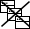 | Alle Fenster verbergen | Verbirgt alle offenen Fenster. Wenn <Alle Kontexte> gesetzt ist werden auch Fenster anderer Ausführungskontexte geschlossen.  **Eingänge:** Alle Kontexte (Wahrheitswert) [Opt.] **Ausgänge:** /
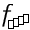 | Array abbilden | Wendet Funktion auf jedes Element aus Array an.  **Eingänge:** Funktion (Funktion), Array (Objekt...) **Ausgänge:** Array (Objekt...)
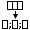 | Array zu CSV | Gibt Array als CSV weiter. Standart-Seperator ist ; und das Standart-Escape-Symbol ist ".  **Eingänge:** Werte (Text...), Seperator-Symbol (Text) [Opt.], Escape-Symbol (Text) [Opt.] **Ausgänge:** CSV (Text)
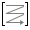 | Array zu Matrix |   **Eingänge:** Werte (Zahl...) [Opt.], Spalten (Zahl) [Opt.] **Ausgänge:** Matrix (Matrix)
 | Array zu Vektor |   **Eingänge:** Werte (Zahl...) **Ausgänge:** Vektor (Vektor)
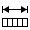 | Array-Länge | Gibt Länge von Array weiter.  **Eingänge:** Array (Objekt...) **Ausgänge:** Länge (32 Bit Ganzzahl)
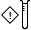 | Assert | Vergleicht Werte und Referenz-Werte auf eine bestimmte Eigenschaft angegeben durch Test-Typ. Zur Auswahl für Test-Typ steht >, <, >=, <=, ==, != zur Verfügung. Im Fall dass Werte und Referenz-Werte diese Eigenschaft nicht erfüllt wird eine Ausnahme ausgelöst.  **Eingänge:** Werte (Zahl...), Referenz-Werte (Zahl...), Test-Typ (Text) [Opt.], Meldung (Text) [Opt.] **Ausgänge:** Werte (Zahl...)
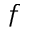 | Aufruf Funktion | Ruft Funktion auf.  **Eingänge:** Funktion (Funktion), Parameter (Objekt...) [Opt.] **Ausgänge:** Resultat (Objekt...)
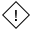 | Ausnahme | Löst eine Ausnahme aus falls Auslösen true ist. Falls Auslösen false ist wird der Eingang Data an den Ausgang Data übergeben.  **Eingänge:** Auslösen (Wahrheitswert) [Opt.], Nachicht (Text) [Opt.], Data (Objekt...) [Opt.] **Ausgänge:** Data (Objekt...)
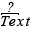 | Beginnt mit | Gibt weiter ob Text mit Prefix beginnt.  **Eingänge:** Text (Text), Prefix (Text) **Ausgänge:** Ist Prefix (Wahrheitswert)
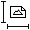 | Bild Maße | Ermittelt Maße von Bild und gibt diese weiter.  **Eingänge:** Bild (Gepuffertes Bild) [Opt.] **Ausgänge:** Breite (32 Bit Ganzzahl), Höhe (32 Bit Ganzzahl)
 | Bild anzeigen | Zeigt Bitmap in Fenster an.  **Eingänge:** Bild (Gepuffertes Bild), Id (SmartIdentifier) [Opt.] **Ausgänge:** Id (SmartIdentifier)
 | Bild auf Bild zeichnen | Zeichnet Bild auf Untergrund.  **Eingänge:** Untergrund (Gepuffertes Bild), Bild (Gepuffertes Bild), x (Zahl) [Opt.], y (Zahl) [Opt.] **Ausgänge:** Neues Bild (Gepuffertes Bild)
 | Bild aufnehmen | Nimmt Bild über Kamera auf.  **Eingänge:** Kamera (Kamera) **Ausgänge:** Snapshot (Gepuffertes Bild)
 | Bild bluren | Schaltet folgende Elemente hintereinander: Gauss Kernel erzeugen -> Faltung durchführen  **Eingänge:** Grösse (32 Bit Ganzzahl) [Opt.], Bild (Gepuffertes Bild) **Ausgänge:** gefaltetes Bild (Gepuffertes Bild)
 | Bild kopieren | Stellt eine tiefe Kopie eines Bildes her.  **Eingänge:** Bild (Gepuffertes Bild) **Ausgänge:** Original (Gepuffertes Bild)
 | Bild rotieren | Dreht Bild. Die ursprünglichen Abmasse können sich hierbei ändern.  **Eingänge:** Bild (Gepuffertes Bild), Rad (64 Bit Gleitkommazahl) [Opt.], Grad (64 Bit Gleitkommazahl) [Opt.] **Ausgänge:** Rotiertes Bild (Gepuffertes Bild)
 | Bild skalieren | Skaliert Bild absolut oder relativ zur Ursprungsgrösse.  **Eingänge:** Bild (Gepuffertes Bild), Proportional skalieren (Wahrheitswert) [Opt.], Verhältniss bewahren (Wahrheitswert) [Opt.], Breite (Zahl) [Opt.], Höhe (Zahl) [Opt.] **Ausgänge:** Skaliertes Bild (Gepuffertes Bild), angepasste Breite (32 Bit Ganzzahl), angepasste Höhe (32 Bit Ganzzahl)
 | Bild weiden | Weidet (positive Werte) oder Beschneidet (negative Werte) Bild absolut oder relativ zur Ursprungsgrösse.  **Eingänge:** Bild (Gepuffertes Bild), links (Zahl) [Opt.], rechts (Zahl) [Opt.], unten (Zahl) [Opt.], oben (Zahl) [Opt.] **Ausgänge:** Skaliertes Bild (Gepuffertes Bild), angepasste Breite (32 Bit Ganzzahl), angepasste Höhe (32 Bit Ganzzahl)
 | Bild zu Daten | Kodiert Bild als JPG, PNG oder BMP und gibt diese weiter.  **Eingänge:** Bild (Gepuffertes Bild...), Format (Text) [Opt.] **Ausgänge:** Data (Rohdaten...)
 | Bild zu Raster | Wandelt Bild in Raster um. Function wird auf jeden Pixel ausgeführt um zu entscheiden welcher Wert in Raster übernommen wird.  **Eingänge:** Bild (Gepuffertes Bild), (Farbe) -> Wahrheitswert (Funktion) **Ausgänge:** Raster (Raster)
 | Bild-Ausgabe-Dialog | Öffnet Dateiausgabe-Dialog welcher es dem Benutzer erlaubt ein Bild im JPG- oder PNG-Format zu speichern.  **Eingänge:** Bild (Gepuffertes Bild), Ausgangspunkt (Dateipfad) [Opt.] **Ausgänge:** /
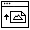 | Bild-Eingabe-Dialog | Öffnet Dateieingabe-Dialog welcher es dem Benutzer erlaubt Bilddateien im JPG-, PNG- oder BMP-Format zu laden und gibt diese als Bitmap weiter. Falls der Benutzer der Eingabe abbricht wird ein Bitmap-Array mit der Länge 0 weitergegeben.  **Eingänge:** Ausgangs Pfad (Dateipfad) [Opt.], Mehrere (Wahrheitswert) [Opt.], Ausnahme bei Abbruch (Wahrheitswert) [Opt.] **Ausgänge:** Bild (Gepuffertes Bild...)
 | Bilder laden | Lädt Bitmap aus File-Objekt.  **Eingänge:** Datei (Dateipfad...) **Ausgänge:** Bilder (Gepuffertes Bild...)
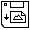 | Bilder speichern | Speichert Bilder in Datei  **Eingänge:** Bilder (Gepuffertes Bild...) [Opt.], Dateien (Dateipfad...) [Opt.], Überschreiben (Wahrheitswert) [Opt.], Format (Text) [Opt.] **Ausgänge:** /
 | Bildschirmpositon definieren | Lässt Benutzer Bildschirmposition bestimmen und gibt diese als x- und y-Koordinaten weiter.  **Eingänge:** Mittteilung (Text) [Opt.], Mittteilung anzeigen (Wahrheitswert) [Opt.] **Ausgänge:** x (32 Bit Ganzzahl), y (32 Bit Ganzzahl)
 | Brücke | Leeres Element. Gibt Eingang weiter ohne diesen zu verarbeiten.  **Eingänge:** Eingang (Objekt...) [Opt.] **Ausgänge:** Ausgang (Objekt...)
 | CMYK-Farbe | Erzeugt Farbe anhand von CMYK-Werten. Werte müssen zwischen 0 und 1 liegen. ACHTUNG: Es handelt sich hierbei nur um eine sehr grobe Annäherung. Es werden in der aktuellen Implementierung KEINE Farbprofile verwendet.  **Eingänge:** C (32 Bit Gleitkommazahl), M (32 Bit Gleitkommazahl), Y (32 Bit Gleitkommazahl), K (32 Bit Gleitkommazahl), A (32 Bit Gleitkommazahl) [Opt.] **Ausgänge:** Farbe (Farbe)
 | CSV zu Array | Teilt Strings aus CSV in Array auf und gibt diese weiter.  **Eingänge:** CSV (Text), Seperator-Symbol (Text) [Opt.], Escape-Symbol (Text) [Opt.] **Ausgänge:** Werte (Text...)
 | Cos-Sin-Tan | Berechnet Cos, Sin, Tan und Tanh von x.   **Eingänge:** x (Zahl) **Ausgänge:** cos (64 Bit Gleitkommazahl), sin (64 Bit Gleitkommazahl), tan (64 Bit Gleitkommazahl), tanh (64 Bit Gleitkommazahl)
 | Counter hochzählen | Gibt Counter weiter und zählt diesen um 1 hoch.  **Eingänge:** Start i (32 Bit Ganzzahl) [Opt.], ID (SmartIdentifier) [Opt.] **Ausgänge:** i (32 Bit Ganzzahl)
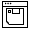 | Datei auswählen Dialog | Öffnet Dateiauswahl-Dialog.  **Eingänge:** Pfad (Dateipfad) [Opt.], Mehere Dateien (Wahrheitswert) [Opt.], Speicher Dialog (Wahrheitswert) [Opt.], Titel (Text) [Opt.] **Ausgänge:** Ausgewählt (Dateipfad...)
 | Datei-Info | Gibt Datei-Informationen weiter.  **Eingänge:** Datei (Dateipfad) **Ausgänge:** Grösse (in Byte) (64 Bit Ganzzahl), Dateiname (Text), Existiert (Wahrheitswert), Endung (Text), Verzeichniss (Wahrheitswert)
 | Dateien aus Verzeichniss | Listet alle Dateien welche sich in Pfad befinden.  **Eingänge:** Verzeichniss (Dateipfad), Rekursiv (Wahrheitswert) [Opt.], Prefix (Text) [Opt.], Sufix (Text) [Opt.], Pre-/Sufix nur bei Dateien (Wahrheitswert) [Opt.] **Ausgänge:** Dateien (Dateipfad...), Verzeichnisse (Dateipfad...)
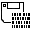 | Daten aus Datei lesen | Liesst Rohdaten aus Datei.  **Eingänge:** Quelldatei (Dateipfad...), Spät laden (Wahrheitswert) [Opt.] **Ausgänge:** Daten (Gelesene Rohdaten...)
 | Daten in Datei schreiben | Schreibt Rohdaten in Datei.  **Eingänge:** Zieldatei (Dateipfad...), Daten (Rohdaten...), Überschreiben (Wahrheitswert) [Opt.] **Ausgänge:** /
 | Daten zu Bild | Erzeugt Bild anhand von kodierten Bilddaten.  **Eingänge:** Data (Rohdaten...) **Ausgänge:** Bild (Gepuffertes Bild...)
 | Daten zu Text | Wandelt Rohdaten in Text um. Ist kein Charset angegeben so wird als Standartwert "UTF-8" verwendet.  **Eingänge:** Data (Rohdaten), Charset (Text) [Opt.] **Ausgänge:** Text (Text)
 | Daten-Länge | Gibt Länge von Daten weiter.  **Eingänge:** Array (Rohdaten) **Ausgänge:** Länge (32 Bit Ganzzahl)
 | Dateneinheiten umwandeln | Wandelt zwischen Dateneinheiten um.  **Eingänge:** Bit (64 Bit Ganzzahl) [Opt.], Byte (64 Bit Gleitkommazahl) [Opt.], Kilobyte  (64 Bit Gleitkommazahl) [Opt.], Kibibyte  (64 Bit Gleitkommazahl) [Opt.], Megabyte (64 Bit Gleitkommazahl) [Opt.], Mebibyte (64 Bit Gleitkommazahl) [Opt.], Gigabyte (64 Bit Gleitkommazahl) [Opt.], Gibibyte (64 Bit Gleitkommazahl) [Opt.], Terabyte (64 Bit Gleitkommazahl) [Opt.], Tebibyte (64 Bit Gleitkommazahl) [Opt.] **Ausgänge:** Bit (64 Bit Ganzzahl), Byte (64 Bit Gleitkommazahl), Kilobyte (64 Bit Gleitkommazahl), Kibibyte (64 Bit Gleitkommazahl), Megabyte (64 Bit Gleitkommazahl), Mebibyte (64 Bit Gleitkommazahl), Gigabyte (64 Bit Gleitkommazahl), Gibibyte (64 Bit Gleitkommazahl), Terabyte (64 Bit Gleitkommazahl), Tebibyte (64 Bit Gleitkommazahl)
 | Diagonalmatrix erzeugen |   **Eingänge:** Werte (Zahl...) **Ausgänge:** Diagonalmatrix (Matrix)
 | Dialog anzeigen | Zeigt Dialog an.  **Eingänge:** Titel (Text) [Opt.], Mitteilung (Text) **Ausgänge:** /
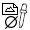 | Durchschnittlicher Farbwert | Extrahiert alle Farbwerte aus Bild und gibt diese weiter.  **Eingänge:** Bild (Gepuffertes Bild) **Ausgänge:** Farbe (Farbe)
 | Eingabe Dialog | Öffnet Dialog für Texteingabe.  **Eingänge:** Titel (Text) [Opt.], Mitteilung (Text) [Opt.] **Ausgänge:** Benutzereingabe (Text)
 | Einheitsmatrix erzeugen |   **Eingänge:** Grösse (32 Bit Ganzzahl) **Ausgänge:** Einheitsmatrix (Matrix)
 | Elemente entfernen | Entfernt ein oder mehrere Objeckte aus Array.  **Eingänge:** Array (Objekt...), Indexs (32 Bit Ganzzahl...) [Opt.] **Ausgänge:** Resultat (Objekt...)
 | Email senden | Sendet Email über SMTP-Server.  **Eingänge:** SMTP (Text) [Opt.], SMTP-Port (32 Bit Ganzzahl) [Opt.], Absender (Text) [Opt.], Passwort (Text) [Opt.], Empfänger (Text) [Opt.], Subject (Text) [Opt.], Text (Text) [Opt.], Anhang (Rohdaten) [Opt.] **Ausgänge:** /
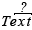 | Endet mit | Gibt weiter ob Text mit Postfix endet.  **Eingänge:** Text (Text), Postfix (Text) **Ausgänge:** Ist Postfix (Wahrheitswert)
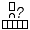 | Enthällt | Gibt weiter ob bestimmtes Element in Array enthalten ist.  **Eingänge:** Array (Objekt...), Wert (Objekt) **Ausgänge:** Enthält (Wahrheitswert)
 | Eulersche Zahl | Gibt die Konstante e weiter.  **Eingänge:** / **Ausgänge:** e (64 Bit Gleitkommazahl)
 | Faltung durchführen | Führt Faltung auf Bild durch.  **Eingänge:** Bild (Gepuffertes Bild), Kernel (Matrix) **Ausgänge:** gefaltetes Bild (Gepuffertes Bild)
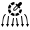 | Farbbestandteile | Extrahiert die einzelnen Farbkanäle aus Farbe.  **Eingänge:** Farbe (Farbe) **Ausgänge:** Rot (RGB: R) (32 Bit Gleitkommazahl), Grün (RGB: G) (32 Bit Gleitkommazahl), Blau (RGB: B) (32 Bit Gleitkommazahl), Farbton (HSB: H) (32 Bit Gleitkommazahl), Farbsättigung (HSB: S) (32 Bit Gleitkommazahl), Helligkeit (HSB: B) (32 Bit Gleitkommazahl)
 | Farbe anpassen | Passt Farbwerte an. Werte müssen zwischen -1 und 1 liegen.  **Eingänge:** Bild (Gepuffertes Bild) [Opt.], R (64 Bit Gleitkommazahl) [Opt.], G (64 Bit Gleitkommazahl) [Opt.], B (64 Bit Gleitkommazahl) [Opt.] **Ausgänge:** Resultierendes Bild (Gepuffertes Bild)
 | Farbpalette | Stellt Standardfarben zur Verfügung.  **Eingänge:** / **Ausgänge:** Schwarz (Farbe), Blau (Farbe), Cyan (Farbe), Dunkel Grau (Farbe), Grün (Farbe), Hell Grau (Farbe), Magenta (Farbe), Orange (Farbe), Pink (Farbe), Rot (Farbe), Weiß (Farbe), Gelb (Farbe)
 | Farbwert extrahieren | Extrahiert Farbwert von Positon (x, y) und gibt diesen weiter.  **Eingänge:** Bild (Gepuffertes Bild), x (Zahl) [Opt.], y (Zahl) [Opt.] **Ausgänge:** Farbe (Farbe)
 | Fenster verbergen | Verbirgt offene Fenster.  **Eingänge:** Id (SmartIdentifier...) **Ausgänge:** /
 | Fibonaci | Berechnet die Fibonacci-Folge bis zum Wert n.  **Eingänge:** n (32 Bit Ganzzahl) [Opt.], rekursiv (Wahrheitswert) [Opt.] **Ausgänge:** fibo(n) (64 Bit Ganzzahl), Folge bis n (64 Bit Ganzzahl...)
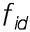 | Funktion durch ID | Sucht nach in Projekt definierter Funktion und gibt diese weiter.  **Eingänge:** ID (SmartIdentifier) **Ausgänge:** Funktion (Funktion)
 | Funktions-Rückgabe | Gibt Daten als Rückgabe von Funktion zurück.  **Eingänge:** Rückgabe (Objekt...) [Opt.], Token (FunctionCallToken) **Ausgänge:** /
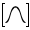 | Gauss Kernel erzeugen | Erzeugt Gauss Kernel.  **Eingänge:** Grösse (32 Bit Ganzzahl) [Opt.] **Ausgänge:** Gauss Kernel (Matrix)
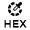 | HEX-Farbe | Erzeugt Farbe anhand von HEX-Wert.  **Eingänge:** HEX (Text) **Ausgänge:** Farbe (Farbe)
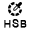 | HSB-Farbe | Erzeugt Farbe anhand von HSB-Werten. Werte müssen zwischen 0 und 1 liegen.  **Eingänge:** H (32 Bit Gleitkommazahl), S (32 Bit Gleitkommazahl), B (32 Bit Gleitkommazahl) **Ausgänge:** Farbe (Farbe)
 | Hauptfenster Zustand setzen | Setzt Zustand von Hauptfenster. Diese Element kann beispielsweise verwendet werden um das Hauptfenster automatisch zu verbergen und wieder anzuzeigen.  **Eingänge:** Minimiert (Wahrheitswert) [Opt.], Normal (Wahrheitswert) [Opt.] **Ausgänge:** /
 | Histogram anzeigen | Zeigt Werte-Array als Histogram in Fenster an.  **Eingänge:** Werte (Zahl...) [Opt.], Id (SmartIdentifier) [Opt.] **Ausgänge:** Id (SmartIdentifier)
 | Histogram erstellen | Erstellt Histogram der einzelnen Farbkanäle eines Bildes.  **Eingänge:** Bild (Gepuffertes Bild), Kumulativ (Wahrheitswert) [Opt.] **Ausgänge:** Rot (32 Bit Ganzzahl...), Grün (32 Bit Ganzzahl...), Blau (32 Bit Ganzzahl...), Helligkeit (32 Bit Ganzzahl...)
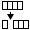 | In Array einfügen | Fügt Elemente zu Array hinzu und gibt Array weiter.  **Eingänge:** Array (Objekt...), Davor (Objekt...) [Opt.], Danach (Objekt...) [Opt.], an Position i (Objekt...) [Opt.], i (32 Bit Ganzzahl) [Opt.] **Ausgänge:** Resultat (Objekt...)
 | Inverse Matrix |   **Eingänge:** Matrix (Matrix) **Ausgänge:** Inverse (Matrix)
 | Ist gleich | Gibt an Ausgang weiter ob A und B gleich ist.  **Eingänge:** A (Objekt) [Opt.], B (Objekt) [Opt.] **Ausgänge:** A ist gleich B (Wahrheitswert)
 | Ja/Nein Dialog | Öffnet Ja/Nein-Dialog.  **Eingänge:** Titel (Text) [Opt.], Mitteilung (Text) **Ausgänge:** Auswahl (Wahrheitswert)
 | Kopie | Koppiert ein beliebige Objekt. Hierfür wird clone() auf das Object aufgerufen.   **Eingänge:** Data (Objekt...) **Ausgänge:** Data (Objekt...), Kopie (Objekt...)
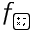 | Math-Funktion erstellen | Erstellt einfache Math-Funktion.  **Eingänge:** k (Zahl) [Opt.] **Ausgänge:** f = $1 * k (Funktion), f = $1 / k (Funktion), f = $1 + k (Funktion), f = $1 - k (Funktion), f = $1^k (Funktion), f = $1^(1/k) (Funktion), f = $1 * $2 (Funktion), f = $1 / $2 (Funktion), f = $1 + $2 (Funktion), f = $1 - $2 (Funktion), f = $1^$2 (Funktion), f = k (Funktion)
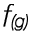 | Math-Funktionen kombinieren | Kombiniert Math-Funktionen miteinander.  **Eingänge:** k (Funktion) [Opt.], f1 (Zahl), f2 (Funktion) [Opt.] **Ausgänge:** f = f1 * k (Funktion), f = f1 / k (Funktion), f = f1 + k (Funktion), f = f1 - k (Funktion), f = f1^k (Funktion), f = f1^(1/k) (Funktion), f = f1 * f2 (Funktion), f = f1 / f2 (Funktion), f = f1 + f2 (Funktion), f = f1 - f2 (Funktion), f = f1^f2 (Funktion)
 | Mathematisches Objekt anzeigen | Zeigt mathematisches Objekt in Fenster an.  **Eingänge:** Wert (Mathematisches Object) [Opt.], Id (SmartIdentifier) [Opt.] **Ausgänge:** Id (SmartIdentifier)
 | Matrix Maße |   **Eingänge:** Matrix (Matrix) [Opt.] **Ausgänge:** Anzahl Spalten (32 Bit Ganzzahl), Anzahl Zeilen (32 Bit Ganzzahl)
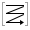 | Matrix zu Array |   **Eingänge:** Matrix (Matrix) [Opt.] **Ausgänge:** Werte (Zahl...), Spalten (Zahl), Zeilen (Zahl)
 | Mausposition | Gibt die x- und y-Koordinaten der Maus weiter.  **Eingänge:** / **Ausgänge:** x (32 Bit Ganzzahl), y (32 Bit Ganzzahl)
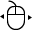 | Mauspostion setzen | Setzt Mausposition auf Position (x, y).  **Eingänge:** x (32 Bit Ganzzahl), y (32 Bit Ganzzahl), Relativ (Wahrheitswert) [Opt.] **Ausgänge:** Neu x (32 Bit Ganzzahl), Neu y (32 Bit Ganzzahl)
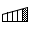 | Maximum | Gibt Maximum aus Array weiter.  **Eingänge:** Array (Zahl...) **Ausgänge:** Maximum (Zahl)
 | Minimum | Gibt Minimum aus Array weiter.  **Eingänge:** Array (Zahl...) **Ausgänge:** Minimum (Zahl)
 | Mouse Click | Simumliert Mausklick an Position (x, y).  **Eingänge:** Links (Wahrheitswert) [Opt.], Mitte (Wahrheitswert) [Opt.], Rechts (Wahrheitswert) [Opt.], Clickdauer in ms (64 Bit Ganzzahl) [Opt.], x (64 Bit Ganzzahl) [Opt.], y (64 Bit Ganzzahl) [Opt.], Drücken (Wahrheitswert) [Opt.], Loslassen (Wahrheitswert) [Opt.] **Ausgänge:** /
 | NAND | Logisches NAND. A und B müssen die gleiche Länge haben.  **Eingänge:** A (Wahrheitswert...), B (Wahrheitswert...) **Ausgänge:** !A & !B (Wahrheitswert...)
 | NOT | Logisches NOT.  **Eingänge:** A (Wahrheitswert...) **Ausgänge:** !A (Wahrheitswert...)
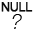 | NULL-Test | Gibt an Ausgang weiter ob Wert NULL ist. Data ist NULL wenn seine Länge 0 ist oder alle Werte null (leer) sind.  **Eingänge:** Data (Objekt...) [Opt.] **Ausgänge:** Ist NULL (Wahrheitswert)
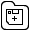 | Neue Datei in Verzeichniss | Erzeugt neues Datei-Objekt ohne diese Datei auf der Festplatte anzulegen.  **Eingänge:** Verzeichniss (Dateipfad) [Opt.], Dateiname (Text) [Opt.] **Ausgänge:** Datei (Dateipfad)
 | Neues Bild | Erzeugt neues Bild.  **Eingänge:** Farbe (Farbe) [Opt.], Breite (Zahl), Höhe (Zahl) **Ausgänge:** Neues Bild (Gepuffertes Bild)
 | OR | Logisches OR. A und B muss die gleiche Länge haben.  **Eingänge:** A (Wahrheitswert...), B (Wahrheitswert...) **Ausgänge:** A | B (Wahrheitswert...)
 | Pi | Gibt die Konstante Pi weiter  **Eingänge:** / **Ausgänge:** Pi (64 Bit Gleitkommazahl)
 | Primzahl-Test | Testet ob es sich bei einer Zahl n um eine Primzahl handelt. Dies kann bei grossen Zahlen eine längere Zeit in Anspruch nehmen.  **Eingänge:** n (64 Bit Ganzzahl) **Ausgänge:** Ist Primzahl (Wahrheitswert)
 | Print Object-Info | Loggt Informationen zu Object-Array in die Log-Ausgabe.  **Eingänge:** Data (Objekt...) **Ausgänge:** /
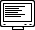 | Print to Log | Loggt Objekt (bzw. Objekte) zeilenweise in die Konsole. Ausgaben können über den Toolbaricon Log eingesehen werden.   **Eingänge:** Data (Objekt...), Fehlerausabe (Wahrheitswert) [Opt.], Nummerieren (Wahrheitswert) [Opt.], Zeitstempel (Wahrheitswert) [Opt.] **Ausgänge:** /
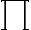 | Produkt | Multipliziert mehrere Werte aufeinander.  **Eingänge:** Werte (Zahl...) [Opt.] **Ausgänge:** Produkt (64 Bit Gleitkommazahl)
 | QR-Code erzeugen | Erzeugt QR-Code und gibt diesen als Bild weiter.  **Eingänge:** Inhalt (Text), Grösse (32 Bit Ganzzahl) [Opt.] **Ausgänge:** QR-Code (Gepuffertes Bild)
 | RGB-Farbe | Erzeugt Farbe anhand von RGB-Werten. Werte müssen zwischen 0 und 1 liegen.  **Eingänge:** R (32 Bit Gleitkommazahl), G (32 Bit Gleitkommazahl), B (32 Bit Gleitkommazahl), A (32 Bit Gleitkommazahl) [Opt.] **Ausgänge:** Farbe (Farbe)
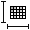 | Raster Maße | Ermittelt Maße von Raster und gibt diese weiter.  **Eingänge:** Raster (Raster) [Opt.] **Ausgänge:** Breite (32 Bit Ganzzahl), Höhe (32 Bit Ganzzahl)
 | Raster zu Array | Extrahiert Werte aus Raster und fügt diese Zeilenweise in Array ein.  **Eingänge:** Raster (Raster) **Ausgänge:** Wahrheitswerte (Wahrheitswert...)
 | Raster zu Bild | Wandelt Raster besetehend aus Wahrheitswerten in Bild um  **Eingänge:** Raster (Raster), True-Farbe (Farbe) [Opt.], False-Farbe (Farbe) [Opt.], Punkt-Breite (32 Bit Ganzzahl) [Opt.] **Ausgänge:** Bild (Gepuffertes Bild)
 | Rechner | Addiert, Subtrahiert, Multipliziert oder Dividiert zwei Werte.  **Eingänge:** A (Zahl), B (Zahl) **Ausgänge:** A + B (Zahl), A - B (Zahl), A * B (Zahl), A / B (Zahl)
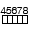 | Reihe | Gibt eine Reihe von Zahlen weiter.  **Eingänge:** Start (32 Bit Ganzzahl) [Opt.], Ende (32 Bit Ganzzahl) [Opt.], Schritgrösse (32 Bit Ganzzahl) [Opt.], Ende einschliessen (Wahrheitswert) [Opt.] **Ausgänge:** Reihe (32 Bit Ganzzahl...)
 | Runden |   **Eingänge:** Wert (Zahl) [Opt.], Kommastellen (32 Bit Ganzzahl) [Opt.] **Ausgänge:** Gerundet (64 Bit Gleitkommazahl), Aufgerundet (64 Bit Gleitkommazahl), Abgerundet (64 Bit Gleitkommazahl)
 | Schlafen | Dieses Element schläft eine angegebene Zeit und gibt dann beliebiges Objekt weiter. Alternativ kann auch der Auslöser verwendet werden um ein weiteres Element anzustossen. Werden Zeiten in verschiedenen Einheiten angegeben so werden diese addiert.  **Eingänge:** Zeit in ms (64 Bit Ganzzahl) [Opt.], Zeit in s (32 Bit Ganzzahl) [Opt.] **Ausgänge:** /
 | Schwellenwert-Farb-Funktion erstellen | Verwendete Werte müssen im Wertebereich 0 und 1 liegen.  **Eingänge:** Minimum Rot (32 Bit Gleitkommazahl) [Opt.], Minimum Grün (32 Bit Gleitkommazahl) [Opt.], Minimum Blau (32 Bit Gleitkommazahl) [Opt.], Minimum Helligkeit (32 Bit Gleitkommazahl) [Opt.], Maximum Rot (32 Bit Gleitkommazahl) [Opt.], Maximum Grün (32 Bit Gleitkommazahl) [Opt.], Maximum Blau (32 Bit Gleitkommazahl) [Opt.], Maximum Helligkeit (32 Bit Gleitkommazahl) [Opt.] **Ausgänge:** (Farbe) -> Wahrheitswert (Funktion)
 | Screenshot | Nimmt Bildschirmabdruck auf.  **Eingänge:** x (32 Bit Ganzzahl) [Opt.], y (32 Bit Ganzzahl) [Opt.], Breite (32 Bit Ganzzahl) [Opt.], Höhe (32 Bit Ganzzahl) [Opt.] **Ausgänge:** Screenshot (Gepuffertes Bild)
 | Sortieren | Sortiert Werte-Array aufsteigend oder absteigend und gibt Array weiter.  **Eingänge:** Array (Zahl...), Aufsteigend (Wahrheitswert) [Opt.] **Ausgänge:** Sortiert (Zahl...)
 | Sourcecode ausführen | Erwartet als Eingabe den Sourcecode einer Javaklasse mit einer (nicht statichen) Funktion ohne Parameter namens doSomething().  **Eingänge:** Javacode (Quellcode), Methodennamen (Text) [Opt.] **Ausgänge:** Rückgabe (Objekt...)
 | Stop | Stoppt Ausführung.  **Eingänge:** Meldung (Text) [Opt.], Fehler (Wahrheitswert) [Opt.] **Ausgänge:** /
 | Sub-Array | Gibt Teil aus Array weiter. Wenn keine Länge angegeben wird, wird nur 1 Element weiter gegeben.  **Eingänge:** Array (Objekt...), Start (32 Bit Ganzzahl) [Opt.], Länge (32 Bit Ganzzahl) [Opt.] **Ausgänge:** Subarray (Objekt...)
 | Summe | Addiert mehrere Werte zusammen.  **Eingänge:** Werte (Zahl...) [Opt.] **Ausgänge:** Summe (64 Bit Gleitkommazahl)
 | System Informationen | Gibt Systeminformationen weiter  **Eingänge:** / **Ausgänge:** Betriebsystem (Text), Benutzername (Text), Arbeits-Pfad (Text), Freier Speicher [B] (64 Bit Ganzzahl), Speicher insgesamt [B] (64 Bit Ganzzahl), Freier Festplattenspeicher [B] (64 Bit Ganzzahl), Festplattenspeicher insgesamt [B] (64 Bit Ganzzahl), Anzahl Prozessoren (32 Bit Ganzzahl)
 | Tastatureingabe simulieren | Simuliert Eingabe über Tastatur. Um das Drücken der Entertaste zu simulieren muss "Spezielle Ausdrücke" aktiviert sein und die Eingabe \n enthalten. Achtung: Es handelt sich hierbei um ein experimentelles Element. Für dieses experimentelle Element gibt es folgende Anmerkung: Dieses Element scheint noch Probleme auf bestimmten Betriebsystemen zu haben. Bekannte Probleme:Auf macOS Sierra kann in seltenen Situationen ein Problem auftreten dass das aktuelle Program seinen Fokus verliert.  **Eingänge:** Eingabe (Text), Spezielle Ausdrücke (Wahrheitswert) [Opt.], Mit Enter beenden (Wahrheitswert) [Opt.] **Ausgänge:** /
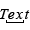 | Teil von Text | Gibt Teil von Text weiter.  **Eingänge:** Text (Text), Start (32 Bit Ganzzahl) [Opt.], Länge (32 Bit Ganzzahl) [Opt.], Ende (32 Bit Ganzzahl) [Opt.] **Ausgänge:** Teiltext (Text)
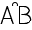 | Text anhängen | Dieses Element dient dazu Texte aneinander zu hängen.  **Eingänge:** Dynamische Liste von Elementen des Types Objekt **Ausgänge:** Text (Text)
 | Text anzeigen | Zeigt Text in Fenster an.  **Eingänge:** Text (Text), Id (SmartIdentifier) [Opt.] **Ausgänge:** Id (SmartIdentifier)
 | Text in Datei schreiben | Schaltet folgende Elemente hintereinander: Text zu Daten -> Daten in Datei schreiben  **Eingänge:** Zieldatei (Dateipfad...), Überschreiben (Wahrheitswert) [Opt.], Text (Text), Charset (Text) [Opt.] **Ausgänge:** /
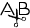 | Text trennen | Trennt Text anhand von Regex in Liste.  **Eingänge:** Text (Text), Regex (Text) [Opt.] **Ausgänge:** Getrennter Text (Text...), Count (32 Bit Ganzzahl)
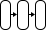 | Text via Dialog speichern | Schaltet folgende Elemente hintereinander: Datei auswählen Dialog -> Text zu Daten -> Daten in Datei schreiben  **Eingänge:** Pfad (Dateipfad) [Opt.], Überschreiben (Wahrheitswert) [Opt.], Text (Text), Charset (Text) [Opt.] **Ausgänge:** /
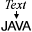 | Text zu Code | Wandelt Text in Quellcode um und Kompiliert den bei Bedarf.  **Eingänge:** Quellcode als Text (Text), Sofort kompilieren (Wahrheitswert) [Opt.] **Ausgänge:** Quellcode (Quellcode)
 | Text zu Daten | Wandelt Text in Rohdaten um. Ist kein Charset angegeben so wird als Standartwert "UTF-8" verwendet.  **Eingänge:** Text (Text), Charset (Text) [Opt.] **Ausgänge:** Data (Rohdaten)
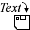 | Text zu Pfad | Wandelt Text in Pfad um.  **Eingänge:** Pfad als Text (Text) **Ausgänge:** Pfad als Pfad (Dateipfad)
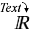 | Text zu Zahl | Wandelt Text in Zahl um.  **Eingänge:** Text (Text) **Ausgänge:** Zahl (Zahl)
 | Text-Länge | Gibt Textlänge weiter.  **Eingänge:** Text (Text) **Ausgänge:** Länge (32 Bit Ganzzahl)
 | Text-Manipulation | Bietet verschiedene Textoperationen an.  **Eingänge:** Text (Text...) **Ausgänge:** Uppercase (Text...), Lowercase (Text...), Trim (Text...)
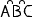 | Texte kombinieren | Dient dazu mehrere Texte zu kombinieren.  **Eingänge:** Text (Text...), Separator (Text) [Opt.] **Ausgänge:** Text (Text)
 | Textsuche | Sucht nach String anhand von Regex.  **Eingänge:** Text (Text), Regex (Text) **Ausgänge:** Index (32 Bit Ganzzahl), Enthält (Wahrheitswert), Beginnt mit (Wahrheitswert), Endet mit (Wahrheitswert)
 | Vector zu Array |   **Eingänge:** Vector (Vektor) [Opt.] **Ausgänge:** Werte (Zahl...), Zeilen (Zahl)
 | Vektor Zeilenanzahl |   **Eingänge:** Vector (Vektor) [Opt.] **Ausgänge:** Anzahl Zeilen (32 Bit Ganzzahl)
 | Vektor aus Matrix | Erstellt aus Zeile(n) oder Spalte(n) von Matrix einen Vektor. Sind mehrere angegeben werden zuerst Spalten-Vektoren dann Zeilen-Vektoren ermittelt.  **Eingänge:** Matrix (Matrix), Spalte (Zahl...) [Opt.], Zeile (Zahl...) [Opt.] **Ausgänge:** Vektor (Vektor...)
 | Vergleichen | Vergleichen von vergleichbaren Werten.  **Eingänge:** A (Zahl), B (Zahl) **Ausgänge:** A < B (Wahrheitswert), A > B (Wahrheitswert), A =< B (Wahrheitswert), A => B (Wahrheitswert), A == B (Wahrheitswert)
 | Verzeichniss erstellen | Falls Name nicht angegeben ist wird nur der Elternpfad erstellt falls dieser nicht existiert.  **Eingänge:** Elternpfad (Dateipfad) [Opt.], Name (Text...) [Opt.] **Ausgänge:** Verzeichnisspfad (Dateipfad)
 | Webcam | Erstellt Kamera-Objekt unter Angabe der Gerätenummer.  **Eingänge:** Geräte Nummer (32 Bit Ganzzahl) [Opt.] **Ausgänge:** Webcam (Kamera)
 | Wurzel | Berechnet die n-te Wurzel von x.   **Eingänge:** x (Zahl), n (Zahl) [Opt.] **Ausgänge:** Resultat (64 Bit Gleitkommazahl)
 | XOR | Logisches XOR. A und B muss die gleiche Länge haben.  **Eingänge:** A (Wahrheitswert...), B (Wahrheitswert...) **Ausgänge:** A ^ B (Wahrheitswert...)
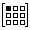 | Zahl aus Matrix |   **Eingänge:** Matrix (Matrix), Spalte (Zahl), Zeile (Zahl) **Ausgänge:** Wert (Zahl)
 | Zahl in Matrix setzen | Erzeugt neue Matrix und setzt in dieser den Wert. Die uhrsprüngliche Matrix bleibt unberührt.  **Eingänge:** Matrix (Matrix), Spalte (32 Bit Ganzzahl), Zeile (32 Bit Ganzzahl), Wert (Zahl) **Ausgänge:** Alter Wert (Zahl), Matrix (Matrix)
 | Zeichen an Position | Gibt Zeichen an bestimmter Position weiter.  **Eingänge:** Text (Text), Positon (32 Bit Ganzzahl) [Opt.] **Ausgänge:** Zeichen (Zeichen)
 | Zeiteinheiten umwandeln | Wandelt zwischen verschiedenen Zeiteinheiten um.  **Eingänge:** Nanosekunden (64 Bit Ganzzahl) [Opt.], Millisekunden (64 Bit Gleitkommazahl) [Opt.], Sekunden (64 Bit Gleitkommazahl) [Opt.], Minuten (64 Bit Gleitkommazahl) [Opt.], Stunden (64 Bit Gleitkommazahl) [Opt.], Tage (64 Bit Gleitkommazahl) [Opt.], Jahre (64 Bit Gleitkommazahl) [Opt.] **Ausgänge:** Nanosekunden (64 Bit Ganzzahl), Millisekunden (64 Bit Gleitkommazahl), Sekunden (64 Bit Gleitkommazahl), Minuten (64 Bit Gleitkommazahl), Stunden (64 Bit Gleitkommazahl), Tage (64 Bit Gleitkommazahl), Jahre (64 Bit Gleitkommazahl)
 | Zeitstempel | Gibt das aktuelle Zeit und Datum weiter.  **Eingänge:** / **Ausgänge:** Datum (Datum), Jahr (32 Bit Ganzzahl), Monat (32 Bit Ganzzahl), Tag (32 Bit Ganzzahl), Stunde (32 Bit Ganzzahl), Minute (32 Bit Ganzzahl), Sekunde (32 Bit Ganzzahl), Millisekunden seit 1970 (64 Bit Ganzzahl), Als Text (Text)
 | Zu Text | Wandelt Objekt in Text um.  **Eingänge:** Objekt (Objekt...) [Opt.] **Ausgänge:** Text (Text)
 | Zufallsgenerator | Generiert zufällige Werte.  **Eingänge:** Min (Zahl) [Opt.], Max (Zahl) [Opt.], Nur Ganzzahlen (Wahrheitswert) [Opt.] **Ausgänge:** Zufallswert (Zahl)
 | Zwischenspeicher | Speichert Werte zwischen zur weiteren Verwendung ausgehend von einem zweiten Element mit der gleichen Kennung.  **Eingänge:** Init (Objekt...) [Opt.], Data (Objekt...) [Opt.], Identifier (SmartIdentifier) **Ausgänge:** Data (Objekt...)
 | neuer Identifier | Erstellt SmartIdentifier. Wenn kein Name angegeben wird, wird ein neuer erstellt.  **Eingänge:** Identifier Name (Text) **Ausgänge:** Identifier (SmartIdentifier), Neu erzeugt (Wahrheitswert), Identifier Name (Text)

## Spezielle Elemente

Icon | Name | Beschreibung
:--- | :---: | :---
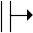 | Ein-Wert | Dieses Element unterscheidet sich dahingehend von "Schnellster Wert" (und auch allen anderen Elementen) dass die Eingänge NICHT angestossen werden.  **Eingänge:** Dynamische Liste von Elementen des Types Objekt... **Ausgänge:** Wert (Objekt...)
 | Für-Alle |   **Eingänge:** Elemente (Objekt...) **Ausgänge:** Element (Objekt)
 | Schnellster-Wert |   **Eingänge:** Dynamische Liste von Elementen des Types Objekt... **Ausgänge:** Wert (Objekt...)
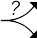 | Wenn-Vor |   **Eingänge:** Objekt (Objekt...) [Opt.], Wahrheitswert (Wahrheitswert) [Opt.] **Ausgänge:** Falls Wahr (Objekt...), Falls Unwahr (Objekt...)
 | Wenn-Zurück |   **Eingänge:** Falls Wahr (Objekt...) [Opt.], Falls Unwahr (Objekt...) [Opt.], Wahrheitswert (Wahrheitswert) **Ausgänge:** Objekt (Objekt...)
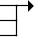 | Zusammenführen |   **Eingänge:** Element (Objekt...) **Ausgänge:** Elemente (Objekt...)

## Kontext Erzeugende Elemente

Icon | Name | Beschreibung
:--- | :---: | :---
 | Bewegungsmelder | Erzeugt bei jeder erkannten Bewegung einen neuen Kontext. Empfindlichkeit muss zwischen 0.0 (nicht empfindlich) und 1.0 (sehr empfindlich). Es ist zu empfehlen sehr kleine Werte wie z.B. 0.0001 zu verwenden Achtung: Es handelt sich hierbei um ein experimentelles Element. Für dieses experimentelle Element gibt es folgende Anmerkung: Kann hohe Auslastung des Hauptspeicher verursachen.  **Eingänge:** Empfindlichkeit (64 Bit Gleitkommazahl) [Opt.], Echtzeitmonitor (Wahrheitswert) [Opt.] **Ausgänge:** Ganzes Bild (Gepuffertes Bild), Aktiver Bereich (Raster)
 | Einfacher Start | Startet genau einen Kontext.  **Eingänge:** / **Ausgänge:** /
 | Funktions-Start | Definiert Funktion in Projekt.  **Eingänge:** ID (SmartIdentifier) **Ausgänge:** Parameter (Objekt...), Token (FunctionCallToken)
 | Timer | Startet Kontext zeitverzögert.  **Eingänge:** Zeit in ms (64 Bit Ganzzahl) [Opt.], Zeit in s (32 Bit Ganzzahl) [Opt.], Wiederholen (Wahrheitswert) [Opt.], Maximum Wiederh. (64 Bit Ganzzahl) [Opt.] **Ausgänge:** /
 | Wiederholen | Startet wiederhollt Kontexte bis i eine bestimmte Grösse erreicht hat. der Jeweils nächste Kontext wird erst gestartet wenn der jeweils vorhergehende terminiert ist.  **Eingänge:** Start i (64 Bit Ganzzahl) [Opt.], Solange i< (64 Bit Ganzzahl) [Opt.], Check I. in ms. (64 Bit Ganzzahl) [Opt.] **Ausgänge:** i (64 Bit Ganzzahl)