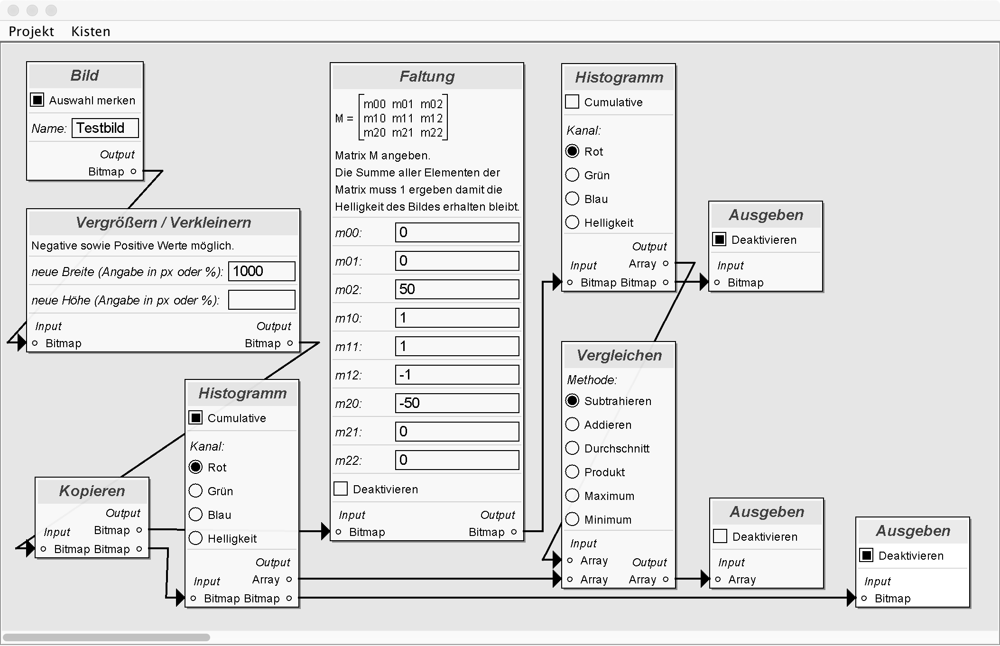

# Einleitung

## Fragestellung / Problemstellung

2016 habe ich unter dem Namen [*EditorPanel*](https://github.com/colbach/EditorPanel) eine Software für eine grafische "Blueprint"-artige Editierung von Bildern entwickelt. 

Prinzipiell war dieses Projekt ein erfolg und hat mich vom Potential dieses Konzeptes überzeugt, jedoch hat es mir auch aufgezeigt wo die Grenzen dieses Konzeptes lagen und hat mich zu Überlegungen angeregt ob und wie dieses verbessert werden kann..

Das offensichtliche Problem von *EditorPanel* ist dass es keinerlei Art von Kontrollstrukturen unterstützt.

Um Herauszufinden wie sich solche am besten in mein Projekt integrieren kann habe ich mir hierzu verwandte Konzepte der grafischen Programmierung wie unter anderem *Unreal Blueprints*, *Lego Mindstorms Software*, *LabVIEW* und *App Inventor* angeschaut. Bei allen diesen grafischen Konzepten gibt es zwei Probleme an welchen ich mich störe. Einerseits habe diese System meistens die Eigenschaft entweder ein sehr spezielles Anwendungsgebiet zu haben oder andererseits zu nah an der klassischen – textbasierten – Programmierung sein und eigentlich nur eine grafische Betrachtung und Editierung dieser bereit zustellen.

## Zielsetzung

Ziel meiner Arbeit ist es ein alternatives, einfach zu bedienen, einfach zu erweiterndes und allgemein gehaltenes grafisches Programmierkonzept zu entwickeln.

## Konzept

## Einsatzbereiche

Das Einsatzgebiet soll bewusst offen gehalten werden. Jedoch gibt es bestimmte Bereiche bei welcher ich mir die Verwendung gut vorstellen kann.

- Bildverarbeitung
- Mathematische Berechnungen
- Überwachungstechnik
- Programmierung von Geräten für das *Internet der Dinge*

## Planung