# Benutzerhandbuch

## Einrichtung
## Verwendung als Endnutzer
### Begriffe
### Funktionsweise

#### Grundsätzlicher Aufbau

#### Ein-/Ausgänge

Ein-/Ausgänge bestehen jeweils aus einem Namen und einem Datentyp.

##### Virtuelle Ein-/Ausgänge

Virtuelle Ein-/Ausgänge sind Ein-Ausgänge welche von den Elementen selbst nicht vorgesehen sind und nur von der Umgebung unterstützend verwendet werden.

Konkret gibt es drei Arten von virtuellen Eingängen:

- copy (nur Ausgang): Diese Ausgänge ermöglichen es Daten an mehrere Elemente zu übergeben ohne diese neu berechnen zu müssen. Diese Ausgänge sind bei allen nicht virtuellen Ausgänge verfügbar.
- append (nur Eingang): Diese Eingänge ermöglichen es Daten welche an einem Eingang eingehen sollen aus mehreren Ausgängen zusammenzusetzen. Diese Eingänge sind nur bei nicht virtuellen Eingängen welche Listen akzeptieren.
- Auslöser (Ein- und Ausgang): Dieser Eingang oder Ausgang dient nur dazu ein vorhergehendes oder nachfolgendes Element anzustossen. Es werden keine Daten angenommen oder weitergereicht.

##### Optionale und nicht optionale Eingänge

Eingänge sind optional wenn sie nicht verbunden werden müssen damit ein Element funktionieren kann. Anstelle von Eingangsdaten greift das Element in diesem Fall auf Standardwerte oder dynamisch generierte Werte zurück so dass es nicht zu einem Fahler kommt.

##### Dynamische Eingänge

Dynamische Eingänge sind Eingänge welche sich dynamisch hinzu schalten wenn die Eingänge davor verbunden werden. Anzumerken hierzu ist dass es sich bei dynamischen Eingängen logischerweise immer auch um optionale Eingänge handelt auch wenn in der UI nicht gesondert darauf hingewiesen wird.

#### Datentypen

Datentypen bestehen jeweils aus einer aus (Java) Basisklasse/Interface und einer Angabe ob es sich um einen Listen-Datentypen handelt.

Datentypen werden wie folgenden zwei Teilen zusammen:
1. (Evtl. übersetzter) Klassenname
2. "..." falls es sich um einen Listen-Datentyp handelt oder "" (leer) falls nicht.

Beispiele für korrekte Bezeichnungen:

* Matrix (Instanz des eigenen Interface `reflection.customdatatypes.math.Matrix`)
* Text... (Array von Instanzen der Klasse `java.lang.String`)
* Vektor... (Array von Instanzen des eigenen Interface `reflection.customdatatypes.math.Vector`)
* Farbe (Instanz der Klasse `java.awt.Color`)
* 64 Bit Ganzzahl (Instanz der `Klasse java.lang.Long`)
* Zahl... (Array von Instanzen des Interface `java.lang.Number`)

Folgende Basisklassen/Interfaces werden jeweils als Datentyp für einen einzelnen Wert sowie als Listen-Datentypen verwendet:

- "Wahrheitswert" (Basierend auf: `java.lang.Boolean`)
- "Text" (Basierend auf `java.lang.String`)
- "Zeichen" (Basierend auf `java.lang.Character`)
- "Zahl" (Basierend auf `java.lang.Number`)
- "8 Bit" Ganzzahl (Basierend auf `java.lang.Byte`)
- "16 Bit" Ganzzahl (Basierend auf `java.lang.Short`)
- "32 Bit" Ganzzahl (Basierend auf `java.lang.Integer`)
- "64 Bit" Ganzzahl (Basierend auf `java.lang.Long`)
- "32 Bit" Gleitkommazahl (Basierend auf `java.lang.Float`)
- "64 Bit" Gleitkommazahl (Basierend auf `java.lang.Double`)
- "Datum"(Basierend auf `java.util.Date`)
- "Farbe" (Basierend auf `java.awt.Color`)
- "Objekt" (Basierend auf `java.lang.Object`)
- "Funktion" (Basierend auf `reflection.​customdatatypes.Function`)
- "Bild" (Basierend auf `java.​awt.Image`)
- "Gepuffertes Bild" (Basierend auf `java.​awt.BufferedImage`)
- "Rohdaten" (Basierend auf `reflection.​customdatatypes.​rawdata.RawData`)
- "Gelesene Rohdaten" (Basierend auf `reflection.​customdatatypes.​rawdata.RawDataFromFile`)
- "Empfangene Rohdaten" (Basierend auf `reflection.​customdatatypes.​rawdata.RawDataFromNetwork`)
- "Pfad" (Basierend auf `java.​nio.​file.Path`)
- "Dateipfad" (Basierend auf `java.​ni.​File`)
- "Kamera" (Basierend auf `reflection.customdatatypes.camera.​Camera`)
- "Raster" (Basierend auf `reflection.customdatatypes.BooleanGrid`)
- "Matrix" (Basierend auf `reflection.customdatatypes.math.Matrix`)
- "Vektor" (Basierend auf `reflection.customdatatypes.math.Vector`)
- "Mathematisches Object" (Basierend auf `reflection.customdatatypes.math.MathObject`)
- "Quellcode" (Basierend auf `reflection.customdatatypes.SourceCode`)

Im folgenden werden die Datentypen Text, Zeichen, 8/16/32/64 Bit Ganzzahl sowie 32/64 Bit Gleitkommazahl als *Primitive Datentypen* bezeichnet.

Ein weiter jedoch nicht als Listen-Datentyp verwendbarer Datentyp ist der Void-Datentyp welcher sich auf der Klasse `java.​lang.Void` basiert. Dieser Datentyp wird im allgemeinen nur verwendet um Elemente anzustossen ohne diesen Jedoch Daten zu über geben.

#### Kompatibilität von Ein-/Ausgängen

Ein Ausgang ist im einfachsten Fall zu einem Eingang kompatibel wenn sein Datentyp sich auf die gleiche Basisklasse bezieht wie der Datentyp des Eingangs. Hierbei stellt es in erster Instanz keine Rolle ob es sich bei den Datentypen um Listen-Datentypen oder nicht.

Jedoch können Ein-/Ausgängen mit unterschiedlichen Basisklassen unter bestimmten Situationen trotzdem kompatibel zu einander sein.

##### Fall 1:

Die Basisklasse des Ausgangs ist eine Ableitung von der Basisklasse des Eingangs. Dies ist der unproblematischste Fall da es in diesem Fall nie zu einem Laufzeit-Fehler kommen kann. Instanzen einer Klasse welche von einer anderen zweiten Klasse abgeleitet sind de facto auch Instanzen dieser zweiten Klasse.

##### Fall 2:

Die Basisklasse des Eingangs ist eine Ableitung von der Basisklasse des Ausgangs. Dies ist der problematischste Fall. Je nach Situation können Daten welche von Ausgängen kommen welche sich auf eine Oberklasse einer zweiten Klasse bezieht auch Instanzen dieser zweiten Klasse sein. Dies is insbesondere dann der Fall wenn ein Ausgang den sehr allgemeinen Typ Objekt oder Object... besitzt. In diesem Fall ist es als Benutzer wichtig zu beachten welche Daten von einem Ausgang erwartet werden.

##### Fall 3:

In bestimmten Fällen wird zur Erhöhung der Kompatibilität eine automatische Konvertierung durchgeführt. In diesen Fällen können Ein-/Ausgänge komplett unterschiedlicher Typen trotzdem kompatibel zu einander sein.

In folgenden Fällen ist dies der Fall:

- Der Eingang oder der Ausgang hat als Datentyp den Void-Datentyp.
- Der Eingang und der Ausgang haben als Datentyp jeweils einen Primitive Datentypen.
- Der Eingang hat den Datentyp "Text" und der Ausgang hat den Datentyp "Objekt".
- Der Eingang hat den Datentyp "Dateipfad" und der Ausgang hat den Datentyp "Text" oder umgekehrt.
- Der Eingang hat den Datentyp "Pfad" und der Ausgang hat den Datentyp "Text" oder umgekehrt.
- Der Eingang hat den Datentyp "Pfad" und der Ausgang hat den Datentyp "Dateipfad" oder umgekehrt.
- Der Eingang hat den Datentyp "Mathematisches Objekt" Bzw. leitet von der dessen Basisklasse ab und der Ausgang hat den Datentyp Zahl Bzw. leitet von der dessen Basisklasse ab oder umgekehrt.

#### Kontexte

Ein Kontext stellt eine Umgebung dar in welcher Elemente ausgeführt werden und Daten weiter gereicht werden können. In einem Kontext wird ein Element nie oder oder genau einmal ausgeführt. Dies bedeutet soll ein Ablauf wiederholt werden müssen mehrere Kontexte erzeugt werden. Kontexte können terminieren müssen dies jedoch nicht. Ein Kontext gilt als terminiert wenn sich keine aktiven Elemente mehr in diesem befinden.

Innerhalb eines Kontextes können Elemente *angestossen* werden. Angestossene Elemente versuchen von ihrem Zustand 1 in den Zustand 5 kommen (Siehe Abschnitt *Zustände von Elementen*). Elemente welche sich bereits in einem Zustand grösser 1 befinden ignorieren diese Aufforderung.

Liefern Elemente Daten über ihre Ausgänge weiter so werden diese innerhalb des Kontextes gespeichert und stehen zum Abruf durch ein mit diesem Ausgang verbunden Eingang bereit. Treffen Daten von einem Ausgang ein werden automatisch alle Elemente angestossen welche mit ihren Eingängen an diesem Ausgang verbunden sind.

#### Zustände von Elementen

Es gibt fünf Zustände in welchen sich Elemente befinden können:  

Zustand 1 *Nicht ausgeführt* (inaktiv)  
Zustand 2 *Warten* (aktiv)  
Zustand 3 *Arbeiten* (aktiv)  
Zustand 4 *Ausliefern* (aktiv)  
Zustand 5 *Terminiert* (inaktiv)  

Der Zustand eines Elementes betrifft immer nur einen bestimmten Kontext. Ein Element kann sich beispielsweise in einem Kontext im Zustand 2 und gleichzeitig in einem anderen Kontext im Zustand 4 befinden. Zustände können immer nur von Zustand 1 nach Zustand 5 durchlaufen werden (Zustände dürfen übersprungen werden). Ein Element bewegt sich nie in einen Vorherigen Zustand zurück. Ein Element gilt in einem Kontext als aktiv wenn es sich in diesem Kontext im Zustand 2, 3 oder 4 befindet.

#### Elemente

Elemente bestehen jeweils aus einem Namen, einem Icon, einer Beschreibung, einer Liste von Eingängen und einer Liste von Ausgängen.

Es gibt drei verschiedene Arten von Elementen: *Einfache Elemente*, *Spezielle Elemente* und *Kontext Erzeugende Elemente*

Im folgenden gehe ich nur auf bestimmte – wichtige – Elemente ein. Eine vollständige Liste aller implementierter Elemente entnehmen sie dem Anhang *Vollständige Liste der Implementierten Elemente*.

##### Einfache Elemente

Diese Elemente finden am häufigsten Verwendung. Sie repräsentieren Tätigkeiten welche abgearbeitet werden so dass dann fortgefahren werden kann. Alle diese Elemente terminieren (durch Erfolg oder durch Abbruch bei einem Fehler). Die Ausführung dieser Elemente ist jeweils einem bestehendem Kontext zugeordnet.

Einfache Elemente gehen hierbei in 4 Schritten vor:

1. Anstossen aller vorhergehenden Elementen (an Eingängen verbunden). (Zustand 2)
2. Warten bis die Daten aller Eingänge im Kontext abrufbar sind.
3. Abarbeiten ihrer spezifischen Tätigkeit mit den Daten an den Eingängen als Parameter. (Zustand 3)
4. Liefern der Daten an alle Verbunden Ausgänge. (Zustand 4)

##### Spezielle Elemente

Diese Elemente verhalten sich prinzipiell wie einfache Elemente haben jedoch immer jeweils eine Eigenschaft welche diese von diesen unterscheidet so dass diese von der Ausführungsumgebung gesondert behandelt werden. Um die Funktionsweise dieser speziellen Elemente zu verstehen ist es nötig diese im einzeln zu betrachten.

Element *Wenn-Vor*:

1. Anstossen aller vorhergehenden Elementen (an Eingängen verbunden). (Zustand 2)
2. Warten bis die Daten aller Eingänge im Kontext abrufbar sind. (Zustand 2)
3. Liefern der Daten von Eingang "Objekt" an Ausgang "Falls Wahr" falls an Eingang "Wahrheitswert" `true` anliegt und an Ausgang "Falls Unwahr" sonst. (Zustand 4, Zustand 3 übersprungen)

Element *Wenn-Zurück*:

1. Anstossen des vorhergehenden Element von Eingang "Wahrheitswert". (Zustand 2)
2. Anstossen des vorhergehenden Element von Eingang "Falls Wahr"  falls an Eingang "Wahrheitswert" `true` anliegt und Anstossen des vorhergehenden Element von Eingang "Falls Unwahr"" sonst. (Zustand 2)
3. Liefern der Daten an verbunden Ausgang "Objekt". (Zustand 4, Zustand 3 übersprungen)

Element *Schnellster Wert*:

1. Anstossen aller vorhergehenden Elementen (an Eingängen verbunden). (Zustand 2)
2. Warten bis die Daten **eines Eingang** im Kontext abrufbar sind. (Zustand 2)
3. Liefern der Daten dieses Eingangs an verbunden Ausgang "Wert". (Zustand 4, Zustand 3 übersprungen)

Element *Ein Wert*:

1. Warten bis die Daten **eines Eingang** im Kontext abrufbar sind (die vorhergehenden Elemente werden nicht angestossen). (Zustand 2)
2. Liefern der Daten an verbunden Ausgang "Wert". (Zustand 4, Zustand 3 übersprungen)

Element *Für Alle* und *Zusammenführen*:

Diese Elemente gehören zusammen. Das Vor *Für Alle*-Element teilt eine Liste in ihre einzelnen Elemente auf und erzeugt für jedes einen eigenen Kontext um diese abzuarbeiten. Das Zusammenführen-Element wiederum führt diese Elemente wieder zusammen auf den ursprünglichen Kontext.

##### Kontext Erzeugende Elemente

Kontext Erzeugende Elemente dienen dazu Kontexte zu erzeugen. Ihre Ausführung kann, muss jedoch nicht terminieren. Die Ausführung dieser Elemente ist jeweils einem eigenen Kontext zugeordnet welcher nur dazu dient diese und evtl. vorhergehende Elemente am Laufen zu halten.

Kontext Erzeugende Elemente gehen hierbei in folgenden Schritten vor.

1. Anstossen aller vorhergehenden Elemente in innerhalb von ihrem eigenen Kontext. (Zustand 2)
2. Warten bis die Daten aller Eingänge in ihrem eigenen Kontext abrufbar sind. (Zustand 2)
3. Starten der eigenen Tätigkeit.
4. Starten von Kind-Kontexten und Übergabe von Daten an die über die Ausgänge verbunden Elemente innerhalb von den Kind-Kontexten.
5. Schritt 4 beliebig oft (nie, einmal oder mehrmals) wiederholen.

### Beispiele

#### FritzBuzz

### Benutzerinterface

#### Übersicht Hauptfenster

#### Zustände Hauptfenster

Grundlegend unterscheidet das Benutzerinterface des Hauptfensters zwischen folgenden Zuständen:

Zustand | Beschreibung | Kontextmenüs | Zusätzliche Informationen
:---: | :--- | :---:  | :---:
1a | Projekt wird nicht ausgeführt | Ja | Ja
1b | Projekt wird nicht ausgeführt und es wird Verbindung zwischen Elementen gezogen | Nein | Ja
1c | Projekt wird nicht ausgeführt und Overlay um Elemente zu verbinden ist geöffnet | Nein | Ja
1d | Projekt wird nicht ausgeführt, Overlay um Elemente zu verbinden ist geöffnet und es wird Verbindung zwischen Ein-/Ausgängen gezogen | Nein | Ja1
2 | Projekt wird ausgeführt | Nein | Nein
2x | Projekt wird nicht mehr ausgeführt | Nein | Nein
3a | Projekt wird ausgeführt mit Debugger | Nein | Ja2 
3b | Projekt wird ausgeführt mit Debugger und Element wird eingesehen  | Nein | Ja2
3x | Projekt wird nicht mehr ausgeführt mit Debugger| Nein | Nein

1: Entspricht Informationen von Zustand 1c.

2: Anstelle von einer Information darüber welche Möglichkeiten der Benutzer gerade hat werden Informationen über die Zustände der einzelnen Elemente im Debugger angezeigt.

Je nach Zustand stellt das Benutzerinterface andere Funktionen zur Funktionen und stellt andere Informationen dar. Zu beachten ist dass die in der Tabelle beschriebenen Zustände **nur** das Hauptfenster betreffen und andere Fenster von diesen nicht Beeinflusst werden.

#### Toolbar Hauptfenster

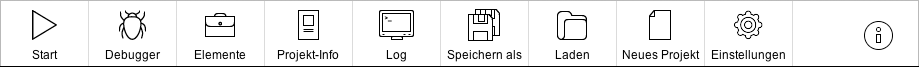

Die Toolbar stellt dem Benutzer dynamisch Funktionalitäten zur Verfügung. Je nach Zustand der Benutzeroberfläche werden unterschiedliche Einträge dargestellt. Auch ist es je nach Eintrag möglich dass Untereinträge dargestellt werden, diese können Mittels einem *Verlassen*-Eintrag wieder geschlossen werden können womit der Benutzer wieder zur vorherigen Ansicht zurück gelangt.

Welche Einträge in der Toolbar angezeigt werden entscheidet sich hauptsächlich daran in welchem Zustand das Benutzerinterface sich gerade befindet.

Folgende Einträge werden in der Toolbar angezeigt: 

Icon | Name | Sichtbare Zustände | Beschreibung | Besonderheit
:---: | :---: | :---: | :--- | :---
 | Start | 1a, 1b, 1c, 1d | Startet Ausführung von aktuellem Projekt. |
 | Elemente | 1a, 1b, 1c, 1d | Öffnet Auswahlfenster für neue Elemente. |
 | Projekt-Info | 1a, 1b, 1c, 1d |  Zeigt Informationen zum Aktuellen Projekt an. |
 | Konsole / Log | 1a, 1b, 1c, 1d, 2, 2x, 3a, 3b, 3x (Jeder Zustand)| Öffnet Fenster für System Ein-/Ausgaben. | Je nachdem ob der Prompt aktiviert ist wird hier Konsole (aktiver Prompt) oder Log (Kein Prompt) angezeigt
 | Speichern | (1a)2, (1b)2, (1c)2, (1d)2 | Speichert aktuelles Projekt unter dem aktuellen Pfad. | Wird nur angezeigt wenn Projekt nicht bereits gespeichert ist.
 | Speichern als | 1a, 1b, 1c, 1d | Speichert aktuelles Projekt über Auswahl Dialog unter einem neuen Pfad. |
 | Laden | 1a, 1b, 1c, 1d | Öffnet bestehendes Projekt über ein Auswahl Dialog. |
 | Neues Projekt | 1a, 1b, 1c, 1d | Legt neues Projekt an. Falls aktuelles Projekt nicht gespeichert ist wird nachgefragt ob und wohin dieses gespeichert werden soll. |
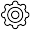 | Einstellungen | 1a, 1b, 1c, 1d | Öffnet Enstellungs-Fenster. |
 | Debugger | 1a, 1b, 1c, 1d | Stellt Funktionen des Debuggers zur Verfügung und zeigt folgende Untereinträge an: Debug, Breakpoint Auslöser, Monitor, Log. |
 | Debug | (1a)1, (1b)1, (1c)1, (1d)1 | Startet Ausführung von aktuellem Projekt mit aktivierten Debugger. |
 | Monitor | 3a, 3b | Öffnet Monitoring-Fenster. | 
 | Breakpoint Auslöser | (1a)1, (1b)1, (1c)1, (1d)1, 3a, 3b | Stellt eine Reihe von Toogle-Einträge zur Verfügung. | 
 | Breakpoint Auslöser: Neuer Prozess |  1a, 1b, 1c, 1d, 3a, 3b | Entscheidet ob Breakpoint bei neuem Prozess ausgelöst werden soll. | Toogle-Eintrag, Untereintrag von Breakpoint Auslöser
 | Breakpoint Auslöser: Vorbereiten | (1a)1, (1b)1, (1c)1, (1d)1, (3a)1, (3b)1 | Entscheidet ob Breakpoint bei Zustandswechel zu "Vorbereiten" ausgelöst werden soll | Toogle-Eintrag, Untereintrag von Breakpoint Auslöser
 | Breakpoint Auslöser: Sammeln | (1a)1, (1b)1, (1c)1, (1d)1, (3a)1, (3b)1 | Entscheidet ob Breakpoint bei Zustandswechel zu "Sammeln" ausgelöst werden soll | Toogle-Eintrag, Untereintrag von Breakpoint Auslöser
 | Breakpoint Auslöser: Arbeiten | (1a)1, (1b)1, (1c)1, (1d)1, (3a)1, (3b)1 | Entscheidet ob Breakpoint bei Zustandswechel zu "Arbeiten" ausgelöst werden soll | Toogle-Eintrag, Untereintrag von Breakpoint Auslöser
 | Breakpoint Auslöser: Ausliefern | (1a)1, (1b)1, (1c)1, (1d)1, (3a)1, (3b)1 | Entscheidet ob Breakpoint bei Zustandswechel zu "Ausliefern" ausgelöst werden soll | Toogle-Eintrag, Untereintrag von Breakpoint Auslöser
 | Breakpoint Auslöser: Beendet | (1a)1, (1b)1, (1c)1, (1d)1, (3a)1, (3b)1 | Entscheidet ob Breakpoint bei Zustandswechel zu "Beendet" ausgelöst werden soll | Toogle-Eintrag, Untereintrag von Breakpoint Auslöser
 | Stop | 2, 3a, 3b | Bricht Ausführung von Projekt ab. | 
 | Schritt | 3a, 3b | Schritt bis zum nächsten Auslöser (nächstes Element, unabhängig davon ob dieses einen gesetzten Breakpoint hat)  | Eine Besonderheit hierbei ist dass Schritt auch ausgelösst werden kann ohne dass gerade gehalten wird.
 | Fortsetzen | (3a)2, (3b)2 | Fortsetzen bis zum nächsten Breakpoint. | Nur sichtbar wenn gerade an Breakpoint gehalten wird.
 | Weiter ohne Debugger | (3a)2, (3b)2 | Fortsetzen ohne am nächsten Breakpoint zu halten. | Nur sichtbar wenn gerade an Breakpoint gehalten wird.
 | Weiter mit Debugger | (3a)2, (3b)2 | Deaktiviert Debugger temporär. | Nur sichtbar wenn gerade Debugger deaktiviert ist.
 | Bericht | 2x, 3x | Öffnet Fenster mit Bericht über gerade beendete Ausführung. |
 | Fertig | 2x, 3x | Führt von Zustand 2x oder 3x wieder in Zustand 1 |

1 Als Untereintrag.

2 Situationsbedingt.

#### Arbeitsfläche Hauptfenster

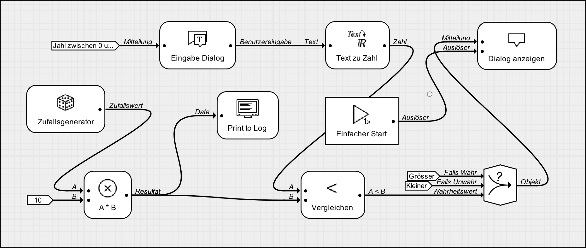

Auf der Arbeitsfläche befinden sich alle aktuell im Projekt platzierte und damit aktive Elemente und es wird dargestellt wie diese miteinander verbunden sind. 

Elemente auf der Arbeitsflächte können beliebig verschoben werden. Bewegt sich ein Element rechts oder unten über die Arbeitsfläche hinaus erweitert sich diese dynamisch. 

Um Elemente miteinander zu verbinden muss ein Element mit gedrückter CTRL-Taste auf ein anderes Element gezogen werden. Auf diese Aktion hin öffnet sich das Verbindungs-Overlay um diese beiden Elemente miteinander zu verbinden.

Durch das Klicken auf einen freien Bereich auf der Arbeitsfläche wird diese Stelle als *Target-Position* festgelegt. Die *Target-Position* definiert den Ort an welchem neue Elemente angelegt werden.

#### Verbindungs-Overlay Hauptfenster

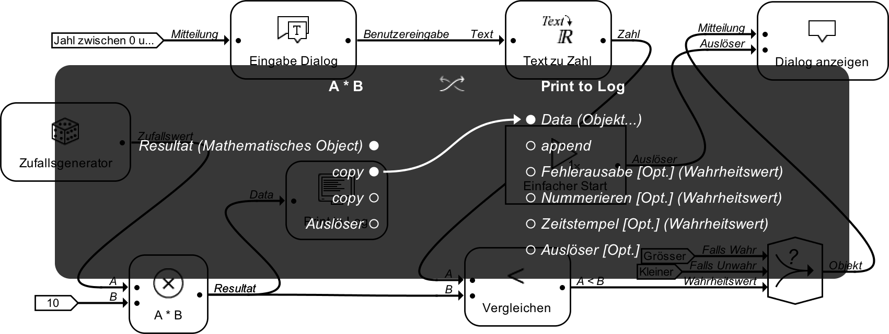

Werden auf der Arbeitsfläche zwei Elemente mit gedrückter CTRL-Taste auf einander gezogen erscheint das Verbindungs-Overlay. Auf dem Verbindungs-Overlay sieht man welche Ausgänge mit welchen Eingängen verbunden werden können. Hierbei gibt die Kennzeichnung [Opt.] an dass es sich bei diesem Eingang um einen optionalen Eingang handelt und die Kennzeichnung [Dyn.] gibt an dass es sich um einen dynamisch hinzugefügten Eingang handelt. Ausserdem ist hinder der Bezeichnung für den Ein-/Ausgang zusätzlich angegeben welchen Typ diese Ein-/Ausgang besitzt.

Auf der linken Seite befinden sich die Ausgänge des Elementes von welchem aus die Verbindung gezogen wurde (Von-Element) und auf der Rechten Seite befinden sich die Eingänge des Elementes auf welches die Verbindung gezogen wurde (Zu-Element). Um dies umzukehren, also das Zu-Element und Von-Element zu vertauschen befindet sich ein Button  in der Mitte zwischen den beiden Elementen. Ein-/Ausgänge welche mit einem ausgefülltem Kreis  gekennzeichnet sind bereits verbunden und Aus-/Eingänge welche mit einem nicht ausgefülltem Kreis  gekennzeichnet sind noch nicht verbunden. 

Um ein Ausgang mit einem Eingang zu verbinden muss eins von den beiden auf das jeweils andere gezogen werden. Falls ein Ein-/Ausgänge bereits eine Verbindung besitzt wird diese automatisch verworfen wenn eine neue Verbindung erstellt wird. Werden zwei Ein-/Ausgänge mit einander verbunden welche nicht kompatibel zu einander sind wird eine Fehlermeldung angezeigt.

Um Verbindungen nur zu entfernen reicht es einen einfachen Klick auf den Namen des Ein-/Ausgänge auszuführen. Die Verbindung wird daraufhin verworfen und Direkte Eingabe Elemente gegebenenfalls automatisch entfernt.

#### Kontextmenüs Hauptfenster

Es gibt 2 verschiedene Arten von Kontextmenüs. Einträge in Kontextmenüs können Untermenüs haben.

##### Auf Arbeitsfläche

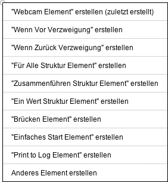

Dieses Kontextmenü zeigt eine Auswahl von Elementen an welche erstellt werden können. Hierbei ist das erste immer das zuletzt erstellte Element. Der letzte Eintrag öffnet ein Auswahlfenster mit allen zur Verfügung stehenden Elementen.

##### Auf Element

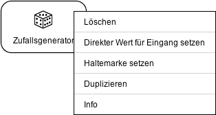

<!---
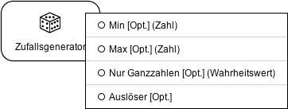
--->

Dieses Kontextmenü zeigt eine Auswahl von Funktionen betreffend diesem Element.

##### Anzeige von zusätzlichen Informationen im Hauptfenster

Situationsbedingt werden zusätzliche Informationen in der unteren rechten oder linken Ecke angezeigt. Diese Informationen dienen in erster Linie dazu auf Dinge hinzuweisen welche nicht intuitiv erkennbar sind (Bsp. Tasten welche zusätzlich gedrückt werden können).

##### Anzeige von Meldungen im Hauptfenster

Meldungen über erfolgreiche oder fehlgeschlagene Operationen betreffend des Hauptfensters werden an der unteren Kante angezeigt. Meldungen lassen sich durch das Drücken der ESC-Taste schliessen.

### Auswahlfenster für Elemente

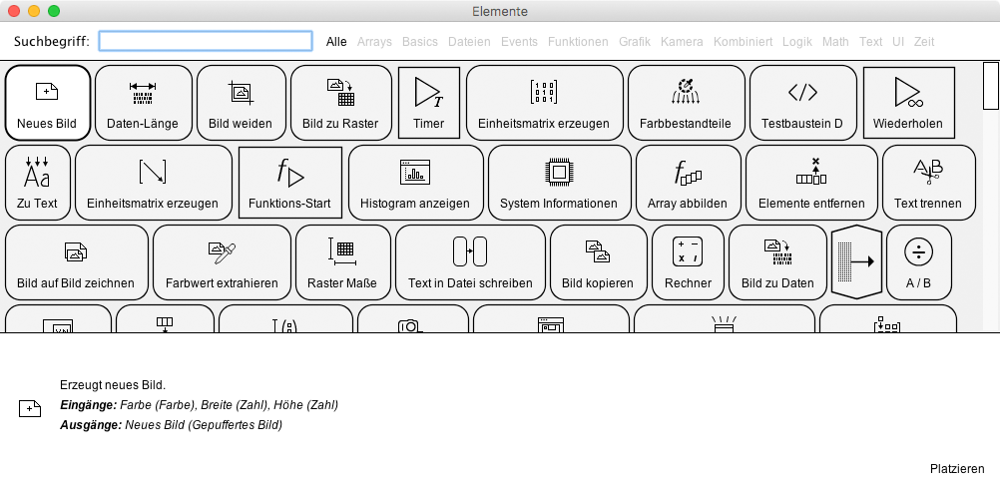

Über den Toolbar-Eintrag "Elemente" oder den Kontextmenü-Eintrag "Anderes Element erstellen" lässt sich das Auswahlfenster für neue Elemente öffnen. In diesem werden alle verfügbaren Elemente, unterteilt in Kategorien, angezeigt. Hierbei ist zu beachten dass Elemente keiner, einer oder mehreren Kategorien zugeteilt sein können. Um Elemente ausserdem besser zu finden gibt es zusätzlich ein Eingabefeld für Suchbegriffe. Hierbei funktionieren Suchbegriffe wie Filter. Elemente bei welchen in der Beschreibung oder in deren Tags keins der Worte vorkommen nach welchen gesucht wird werden nicht angezeigt.

Beim einfachen Klick auf eines der angezeigten Elemente öffnet sich am unteren Rand ein Beschreibungsfeld in welchem Informationen bezüglich dieses Elements dargestellt werden.

Um ein Element auf der Arbeitsfläche zu platzieren gibt es zwei Möglichkeiten. Zum einen kann der Benutzer ein Doppelklick auf eines der Elemente aufführen. Dieser bewirkt dass das Auswahlfenster geschlossen und das Element an der angegebenen *Target-Position* angelegt wird.
Alternativ kann der Benutzer den "Platzieren"-Button am unteren rechten Rand verwenden. Dieser bewirkt dass das Element an der *Target-Position* angelegt wird, das Auswahlfenster jedoch nicht geschlossen wird.

### Fenster für System Ein-/Ausgaben (*Konsole*)

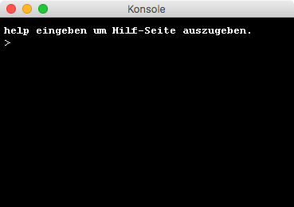

Für den einfachen Zugriff auf Ein-/Ausgaben welche dem Benutzer von grafischer Software normalerweise verborgen bleiben gibt es ein eigenes Konsolen-Fenster. Dieses lässt sich über den Toolbar-Eintrag "Konsole" / "Log" (je nachdem ob der Prompt aktiviert ist) öffnen.
In diesem Fenster werden alle Java-eigenen Ein-/Ausgaben angezeigt. Wenn der Prompt in den Eistellungen aktiviert ist lassen sich hier auch Eingaben für die interne Kommandozeile tätigen.

### Berichte

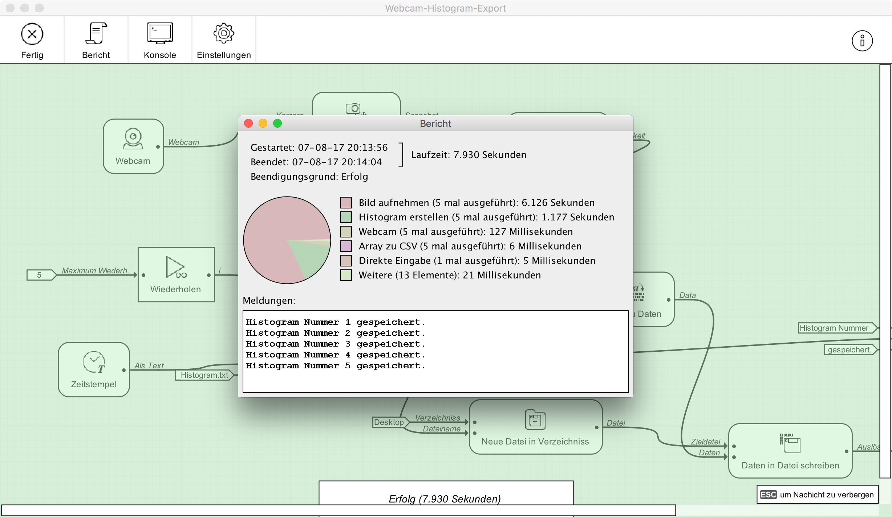

Nach erfolgreicher oder nicht erfolgreicher Ausführung eines Projektes hat der Benutzer die Möglichkeit sich einen Bericht anzeigen zu lassen. 

Folgende Informationen sind in diesem Bericht enthalten:

- Startzeit
- Endzeit
- Laufzeit
- Meldungen
- Übersicht der Elemente welche am längsten Ausgeführt wurden mit passendem Tortendiagramm.

### Debugger

#### Haltemarken und Auslöser

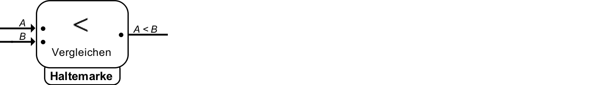

Haltemarken und gesetzte Auslöser entscheiden darüber ob und wann eine Projektausführung angehalten wird. Haltemarken können an alle Elemente gehängt werden welche selbst keine Kontexte erzeugen. Auslöser, also Zustandswechsel welche ein Halten auslösen, werden über die entsprechenden  Einträge in der Toolbar festgelegt.

#### Kennzeichnungen

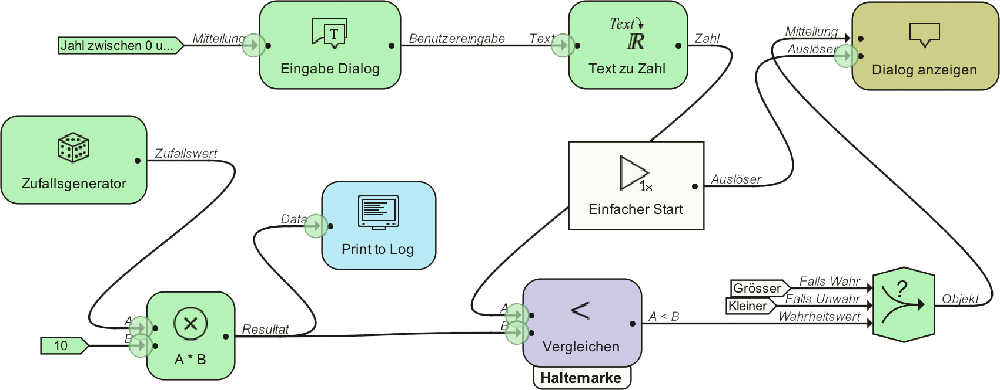

##### Farbliche Kennzeichnungen

Durch die Hintergrundfarbe der Elemente ist es für den Benutzer ersichtlich welchen Zustand jedes Element momentan besitzt. Hierbei ist darauf zu achten dass Elemente in verschiedenen Kontexten verschiedene Zustände haben können

##### Kennzeichnung von belieferten Eingängen 

Eingänge welche bereits beliefert sind, sind mit grünen Kreisen markiert.

#### Inspect-Overlay

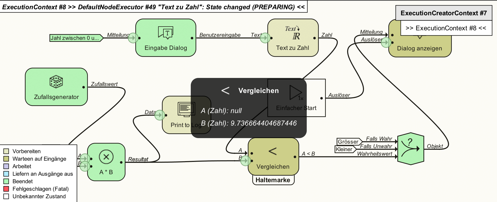

Während der Laufzeit besteht die Möglichkeit einzelne Elemente zu inspizieren. Durch einfaches Klicken auf ein Element öffnet sich das Inspect-Overlay, in diesem wird angezeigt welche Daten an den jeweiligen Eingängen dieses Elementes bereits angekommenen sind. Hierbei zu beachten dass Elemente je nach Kontext verschiedene Daten an ihren Eingängen bekommen. Vorher ist es also ratsam sich zu vergewissern dass man in der Kontext-Übersicht den gewünschten Kontext gewählt hat.

#### Kontext-Übersicht

Die Kontext-Übersicht ermöglicht es zu sehen welche Kontexte aktuell aktiv sind und erlaubt es zwischen diesen zu wechseln. Der Kontext welcher aktuell betrachtet wird, wird mit einem hellen Hintergrund hervorgehoben. Durch Klicken lässt sich dieser Kontext wechseln.

Falls ein Kontext aktuell ein Halten ausgelöst hat ist mit \>> << gekennzeichnet.

#### Monitor-Fenster

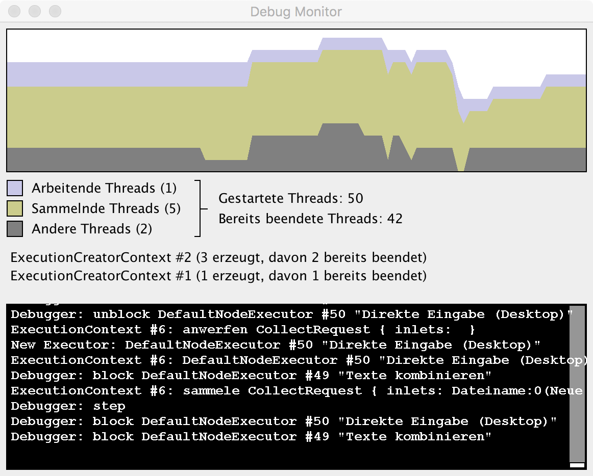

Ein weiteres Werkzeug das aktuelle Projekt zu debuggen bietet das Monitor-Fenster. Hier werden zusätzliche Informationen zur Laufzeit sowie ein Log der Debugger-Ereignisse angezeigt.

### Direkte Eingaben

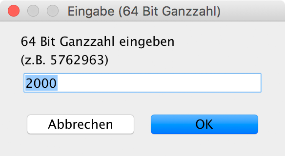

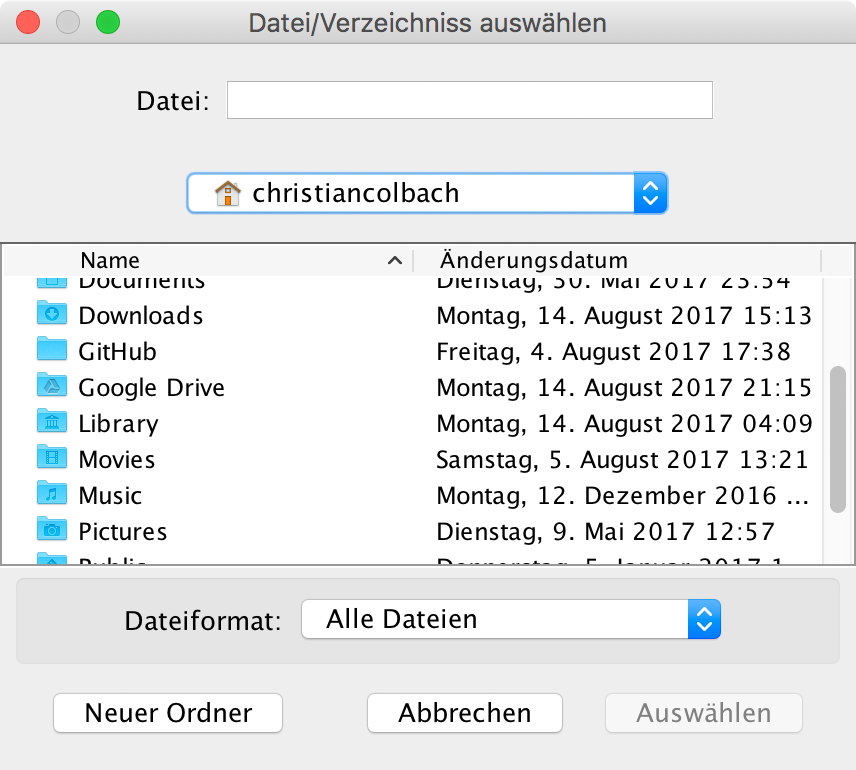

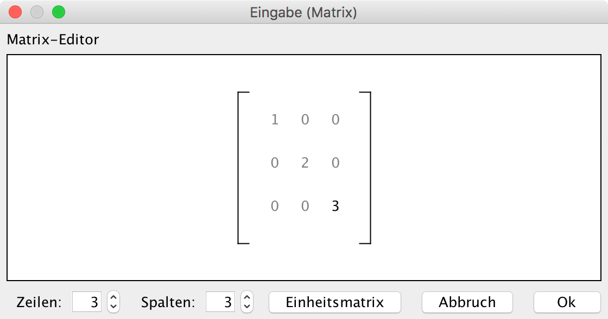

### Einstellungen

### Konsole

in Datei umleiten

eigene Shell

### Automatischer Check

### Einzelne Elemente

## Verwendung als Programmierer (Erweiterung des bestehenden Frameworks)