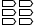
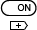
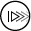
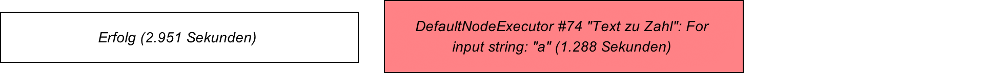

# Benutzerhandbuch

## Einrichtung
## Verwendung als Endnutzer
### Begriffe
### Funktionsweise

- Virtuelle automatische ein ausgänge append copy Auslöser ...

### Benutzerinterface

#### Übersicht Hauptfenster

#### Zustände Hauptfenster

Grundlegend unterscheidet das Benutzerinterface des Hauptfensters zwischen folgenden Zuständen:

Zustand | Beschreibung | Kontextmenüs | Zusätzliche Informationen
:---: | :--- | :---:  | :---:
1a | Projekt wird nicht ausgeführt | Ja | Ja
1b | Projekt wird nicht ausgeführt und es wird Verbindung zwischen Elementen gezogen | Nein | Ja
1c | Projekt wird nicht ausgeführt und Overlay um Elemente zu verbinden ist geöffnet | Nein | Ja
1d | Projekt wird nicht ausgeführt, Overlay um Elemente zu verbinden ist geöffnet und es wird Verbindung zwischen Ein-/Ausgängen gezogen | Nein | Ja1
2 | Projekt wird ausgeführt | Nein | Nein
2x | Projekt wird nicht mehr ausgeführt | Nein | Nein
3a | Projekt wird ausgeführt mit Debugger | Nein | Ja2 
3b | Projekt wird ausgeführt mit Debugger und Element wird eingesehen  | Nein | Ja2
3x | Projekt wird nicht mehr ausgeführt mit Debugger| Nein | Nein

1: Entspricht Informationen von Zustand 1c.

2: Anstelle von einer Information darüber welche Möglichkeiten der Benutzer gerade hat werden Informationen über die Zustände der einzelnen Elemente im Debugger angezeigt.

Je nach Zustand stellt das Benutzerinterface andere Funktionen zur Funktionen und stellt andere Informationen dar. Zu beachten ist dass die in der Tabelle beschriebenen Zustände **nur** das Hauptfenster betreffen und andere Fenster von diesen nicht Beeinflusst werden.

#### Toolbar Hauptfenster

Die Toolbar stellt dem Benutzer dynamisch Funktionalitäten zur Verfügung. Je nach Zustand der Benutzeroberfläche werden unterschiedliche Einträge dargestellt. Auch ist es je nach Eintrag möglich dass Untereinträge dargestellt werden, diese können Mittels einem *Verlassen*-Eintrag wieder geschlossen werden können womit der Benutzer wieder zur vorherigen Ansicht zurück gelangt.

Welche Einträge in der Toolbar angezeigt werden entscheidet sich hauptsächlich daran in welchem Zustand das Benutzerinterface sich gerade befindet.

Folgende Einträge werden in der Toolbar angezeigt: 

Icon | Name | Sichtbare Zustände | Beschreibung | Besonderheit
:---: | :---: | :---: | :--- | :---
 | Start | 1a, 1b, 1c, 1d | Startet Ausführung von aktuellem Projekt. |
 | Elemente | 1a, 1b, 1c, 1d | Öffnet Auswahlfenster für neue Elemente. |
 | Projekt-Info | 1a, 1b, 1c, 1d |  Zeigt Informationen zum Aktuellen Projekt an. |
 | Konsole / Log | 1a, 1b, 1c, 1d, 2, 2x, 3a, 3b, 3x (Jeder Zustand)| Öffnet Fenster für System Ein-/Ausgaben. | Je nachdem ob der Prompt aktiviert ist wird hier Konsole (aktiver Prompt) oder Log (Kein Prompt) angezeigt
 | Speichern | (1a)2, (1b)2, (1c)2, (1d)2 | Speichert aktuelles Projekt unter dem aktuellen Pfad. | Wird nur angezeigt wenn Projekt nicht bereits gespeichert ist.
 | Speichern als | 1a, 1b, 1c, 1d | Speichert aktuelles Projekt über Auswahl Dialog unter einem neuen Pfad. |
 | Laden | 1a, 1b, 1c, 1d | Öffnet bestehendes Projekt über ein Auswahl Dialog. |
 | Neues Projekt | 1a, 1b, 1c, 1d | Legt neues Projekt an. Falls aktuelles Projekt nicht gespeichert ist wird nachgefragt ob und wohin dieses gespeichert werden soll. |
 | Einstellungen | 1a, 1b, 1c, 1d | Öffnet Enstellungs-Fenster. |
 | Debugger | 1a, 1b, 1c, 1d | Stellt Funktionen des Debuggers zur Verfügung und zeigt folgende Untereinträge an: Debug, Breakpoint Auslöser, Monitor, Log. |
 | Debug | (1a)1, (1b)1, (1c)1, (1d)1 | Startet Ausführung von aktuellem Projekt mit aktivierten Debugger. |
 | Monitor | 3a, 3b | Öffnet Monitoring-Fenster. | 
 | Breakpoint Auslöser | (1a)1, (1b)1, (1c)1, (1d)1, 3a, 3b | Stellt eine Reihe von Toogle-Einträge zur Verfügung. | 
 | Breakpoint Auslöser: Neuer Prozess |  1a, 1b, 1c, 1d, 3a, 3b | Entscheidet ob Breakpoint bei neuem Prozess ausgelöst werden soll. | Toogle-Eintrag, Untereintrag von Breakpoint Auslöser
 | Breakpoint Auslöser: Vorbereiten | (1a)1, (1b)1, (1c)1, (1d)1, (3a)1, (3b)1 | Entscheidet ob Breakpoint bei Zustandswechel zu "Vorbereiten" ausgelöst werden soll | Toogle-Eintrag, Untereintrag von Breakpoint Auslöser
 | Breakpoint Auslöser: Sammeln | (1a)1, (1b)1, (1c)1, (1d)1, (3a)1, (3b)1 | Entscheidet ob Breakpoint bei Zustandswechel zu "Sammeln" ausgelöst werden soll | Toogle-Eintrag, Untereintrag von Breakpoint Auslöser
 | Breakpoint Auslöser: Arbeiten | (1a)1, (1b)1, (1c)1, (1d)1, (3a)1, (3b)1 | Entscheidet ob Breakpoint bei Zustandswechel zu "Arbeiten" ausgelöst werden soll | Toogle-Eintrag, Untereintrag von Breakpoint Auslöser
 | Breakpoint Auslöser: Ausliefern | (1a)1, (1b)1, (1c)1, (1d)1, (3a)1, (3b)1 | Entscheidet ob Breakpoint bei Zustandswechel zu "Ausliefern" ausgelöst werden soll | Toogle-Eintrag, Untereintrag von Breakpoint Auslöser
 | Breakpoint Auslöser: Beendet | (1a)1, (1b)1, (1c)1, (1d)1, (3a)1, (3b)1 | Entscheidet ob Breakpoint bei Zustandswechel zu "Beendet" ausgelöst werden soll | Toogle-Eintrag, Untereintrag von Breakpoint Auslöser
 | Stop | 2, 3a, 3b | Bricht Ausführung von Projekt ab. | 
 | Schritt | 3a, 3b | Schritt bis zum nächsten Auslöser (nächstes Element, unabhängig davon ob dieses einen gesetzten Breakpoint hat)  | Eine Besonderheit hierbei ist dass Schritt auch ausgelösst werden kann ohne dass gerade gehalten wird.
 | Fortsetzen | (3a)2, (3b)2 | Fortsetzen bis zum nächsten Breakpoint. | Nur sichtbar wenn gerade an Breakpoint gehalten wird.
 | Weiter ohne Debugger | (3a)2, (3b)2 | Fortsetzen ohne am nächsten Breakpoint zu halten. | Nur sichtbar wenn gerade an Breakpoint gehalten wird.
 | Weiter mit Debugger | (3a)2, (3b)2 | Deaktiviert Debugger temporär. | Nur sichtbar wenn gerade Debugger deaktiviert ist.
 | Bericht | 2x, 3x | Öffnet Fenster mit Bericht über gerade beendete Ausführung. |
 | Fertig | 2x, 3x | Führt von Zustand 2x oder 3x wieder in Zustand 1 |

1 Als Untereintrag.

2 Situationsbedingt.

#### Arbeitsfläche Hauptfenster

Auf der Arbeitsfläche befinden sich alle aktuell im Projekt platzierte und damit aktive Elemente und es wird dargestellt wie diese miteinander verbunden sind. 

Elemente auf der Arbeitsflächte können beliebig verschoben werden. Bewegt sich ein Element rechts oder unten über die Arbeitsfläche hinaus erweitert sich diese dynamisch. 

Um Elemente miteinander zu verbinden muss ein Element mit gedrückter CTRL-Taste auf ein anderes Element gezogen werden. Auf diese Aktion hin öffnet sich das Verbindungs-Overlay um diese beiden Elemente miteinander zu verbinden.

Durch das Klicken auf einen freien Bereich auf der Arbeitsfläche wird diese Stelle als *Target-Position* festgelegt. Die *Target-Position* definiert den Ort an welchem neue Elemente angelegt werden.

#### Verbindungs-Overlay Hauptfenster

Werden auf der Arbeitsfläche zwei Elemente mit gedrückter CTRL-Taste auf einander gezogen erscheint das Verbindungs-Overlay. Auf dem Verbindungs-Overlay sieht man welche Ausgänge mit welchen Eingängen verbunden werden können. Hierbei gibt die Kennzeichnung [Opt.] an dass es sich bei diesem Eingang um einen optionalen Eingang handelt und die Kennzeichnung [Dyn.] gibt an dass es sich um einen dynamisch hinzugefügten Eingang handelt. Ausserdem ist hinder der Bezeichnung für den Ein-/Ausgang zusätzlich angegeben welchen Typ diese Ein-/Ausgang besitzt.

Auf der linken Seite befinden sich die Ausgänge des Elementes von welchem aus die Verbindung gezogen wurde (Von-Element) und auf der Rechten Seite befinden sich die Eingänge des Elementes auf welches die Verbindung gezogen wurde (Zu-Element). Um dies umzukehren, also das Zu-Element und Von-Element zu vertauschen befindet sich ein Button  in der Mitte zwischen den beiden Elementen. Ein-/Ausgänge welche mit einem ausgefülltem Kreis  gekennzeichnet sind bereits verbunden und Aus-/Eingänge welche mit einem nicht ausgefülltem Kreis  gekennzeichnet sind noch nicht verbunden. 

Um ein Ausgang mit einem Eingang zu verbinden muss eins von den beiden auf das jeweils andere gezogen werden. Falls ein Ein-/Ausgänge bereits eine Verbindung besitzt wird diese automatisch verworfen wenn eine neue Verbindung erstellt wird. Werden zwei Ein-/Ausgänge mit einander verbunden welche nicht kompatibel zu einander sind wird eine Fehlermeldung angezeigt.

#### Kontextmenüs Hauptfenster

Es gibt 2 verschiedene Arten von Kontextmenüs. Einträge in Kontextmenüs können Untermenüs haben.

##### Auf Arbeitsfläche

Dieses Kontextmenü zeigt eine Auswahl von Elementen an welche erstellt werden können. Hierbei ist das erste immer das zuletzt erstellte Element. Der letzte Eintrag öffnet ein Auswahlfenster mit allen zur Verfügung stehenden Elementen.

##### Auf Element

<!---

--->

Dieses Kontextmenü zeigt eine Auswahl von Funktionen betreffend diesem Element.

##### Anzeige von zusätzlichen Informationen im Hauptfenster

Situationsbedingt werden zusätzliche Informationen in der unteren rechten oder linken Ecke angezeigt. Diese Informationen dienen in erster Linie dazu auf Dinge hinzuweisen welche nicht intuitiv erkennbar sind (Bsp. Tasten welche zusätzlich gedrückt werden können).

##### Anzeige von Meldungen im Hauptfenster

Meldungen über erfolgreiche oder fehlgeschlagene Operationen betreffend des Hauptfensters werden an der unteren Kante angezeigt. Meldungen lassen sich durch das Drücken der ESC-Taste schliessen.

### Auswahlfenster für Elemente

Über den Toolbar-Eintrag "Elemente" oder den Kontextmenü-Eintrag "Anderes Element erstellen" lässt sich das Auswahlfenster für neue Elemente öffnen. In diesem werden alle verfügbaren Elemente, unterteilt in Kategorien, angezeigt. Hierbei ist zu beachten dass Elemente keiner, einer oder mehreren Kategorien zugeteilt sein können. Um Elemente ausserdem besser zu finden gibt es zusätzlich ein Eingabefeld für Suchbegriffe. Hierbei funktionieren Suchbegriffe wie Filter. Elemente bei welchen in der Beschreibung oder in deren Tags keins der Worte vorkommen nach welchen gesucht wird werden nicht angezeigt.

Beim einfachen Klick auf eines der angezeigten Elemente öffnet sich am unteren Rand ein Beschreibungsfeld in welchem Informationen bezüglich dieses Elements dargestellt werden.

Um ein Element auf der Arbeitsfläche zu platzieren gibt es zwei Möglichkeiten. Zum einen kann der Benutzer ein Doppelklick auf eines der Elemente aufführen. Dieser bewirkt dass das Auswahlfenster geschlossen und das Element an der angegebenen *Target-Position* angelegt wird.
Alternativ kann der Benutzer den "Platzieren"-Button am unteren rechten Rand verwenden. Dieser bewirkt dass das Element an der *Target-Position* angelegt wird, das Auswahlfenster jedoch nicht geschlossen wird.

### Fenster für System Ein-/Ausgaben (*Konsole*)

Für den einfachen Zugriff auf Ein-/Ausgaben welche dem Benutzer von grafischer Software normalerweise verborgen bleiben gibt es ein eigenes Konsolen-Fenster. Dieses lässt sich über den Toolbar-Eintrag "Konsole" / "Log" (je nachdem ob der Prompt aktiviert ist) öffnen.
In diesem Fenster werden alle Java-eigenen Ein-/Ausgaben angezeigt. Wenn der Prompt in den Eistellungen aktiviert ist lassen sich hier auch Eingaben für die interne Kommandozeile tätigen.

### Berichte

Nach erfolgreicher oder nicht erfolgreicher Ausführung eines Projektes hat der Benutzer die Möglichkeit sich einen Bericht anzeigen zu lassen. 

Folgende Informationen sind in diesem Bericht enthalten:

- Startzeit
- Endzeit
- Laufzeit
- Meldungen
- Übersicht der Elemente welche am längsten Ausgeführt wurden mit passendem Tortendiagramm.

### Debugger

#### Haltemarken und Auslöser

Haltemarken und gesetzte Auslöser entscheiden darüber ob und wann eine Projektausführung angehalten wird. Haltemarken können an alle Elemente gehängt werden welche selbst keine Kontexte erzeugen. Auslöser, also Zustandswechsel welche ein Halten auslösen, werden über die entsprechenden  Einträge in der Toolbar festgelegt.

#### Inspect-Overlay

#### Kontext-Übersicht

Die Kontext-Übersicht ermöglicht es zu sehen welche Kontext aktuell aktiv sind und erlaubt es zwischen diesen zu wechseln. Der Kontext welcher aktuell betrachtet wird, wird mit einem hellen Hintergrund hervorgehoben. Durch Klicken lässt sich dieser Kontext wechseln.

Falls ein Kontext aktuell ein Halten ausgelöst hat ist mit \>> << gekennzeichnet.

#### Monitor-Fenster

### Direkte Eingaben

### Einstellungen

### Konsole

in Datei umleiten

eigene Shell

### Automatischer Check

### Einzelne Elemente

## Verwendung als Programmierer (Erweiterung des bestehenden Frameworks)

