### Funktionsweise

#### Grundsätzlicher Aufbau

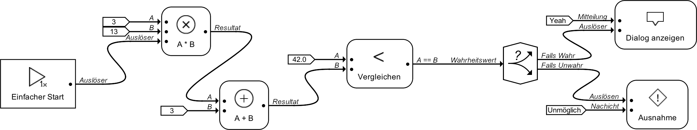

#### Ein-/Ausgänge

Ein-/Ausgänge bestehen jeweils aus einem Namen und einem Datentyp.

##### Virtuelle Ein-/Ausgänge

Virtuelle Ein-/Ausgänge sind Ein-Ausgänge welche von den Elementen selbst nicht vorgesehen sind und nur von der Umgebung unterstützend verwendet werden.

Konkret gibt es drei Arten von virtuellen Eingängen:

- copy (nur Ausgang): Diese Ausgänge ermöglichen es Daten an mehrere Elemente zu übergeben ohne diese neu berechnen zu müssen. Diese Ausgänge sind bei allen nicht virtuellen Ausgänge verfügbar.
- append (nur Eingang): Diese Eingänge ermöglichen es Daten welche an einem Eingang eingehen sollen aus mehreren Ausgängen zusammenzusetzen. Diese Eingänge sind nur bei nicht virtuellen Eingängen welche Listen akzeptieren.
- Auslöser (Ein- und Ausgang): Dieser Eingang oder Ausgang dient nur dazu ein vorhergehendes oder nachfolgendes Element anzustossen. Es werden keine Daten angenommen oder weitergereicht.

##### Optionale und nicht optionale Eingänge

Eingänge sind optional wenn sie nicht verbunden werden müssen damit ein Element funktionieren kann. Anstelle von Eingangsdaten greift das Element in diesem Fall auf Standardwerte oder dynamisch generierte Werte zurück so dass es nicht zu einem Fahler kommt.

##### Dynamische Eingänge

Dynamische Eingänge sind Eingänge welche sich dynamisch hinzu schalten wenn die Eingänge davor verbunden werden. Anzumerken hierzu ist dass es sich bei dynamischen Eingängen logischerweise immer auch um optionale Eingänge handelt auch wenn in der UI nicht gesondert darauf hingewiesen wird.

#### Datentypen

Datentypen bestehen jeweils aus einer aus (Java) Basisklasse/Interface und einer Angabe ob es sich um einen Listen-Datentypen handelt.

Datentypen werden wie folgenden zwei Teilen zusammen:
1. (Evtl. übersetzter) Klassenname
2. "..." falls es sich um einen Listen-Datentyp handelt oder "" (leer) falls nicht.

Beispiele für korrekte Bezeichnungen:

* Matrix (Instanz des eigenen Interface `reflection.customdatatypes.math.Matrix`)
* Text... (Array von Instanzen der Klasse `java.lang.String`)
* Vektor... (Array von Instanzen des eigenen Interface `reflection.customdatatypes.math.Vector`)
* Farbe (Instanz der Klasse `java.awt.Color`)
* 64 Bit Ganzzahl (Instanz der `Klasse java.lang.Long`)
* Zahl... (Array von Instanzen des Interface `java.lang.Number`)

Folgende Basisklassen/Interfaces werden jeweils als Datentyp für einen einzelnen Wert sowie als Listen-Datentypen verwendet:

- "Wahrheitswert" (Basierend auf: `java.lang.Boolean`)
- "Text" (Basierend auf `java.lang.String`)
- "Zeichen" (Basierend auf `java.lang.Character`)
- "Zahl" (Basierend auf `java.lang.Number`)
- "8 Bit" Ganzzahl (Basierend auf `java.lang.Byte`)
- "16 Bit" Ganzzahl (Basierend auf `java.lang.Short`)
- "32 Bit" Ganzzahl (Basierend auf `java.lang.Integer`)
- "64 Bit" Ganzzahl (Basierend auf `java.lang.Long`)
- "32 Bit" Gleitkommazahl (Basierend auf `java.lang.Float`)
- "64 Bit" Gleitkommazahl (Basierend auf `java.lang.Double`)
- "Datum"(Basierend auf `java.util.Date`)
- "Farbe" (Basierend auf `java.awt.Color`)
- "Objekt" (Basierend auf `java.lang.Object`)
- "Funktion" (Basierend auf `reflection.​customdatatypes.Function`)
- "Bild" (Basierend auf `java.​awt.Image`)
- "Gepuffertes Bild" (Basierend auf `java.​awt.BufferedImage`)
- "Rohdaten" (Basierend auf `reflection.​customdatatypes.​rawdata.RawData`)
- "Gelesene Rohdaten" (Basierend auf `reflection.​customdatatypes.​rawdata.RawDataFromFile`)
- "Empfangene Rohdaten" (Basierend auf `reflection.​customdatatypes.​rawdata.RawDataFromNetwork`)
- "Pfad" (Basierend auf `java.​nio.​file.Path`)
- "Dateipfad" (Basierend auf `java.​ni.​File`)
- "Kamera" (Basierend auf `reflection.customdatatypes.camera.​Camera`)
- "Raster" (Basierend auf `reflection.customdatatypes.BooleanGrid`)
- "Matrix" (Basierend auf `reflection.customdatatypes.math.Matrix`)
- "Vektor" (Basierend auf `reflection.customdatatypes.math.Vector`)
- "Mathematisches Object" (Basierend auf `reflection.customdatatypes.math.MathObject`)
- "Quellcode" (Basierend auf `reflection.customdatatypes.SourceCode`)

Im folgenden werden die Datentypen Text, Zeichen, 8/16/32/64 Bit Ganzzahl sowie 32/64 Bit Gleitkommazahl als *Primitive Datentypen* bezeichnet.

Ein weiter jedoch nicht als Listen-Datentyp verwendbarer Datentyp ist der Void-Datentyp welcher sich auf der Klasse `java.​lang.Void` basiert. Dieser Datentyp wird im allgemeinen nur verwendet um Elemente anzustossen ohne diesen Jedoch Daten zu über geben.

#### Kompatibilität von Ein-/Ausgängen

Ein Ausgang ist im einfachsten Fall zu einem Eingang kompatibel wenn sein Datentyp sich auf die gleiche Basisklasse bezieht wie der Datentyp des Eingangs. Hierbei stellt es in erster Instanz keine Rolle ob es sich bei den Datentypen um Listen-Datentypen oder nicht.

Jedoch können Ein-/Ausgängen mit unterschiedlichen Basisklassen unter bestimmten Situationen trotzdem kompatibel zu einander sein.

##### Fall 1:

Die Basisklasse des Ausgangs ist eine Ableitung von der Basisklasse des Eingangs. Dies ist der unproblematischste Fall da es in diesem Fall nie zu einem Laufzeit-Fehler kommen kann. Instanzen einer Klasse welche von einer anderen zweiten Klasse abgeleitet sind de facto auch Instanzen dieser zweiten Klasse.

##### Fall 2:

Die Basisklasse des Eingangs ist eine Ableitung von der Basisklasse des Ausgangs. Dies ist der problematischste Fall. Je nach Situation können Daten welche von Ausgängen kommen welche sich auf eine Oberklasse einer zweiten Klasse bezieht auch Instanzen dieser zweiten Klasse sein. Dies is insbesondere dann der Fall wenn ein Ausgang den sehr allgemeinen Typ Objekt oder Object... besitzt. In diesem Fall ist es als Benutzer wichtig zu beachten welche Daten von einem Ausgang erwartet werden.

##### Fall 3:

In bestimmten Fällen wird zur Erhöhung der Kompatibilität eine automatische Konvertierung durchgeführt. In diesen Fällen können Ein-/Ausgänge komplett unterschiedlicher Typen trotzdem kompatibel zu einander sein.

In folgenden Fällen ist dies der Fall:

- Der Eingang oder der Ausgang hat als Datentyp den Void-Datentyp.
- Der Eingang und der Ausgang haben als Datentyp jeweils einen Primitive Datentypen.
- Der Eingang hat den Datentyp "Text" und der Ausgang hat den Datentyp "Objekt".
- Der Eingang hat den Datentyp "Dateipfad" und der Ausgang hat den Datentyp "Text" oder umgekehrt.
- Der Eingang hat den Datentyp "Pfad" und der Ausgang hat den Datentyp "Text" oder umgekehrt.
- Der Eingang hat den Datentyp "Pfad" und der Ausgang hat den Datentyp "Dateipfad" oder umgekehrt.
- Der Eingang hat den Datentyp "Mathematisches Objekt" Bzw. leitet von der dessen Basisklasse ab und der Ausgang hat den Datentyp Zahl Bzw. leitet von der dessen Basisklasse ab oder umgekehrt.

#### Kontexte

Ein Kontext stellt eine Umgebung dar in welcher Elemente ausgeführt werden und Daten weiter gereicht werden können. In einem Kontext wird ein Element nie oder oder genau einmal ausgeführt. Dies bedeutet soll ein Ablauf wiederholt werden müssen mehrere Kontexte erzeugt werden. Kontexte können terminieren müssen dies jedoch nicht. Ein Kontext gilt als terminiert wenn sich keine aktiven Elemente mehr in diesem befinden.

Innerhalb eines Kontextes können Elemente *angestossen* werden. Angestossene Elemente versuchen von ihrem Zustand 1 in den Zustand 5 kommen (Siehe Abschnitt *Zustände von Elementen*). Elemente welche sich bereits in einem Zustand grösser 1 befinden ignorieren diese Aufforderung.

Liefern Elemente Daten über ihre Ausgänge weiter so werden diese innerhalb des Kontextes gespeichert und stehen zum Abruf durch ein mit diesem Ausgang verbunden Eingang bereit. Treffen Daten von einem Ausgang ein werden automatisch alle Elemente angestossen welche mit ihren Eingängen an diesem Ausgang verbunden sind.

#### Zustände von Elementen

Es gibt fünf Zustände in welchen sich Elemente befinden können:  

Zustand 1 *Nicht ausgeführt* (inaktiv)  
Zustand 2 *Warten* (aktiv)  
Zustand 3 *Arbeiten* (aktiv)  
Zustand 4 *Ausliefern* (aktiv)  
Zustand 5 *Terminiert* (inaktiv)  

Der Zustand eines Elementes betrifft immer nur einen bestimmten Kontext. Ein Element kann sich beispielsweise in einem Kontext im Zustand 2 und gleichzeitig in einem anderen Kontext im Zustand 4 befinden. Zustände können immer nur von Zustand 1 nach Zustand 5 durchlaufen werden (Zustände dürfen übersprungen werden). Ein Element bewegt sich nie in einen Vorherigen Zustand zurück. Ein Element gilt in einem Kontext als aktiv wenn es sich in diesem Kontext im Zustand 2, 3 oder 4 befindet.

#### Elemente

Elemente bestehen jeweils aus einem Namen, einem Icon, einer Beschreibung, einer Liste von Eingängen und einer Liste von Ausgängen.

Es gibt drei verschiedene Arten von Elementen: *Einfache Elemente*, *Spezielle Elemente* und *Kontext Erzeugende Elemente*

Im folgenden gehe ich nur auf bestimmte – wichtige – Elemente ein. Eine vollständige Liste aller implementierter Elemente entnehmen sie dem Anhang *Vollständige Liste der Implementierten Elemente*.

##### Einfache Elemente

Diese Elemente finden am häufigsten Verwendung. Sie repräsentieren Tätigkeiten welche abgearbeitet werden so dass dann fortgefahren werden kann. Alle diese Elemente terminieren (durch Erfolg oder durch Abbruch bei einem Fehler). Die Ausführung dieser Elemente ist jeweils einem bestehendem Kontext zugeordnet.

Einfache Elemente gehen hierbei in 4 Schritten vor:

1. Anstossen aller vorhergehenden Elementen (an Eingängen verbunden). (Zustand 2)
2. Warten bis die Daten aller Eingänge im Kontext abrufbar sind.
3. Abarbeiten ihrer spezifischen Tätigkeit mit den Daten an den Eingängen als Parameter. (Zustand 3)
4. Liefern der Daten an alle Verbunden Ausgänge. (Zustand 4)

##### Spezielle Elemente

Diese Elemente verhalten sich prinzipiell wie einfache Elemente haben jedoch immer jeweils eine Eigenschaft welche diese von diesen unterscheidet so dass diese von der Ausführungsumgebung gesondert behandelt werden. Um die Funktionsweise dieser speziellen Elemente zu verstehen ist es nötig diese im einzeln zu betrachten.

Element *Wenn-Vor*:

1. Anstossen aller vorhergehenden Elementen (an Eingängen verbunden). (Zustand 2)
2. Warten bis die Daten aller Eingänge im Kontext abrufbar sind. (Zustand 2)
3. Liefern der Daten von Eingang "Objekt" an Ausgang "Falls Wahr" falls an Eingang "Wahrheitswert" `true` anliegt und an Ausgang "Falls Unwahr" sonst. (Zustand 4, Zustand 3 übersprungen)

Element *Wenn-Zurück*:

1. Anstossen des vorhergehenden Element von Eingang "Wahrheitswert". (Zustand 2)
2. Anstossen des vorhergehenden Element von Eingang "Falls Wahr"  falls an Eingang "Wahrheitswert" `true` anliegt und Anstossen des vorhergehenden Element von Eingang "Falls Unwahr"" sonst. (Zustand 2)
3. Liefern der Daten an verbunden Ausgang "Objekt". (Zustand 4, Zustand 3 übersprungen)

Element *Schnellster Wert*:

1. Anstossen aller vorhergehenden Elementen (an Eingängen verbunden). (Zustand 2)
2. Warten bis die Daten **eines Eingang** im Kontext abrufbar sind. (Zustand 2)
3. Liefern der Daten dieses Eingangs an verbunden Ausgang "Wert". (Zustand 4, Zustand 3 übersprungen)

Element *Ein Wert*:

1. Warten bis die Daten **eines Eingang** im Kontext abrufbar sind (die vorhergehenden Elemente werden nicht angestossen). (Zustand 2)
2. Liefern der Daten an verbunden Ausgang "Wert". (Zustand 4, Zustand 3 übersprungen)

Element *Für Alle* und *Zusammenführen*:

Diese Elemente gehören zusammen. Das Vor *Für Alle*-Element teilt eine Liste in ihre einzelnen Elemente auf und erzeugt für jedes einen eigenen Kontext um diese abzuarbeiten. Das Zusammenführen-Element wiederum führt diese Elemente wieder zusammen auf den ursprünglichen Kontext.

##### Kontext Erzeugende Elemente

Kontext Erzeugende Elemente dienen dazu Kontexte zu erzeugen. Ihre Ausführung kann, muss jedoch nicht terminieren. Die Ausführung dieser Elemente ist jeweils einem eigenen Kontext zugeordnet welcher nur dazu dient diese und evtl. vorhergehende Elemente am Laufen zu halten.

Kontext Erzeugende Elemente gehen hierbei in folgenden Schritten vor.

1. Anstossen aller vorhergehenden Elemente in innerhalb von ihrem eigenen Kontext. (Zustand 2)
2. Warten bis die Daten aller Eingänge in ihrem eigenen Kontext abrufbar sind. (Zustand 2)
3. Starten der eigenen Tätigkeit.
4. Starten von Kind-Kontexten und Übergabe von Daten an die über die Ausgänge verbunden Elemente innerhalb von den Kind-Kontexten.
5. Schritt 4 beliebig oft (nie, einmal oder mehrmals) wiederholen.

### Beispiele

#### Hello World

Als erstes widmen wir uns dem simpelstem und vermutlich ersten Programm eines jeden Programmierers.

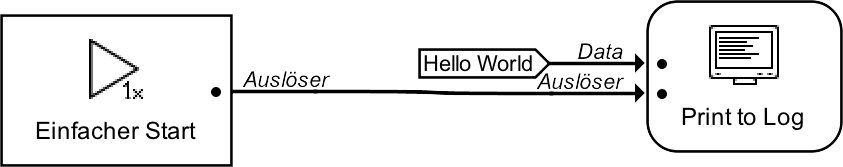

In einer anderen Variante des Hello World verwenden wir keine Konsolen-Ausgabe sondern ein Dialog:

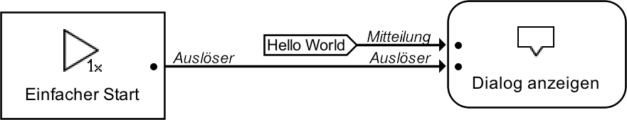

#### Primzahl-Quiz

Bei unserem nächsten Beispiel integrieren wir eine Interaktion vom Benutzer. Bei unserem Programm wird eine zufällige Zahl gewürfelt und berechnet ob es sich bei dieser Zahl um eine Primzahl handelt. Gleichzeitig wird der Benutzer gefragt ob es sich bei der berechneten Zahl um eine Primzahl handelt. Am Ende bekommt der Benutzer eine Ausgabe ob er richtig getippt hat.

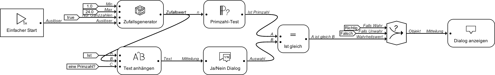

Interessant bei diesem Beispiel ist es dass es dass hier irrelevant ist mit welchem Element das Start-Element verbunden ist.

Start-Element ist verbunden mit "Ist gleich"-Element verbunden:

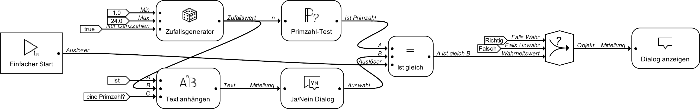

Start-Element ist verbunden mit "Dialog anzeigen"-Element verbunden:

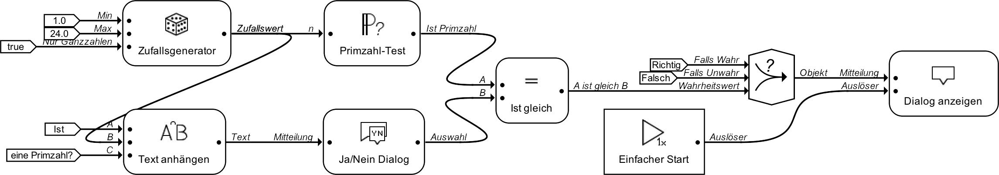

Beim Versuch dieser drei Programme fällt auf dass sich die Dialoge jeweils in der richtigen Reihenfolge öffnen auch wenn das Start-Element mit dem letzten Element verbunden wird. Dies liegt daran dass Elemente immer bis zum Eingang aller Eingänge warten. Aus diesem Grund ist es in den meisten Situationen irrelevant mit welchem Element der Auslöser des Kontext-Erzeugenden-Element verbunden ist.

Dialoge welche der Benutzer angezeigt bekommt:

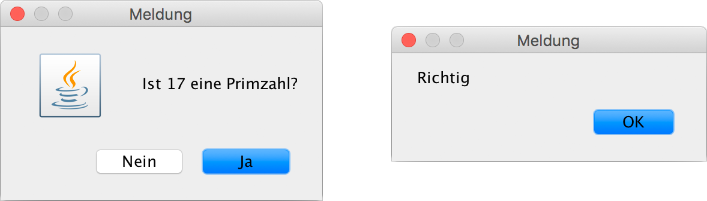

#### Bewegungsmelder

Das folgende Program stellt eine vereinfachte Version eines Bewegungsmelder dar. Immer wenn sich etwas stark vor der Webcam bewegt wird eine Meldung mit dem aktuellen Zeitpunkt ausgegeben und ein Schnappschuss als Datei abgespeichert.

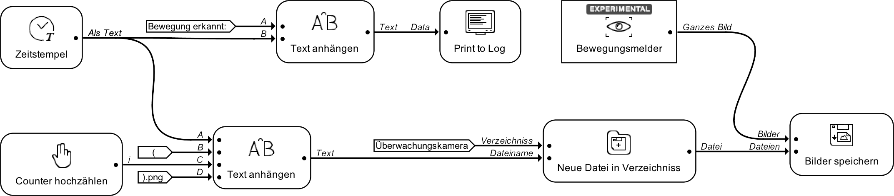

Ähnlich wie beim Primzahl-Quiz ist es hier wieder nicht entscheident welches Element vom Kontext-Erzeugenden-Element angestossen wird. Interessant an diesem Beispiel ist es jedoch zu sehen dass obwohl nur ein Bild an das "Bild speichern"-Element übergeben wird es auch zu einer Ausgabe in der Konsole kommt. Dies liegt daran dass der Zeitstempel welcher Daten an das "Text anhängen"-Element des Bildspeichern-Zweig abgibt auch automatisch seine Daten an das "Text anhängen"-Element des Konsolenausgaben-Zweigs abgibt.

Ausgabe (Gekürzt):

    Bewegung erkannt: 13-08-17 21:41:35
    Bewegung erkannt: 13-08-17 21:41:36
    Bewegung erkannt: 13-08-17 21:41:36
    Bewegung erkannt: 13-08-17 21:41:36
    Bewegung erkannt: 13-08-17 21:41:36
    Bewegung erkannt: 13-08-17 21:41:36
    Bewegung erkannt: 13-08-17 21:41:36
    Bewegung erkannt: 13-08-17 21:41:36
    Bewegung erkannt: 13-08-17 21:41:37
    Bewegung erkannt: 13-08-17 21:41:37
    Bewegung erkannt: 13-08-17 21:41:37
    Bewegung erkannt: 13-08-17 21:41:38
    ...

Inhalt des Ordners "Überwachungskamera":

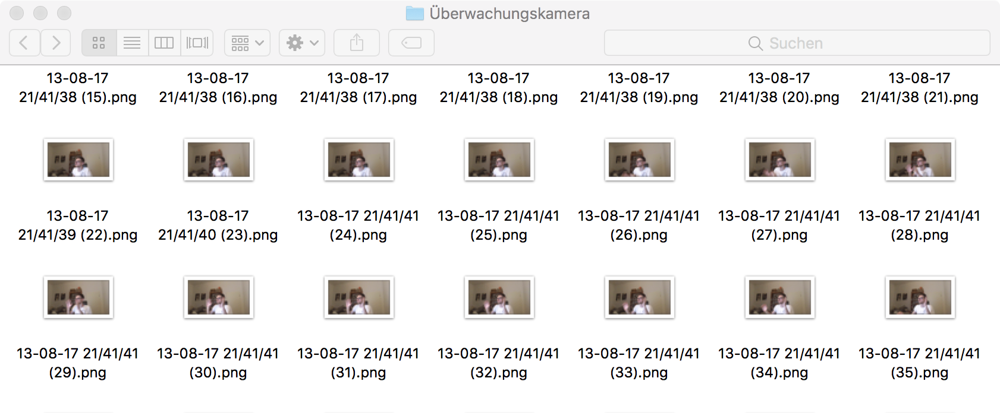

#### *Fizz buzz*

Fizz buzz ist ein Spiel welches erfunden wurde um Kindern die Divisionsregeln zu erklären. Das Spiel hat jedoch einen Bekanntheitsgrad erreicht da es dazu verwendet werden soll um die [Programmierkenntnisse von Bewerbern zu prüfen](https://imranontech.com/2007/01/24/using-fizzbuzz-to-find-developers-who-grok-coding/).

Die Spielregeln laut Wikipedia:
<blockquote>
Players generally sit in a circle. The player designated to go first says the number "1", and each player counts one number in turn. However, any number divisible by three is replaced by the word fizz and any divisible by five by the word buzz. Numbers divisible by both become fizz buzz. A player who hesitates or makes a mistake is eliminated from the game.

For example, a typical round of fizz buzz would start as follows: 1, 2, Fizz, 4, Buzz, Fizz, 7, 8, Fizz, Buzz, 11, Fizz, 13, 14, Fizz Buzz, 16, 17, Fizz, 19, Buzz, Fizz, 22, 23, Fizz, Buzz, 26, Fizz, 28, 29, Fizz Buzz, 31, 32, Fizz, 34, Buzz, Fizz, ...
</blockquote>

Grundsätzlich bedeutet dies dass bei jeder

Wir bauen jetzt ein Programm welches Fizz buzz von 1 bis 50 ausgibt.

##### Erster Ansatz mit Hilfe eines Wiederholen-Elementes

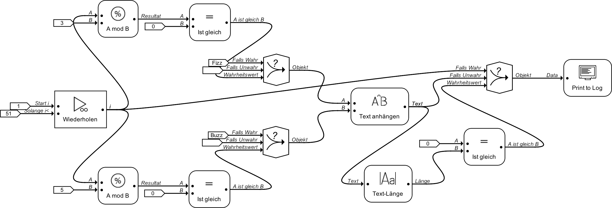

Ausgabe (Gekürzt und Zeilenumbrüche wurde gegen Kommas getauscht):

    1, 2, Fizz, 4, Buzz, Fizz, 7, 8, Fizz, Buzz, 11, Fizz, 13, 14, FizzBuzz, 16, 17, Fizz, 19, Buzz, Fizz, ...

Ausführungszeit: **5.182 ms**

Die Ausgabe ist wie erwartet jedoch ist die Ausführungszeit für eine relativ leichte Arbeit sehr hoch. Dies liegt hauptsächlich daran wie das Wiederholen-Element implementiert ist. Das Wiederholen-Element kontrolliert jede 100 ms ob der zuletzt erzeugte Kontext bereits fertig ist und falls ja erzeugt es den nächsten Kontext.
Um dies das Programm zu optimieren lässt sich die Zeit die zwischen den Kontrollen liegt manuell einstellen. Im folgenden Aufbau setzten wir die Zeit fest auf 0 ms, es wird also aktiv auf das Ende jedes Kontextes gewartet (Rechenaufwändiger, aber in diesem Fall ist dies zu vernachlässigen).

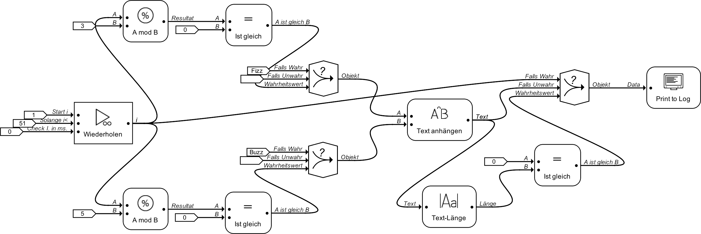

Ausgabe (Gekürzt und Zeilenumbrüche wurde gegen Kommas getauscht):

    1, 2, Fizz, 4, Buzz, Fizz, 7, 8, Fizz, Buzz, 11, Fizz, 13, 14, FizzBuzz, 16, 17, Fizz, 19, Buzz, Fizz, ...

Ausführungszeit: **135 ms**

##### Zweiter Ansatz mit Hilfe einer Für-Alle Struktur

Eine alternative Möglichkeit das Fizz buzz Programm umzusetzen ohne ein Wiederholen-Element zu verwenden (dies ist teilweise mit Nachteilen verbunden oder bedingt durch die Struktur nicht möglich) ist mit Hilfe einer Für-Alle Struktur.

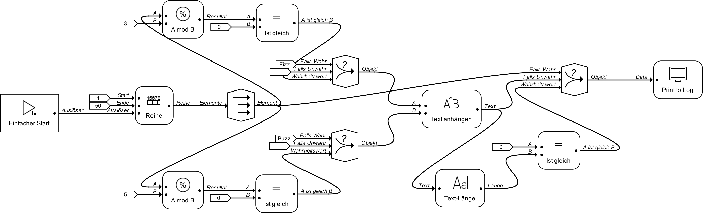

Ausgabe (Gekürzt und Zeilenumbrüche wurde gegen Kommas getauscht):

    1, 2, Fizz, 4, Buzz, Fizz, 7, 8, Fizz, Buzz, 11, Fizz, 13, 14, FizzBuzz, 16, 17, Fizz, 19, Buzz, Fizz, ...

Ausführungszeit: 124 ms

Das Ergebnis ist wieder das gleiche und auch die Ausführungszeit ist vergleichbar, jedoch ist der Aufbau in dieser Form theoretisch **falsch**. Um dies zu verdeutlichen bauen wir zwei weitere Elemente in unser Programm ein.

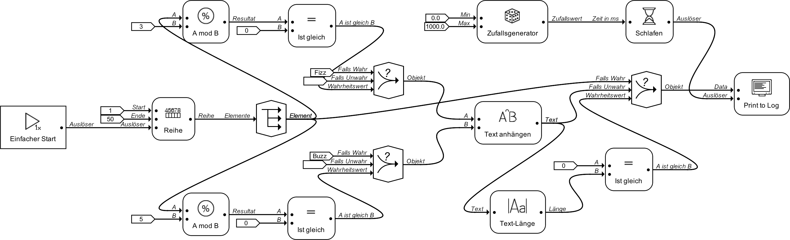

Ausgabe (Gekürzt und Zeilenumbrüche wurde gegen Kommas getauscht):

    29, Fizz, 37, Fizz, 38, 4, Buzz, 46, 43, 28, Fizz, 17, 1, 19, 26, 8, Buzz, Fizz, 13, 32, Fizz, 31, ...
    
Ausführungszeit: 1430 ms (durch künstliche Verzögerung)

Wie zu erkennen ist stimmen die einzelnen Ausgaben zwar befinden sich jedoch in der richtigen Reihenfolge. Dies liegt daran dass Für-Alle Strukturen keine Reihenfolgen kennen und alle Elemente parallel abgearbeitet werden. Da durch die Künstliche Verzögerung die Kontexte unterschiedlich lang benötigen werden wird das Ausgabe-Element in der falschen Reihenfolge angestossen. Ist die Reihenfolge der Elemente entscheidend empfiehlt es sich zusätzlich ein Zusammenführen-Element einzusetzen.

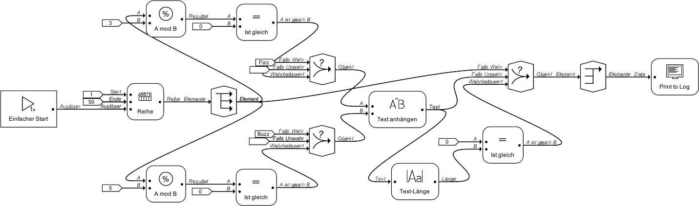

Ausgabe (Gekürzt und Zeilenumbrüche wurde gegen Kommas getauscht):

    1, 2, Fizz, 4, Buzz, Fizz, 7, 8, Fizz, Buzz, 11, Fizz, 13, 14, FizzBuzz, 16, 17, Fizz, 19, Buzz, Fizz, ...

Ausführungszeit: 121 ms

#### léjkléljkéjééjklé

