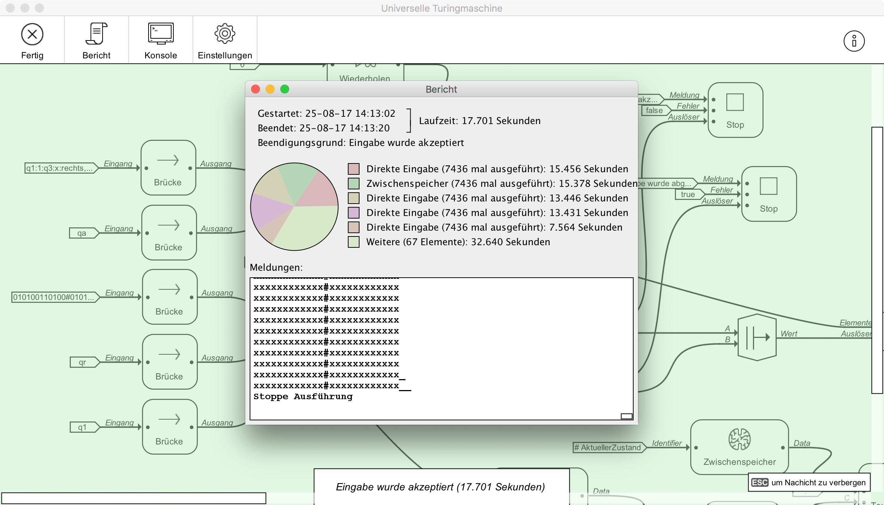

# Überlegungen und technische Eigenschaften der entwickelten Software / Analyse


## Vorteile

### Parallelisierung

Ein Nebeneffekt des Konzept anhand wessen Projekte ausgeführt ist dass die gesamte Ausführung (soweit möglich) parallel stattfindet ohne dass das Projekt vom Benutzer gesondert darauf ausgelegt werden muss. Dies führt gerade bei Mehrkern-Prozessoren zu einer besseren Effizienz gegenüber zu Programmen welche nicht parallelisiert sind.

### Keine Programmierkenntnisse notwendig

Ein Vorteil welches dieses grafische Programmierkonzept gegenüber vieler anderer grafischer Programmierkonzepte hat ist dass es nicht versucht stumpf ein Benutzerinterface um eine bestehendes textbasiertes Programmierparadigma herum zu bauen sondern ein eigenes darstellt. Dies ist gerade für Benutzer von Vorteil welche um keine Programmierkenntnisse verfügen.

### Schnelle Ergebnisse

Ein weiterer Vorteil dieses grafischen Programmierkonzeptes ist es dass gerade einfache Tätigkeiten ohne einen grossen Aufwand erledigt werden können. Tätigkeiten bei welchen es bei anderen Programmierkonzepten nötig ist erst einen Rahmenprogramm zu entwickeln bevor erste Ergebnisse sichtbar sind können sich in meinem Programmierkonzept mit dem Verbinden einer Hand voll von Elementen erledigt werden.

### Einfache Erweiterung

Da Elementdefinitionen erst zur Laufzeit geladen werden und nicht Teil des Programmcodes sind ist die Programmierumgebung leicht um Elemente zu erweitern. Steht einmal kein passendes Element so kann dieses einfach zum Umgebung hinzugefügt werden.


## Nachteile

- Begrenzter Baukasten
- Funktionsumfang des Benutzerinterface noch sehr eingeschränkt: Keine Kommentare, Skallierung
- Für Programmierer teilweise nicht intuitiv in der Verwendung da bekannte Konzepte fehlen und neue Konzepte noch unbekannt sind.
- Langsam wegen erhöhtem Verwaltungsaufwand


## Vergleich mit anderen Programmierkonzepten


## Turing-Vollständigkeit

Schlussendlich drängt sich noch die Frage ob das entwickelte Programmierkonzept Turing-vollständig ist. Dies ist in erster Linie deswegen interessant weil Turing-Vollständigkeit impliziert dass sich (bei unbegrenztem Speicher und Rechenzeit) theoretisch jedes programmiertechnisch lösbare Problem damit lösen lässt.

Allgemein ist ein erster Ansatzpunkt um intuitiv zu bestimmen ob eine Sprache Turing-vollständig ist die Frage ob eine Sprache entweder (1) While-Konstrukte oder (2) If-Konstrukte in Verbindung mit Goto-Befehlen besitzt. Dies ist auf den ersten Blick bei meinem Fall *nicht* der Fall. Jedoch gibt es in meinem Fall ein Konstrukt welches sich auf eine ähnliche Art und Weise verwenden lässt. Durch die Verwendung eines Wiederholen-Elementes und If-Elementen lässt sich ein While artiges Konstrukt zusammenbauen. Aus diesem Grund könnte das entwickelte Programmierkonzept Turing-vollständig sein.

### Beweis Turing-Vollständigkeit

Um den Beweis zu liefern dass das entwickelte Programmierkonzept Turing-vollständig ist habe ich mit meinen Programmierkonzept eine Universelle Turingmaschine aufgebaut. Diese erhält auf der linken Seite eine beliebige Turingmaschine in kodierter Form und führt diese aus.

Das Projekt ist wie folgt aufgebaut und steht auf GitHub zum Download bereit:


Link: [Beispiel Universelle Turingmaschine (GitHub)](https://github.com/colbach/Bachelor-Projekt/tree/master/Beispiele/Universelle%20Turingmaschine)

Konkret verarbeitet das Projekt eine Turingmaschine welche in folgender Form kodiert ist:


Die Existenz einer universellen Turingmaschine innerhalb meines Programmierkonzept beweist dass dieses Turing-vollständig ist.

### Beispiel

Als Beispiel habe ich folgende Turingmaschine zum testen verwendet:
Die Turingmaschine soll bestimmen ob zwei binäre Folgen welche mit einem `#` getrennt sind gleich oder nicht gleich sind.
`010100110100#010100110100` soll also von der Turingmaschine akzeptiert werden und `010100110100#010110110110` soll abgelehnt werden.

Realisiert werden kann dies über folgende Turingmaschine.

Überführungsfunktion:

```
q1:1:q3:x:rechts, q1:0:q2:x:rechts, q1:#:q8:#:rechts, q2:0:q2:0:rechts, q2:1:q2:1:rechts, q2:#:q4:#:rechts, q3:0:q3:0:rechts, q3:1:q3:1:rechts, q3:#:q5:#:rechts, q4:x:q4:x:rechts, q4:0:q6:x:links, q5:x:q5:x:rechts, q5:1:q6:x:links, q6:0:q6:0:links, q6:1:q6:1:links, q6:x:q6:x:links, q6:#:q7:#:links, q7:0:q7:0:links, q7:1:q7:1:links, q7:x:q1:x:rechts, q8:x:q8:x:rechts, q8:_:qa:_:rechts
```

Startzustand:

```
qa
```

Eingabe (zum testen):

```
010100110100#010100110100
```

Nicht akzeptierende Zustände:

```
qr
```

Akzeptierende Zustände:

```
q1
```

Ergebnis der Ausführung:



Anzumerken ist dass meine Implementierung nicht besonders effizient ist, dies war jedoch auch nicht das Ziel bei der Umsetzung einer Universellen Turingmaschine. Konkret hat die vollständige Ausführung dieser Turingmaschine mit einer Eingabelänge von 25 Zeichen 17 Sekunden benötigt.