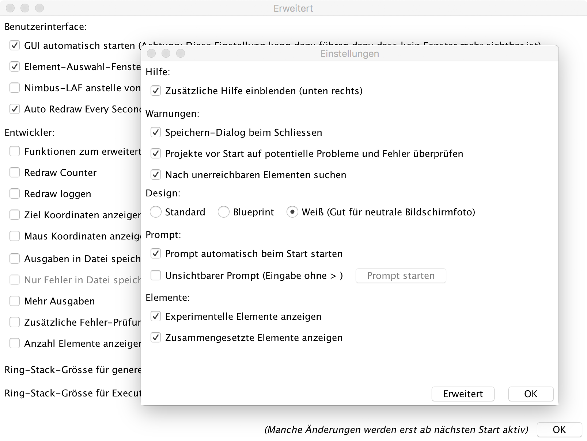
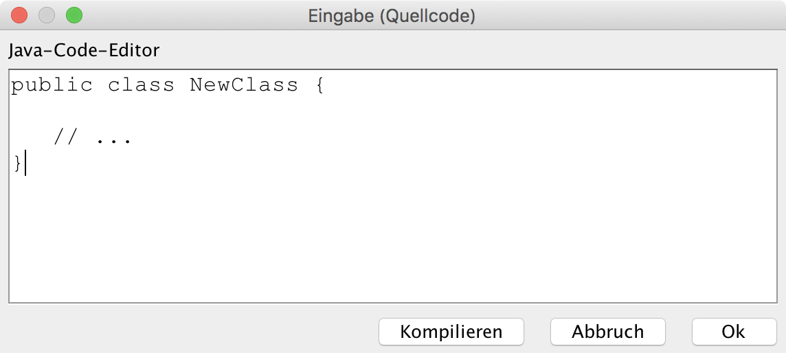
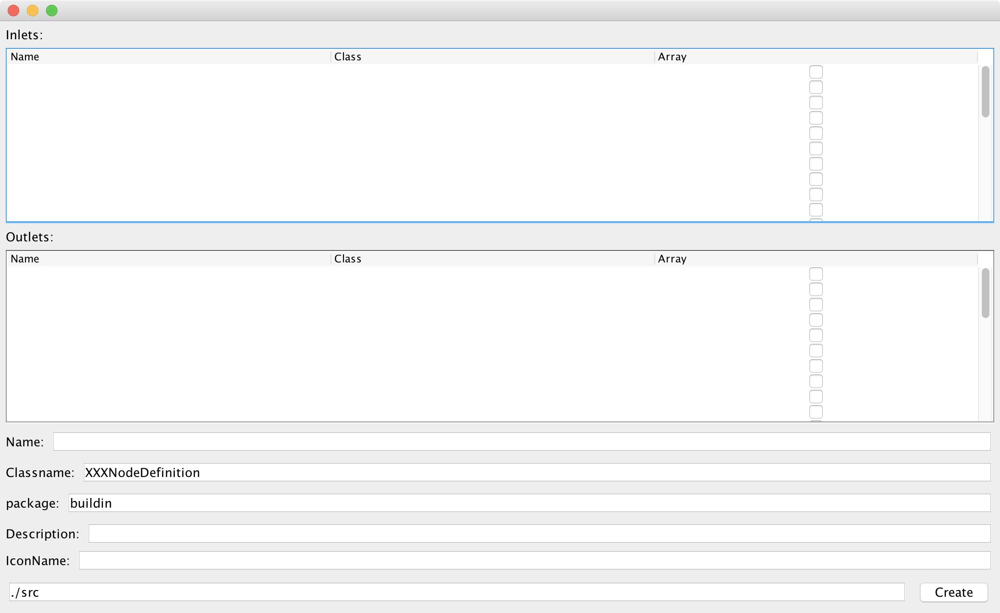

# Einleitung


## Fragestellung / Problemstellung

2016 habe ich unter dem Namen [*EditorPanel*](https://github.com/colbach/EditorPanel) eine Software für eine grafische "Blueprint"-artige Editierung von Bildern entwickelt. 


Prinzipiell war dieses Projekt ein Erfolg und hat mich vom Potential dieses Konzeptes überzeugt, jedoch hat es mir auch aufgezeigt wo die Grenzen dieses Konzeptes lagen und hat mich zu Überlegungen angeregt ob und wie dieses verbessert werden kann.

Das offensichtliche Problem von EditorPanel ist dass es keinerlei Art von Kontrollstrukturen unterstützt.
Um Herauszufinden wie sich solche am besten in mein Projekt integrieren lassen, habe ich mir hierzu verwandte Konzepte der grafischen Programmierung wie unter anderem *Unreal Blueprints*, *Lego Mindstorms Software*, *LabVIEW* und *App Inventor* angeschaut. Bei allen diesen grafischen Konzepten gibt es zwei Probleme an welchen ich mich störe. Einerseits haben diese System meistens die Eigenschaft entweder ein sehr spezielles Anwendungsgebiet zu haben oder andererseits zu nah an der klassischen – textbasierten – Programmierung sein und eigentlich nur eine grafische Betrachtung und Editierung dieser bereit zustellen.

## Zielsetzung

Ziel meiner Arbeit ist es ein alternatives, einfach zu bedienen, einfach zu erweiterndes und allgemein gehaltenes grafisches Programmierkonzept auszuarbeiten und die Entwicklungsumgebung um in diesem zu arbeiten und dieses auszuführen zu entwickeln.

## Entwicklung des Konzeptes und Planung der Umsetzung

Bei der Entwicklung meines Konzeptes nehme ich als Ausgangsbasis die Funktionsweise von EditorPanel und versuche diese um Kontrollstrukturen und weitere Konzepte zu erweitern welche es ermöglichen komplexe Aufgaben lösen. Die Software die hierbei entsteht baut nicht auf EditorPanel auf und wird von Grund auf neu entwickelt.

Konkret stelle ich folgende Anforderungen an mein Programm:

- Grundlegende mathematische Operationen
- Wiederholende Tätigkeiten
- Bedingte Anweisungen
- Verschiedene Arten von Eingabe / Ausgabe
- Reaktion auf Ereignisse
- Leichte Erweiterbarkeit
- Einfach zu verwendendes Benutzerinterface

Die Erfüllung dieser Anforderungen ist mit einer Reihe von Problemen verbunden welchen ich mich jedoch einzeln widmen werde und versuche werde eine Lösung für diese zu finden.

Um eine Vorstellung davon zu bekommen wie die Software später aussehen soll welche ich entwickelen werde baue ich mir ein Mockup welches mich bei der Entwicklung begleiten soll und mir als Vorlage dient das Benutzerinterface zu implementieren. Hierbei ist zu beachten dass es sich nur um einen ersten Entwurf handelt der bereits vor der ersten Zeile Programmcode entstanden ist. Während der Entwicklung wurden viele Ideen verworfen und neue Ideen hinzugefügt.


## Einsatzbereiche

Das Einsatzgebiet soll bewusst offen gehalten werden. Jedoch gibt es bestimmte Bereiche bei welchen ich mir die Verwendung gut vorstellen kann.

Diese Bereiche sind:

- Bildverarbeitung
- Mathematische Berechnungen
- Überwachungstechnik
- Programmierung von Geräten für das *Internet der Dinge*
- DIY Heimprojekte

## Programmcode

Sämtlicher Programmcode welcher im Rahmen dieser Arbeit entstanden ist steht unter folgendem Link zum Download bereit: [Bachelor-Projekt (GitHub)](https://github.com/colbach/Bachelor-Projekt)

# Benutzerhandbuch

## Einrichtung

### Systemvoraussetzungen

#### Mindestvorraussetzung

- [Java 8 JRE](http://www.oracle.com/technetwork/java/javase/downloads/)
- 64 MB freien Hauptspeicher für die JVM

<!--- -Xms64m -Xmx512m -->


#### Empfohlene System-Eingenschaften um sämtliche Features optimal nutzen zu können

- [Java 8 JDK](http://www.oracle.com/technetwork/java/javase/downloads/) (Für Kompilierung zur Laufzeit von Javacode)
- [OpenCV](http://opencv.org/) (Für Camera-Features)
- 512 MB freien Hauptspeicher für die JVM (Dies wird erzwungen durch den VM-Parameter `-Xmx512m`)


### Starten des Hauptprogramm

#### Unix-basierte Betriebsysteme

Navigieren im Terminal in das Programm-Verzeichnis und geben sie folgenden Befehl ein:
```bash
java -cp ".:lib/*" main.MainClass
```

#### Windows

Navigieren in der Windows-Shell in das Programm-Verzeichnis und geben sie folgenden Befehl ein:
```bash
java -cp ".;lib/*" main.MainClass
```

## Verwendung als Endnutzer

### Funktionsweise

#### Grundsätzlicher Aufbau


#### Ein-/Ausgänge

Ein-/Ausgänge bestehen jeweils aus einem Namen und einem Datentyp.

##### Virtuelle Ein-/Ausgänge

Virtuelle Ein-/Ausgänge sind Ein-/Ausgänge welche von den Elementen selbst nicht vorgesehen sind und nur von der Umgebung unterstützend verwendet werden.

Konkret gibt es drei Arten von virtuellen Eingängen:

- copy (nur Ausgang): Diese Ausgänge ermöglichen es Daten an mehrere Elemente zu übergeben ohne diese neu berechnen zu müssen. Diese Ausgänge sind für alle nicht virtuellen Ausgänge verfügbar.
- append (nur Eingang): Diese Eingänge ermöglichen es Daten welche an einem Eingang eingehen sollen aus mehreren Ausgängen zusammenzusetzen. Diese Eingänge sind nur für nicht virtuelle Eingänge welche Listen akzeptieren verfügbar.
- Auslöser (Ein- und Ausgang): Dieser Eingang oder Ausgang dient nur dazu ein vorhergehendes oder nachfolgendes Element anzustossen. Es werden keine Daten angenommen oder weitergereicht.

##### Optionale und nicht optionale Eingänge

Eingänge sind *optional* wenn sie nicht verbunden werden müssen damit ein Element funktionieren kann. Anstelle von Eingangsdaten greift das Element in diesem Fall auf Standardwerte oder dynamisch generierte Werte zurück so dass es nicht zu einem Fehler kommt.

##### Dynamische Eingänge

Dynamische Eingänge sind Eingänge welche sich dynamisch hinzu schalten wenn die Eingänge davor verbunden sind. Anzumerken hierzu ist dass es sich bei dynamischen Eingängen logischerweise immer auch um optionale Eingänge handelt auch wenn in dem Benutzerinterface nicht gesondert darauf hingewiesen wird.

#### Datentypen

Datentypen bestehen jeweils aus einer aus (Java) Basisklasse/Schnittstelle und der Angabe ob es sich um einen Listen-Datentypen handelt oder nicht.

Die Beschreibungen der Datentypen setzen sich wie folgenden zwei Teilen zusammen:

1. (Evtl. übersetzter) Klassenname
2. "..." falls es sich um einen Listen-Datentyp handelt oder "" (leer) falls nicht.

Beispiele für korrekte Bezeichnungen:

* Matrix (Instanz der eigenen Schnittstelle `reflection.customdatatypes.math.Matrix`)
* Text... (Liste von Instanzen der Klasse `java.lang.String`)
* Vektor... (Liste von Instanzen der eigenen Schnittstelle `reflection.customdatatypes.math.Vector`)
* Farbe (Instanz der Klasse `java.awt.Color`)
* 64 Bit Ganzzahl (Instanz der `Klasse java.lang.Long`)
* Zahl... (Liste von Instanzen der Schnittstelle `java.lang.Number`)

Folgende Basisklassen/Schnittstellen werden jeweils als Datentyp für einen einzelnen Wert sowie als Listen-Datentypen verwendet:

- "Wahrheitswert" (Basierend auf: `java.lang.Boolean`)
- "Text" (Basierend auf `java.lang.String`)
- "Zeichen" (Basierend auf `java.lang.Character`)
- "Zahl" (Basierend auf `java.lang.Number`)
- "8 Bit" Ganzzahl (Basierend auf `java.lang.Byte`)
- "16 Bit" Ganzzahl (Basierend auf `java.lang.Short`)
- "32 Bit" Ganzzahl (Basierend auf `java.lang.Integer`)
- "64 Bit" Ganzzahl (Basierend auf `java.lang.Long`)
- "32 Bit" Gleitkommazahl (Basierend auf `java.lang.Float`)
- "64 Bit" Gleitkommazahl (Basierend auf `java.lang.Double`)
- "Datum"(Basierend auf `java.util.Date`)
- "Farbe" (Basierend auf `java.awt.Color`)
- "Objekt" (Basierend auf `java.lang.Object`)
- "Funktion" (Basierend auf `reflection.​customdatatypes.Function`)
- "Bild" (Basierend auf `java.​awt.Image`)
- "Gepuffertes Bild" (Basierend auf `java.​awt.BufferedImage`)
- "Rohdaten" (Basierend auf `reflection.​customdatatypes.​rawdata.RawData`)
- "Gelesene Rohdaten" (Basierend auf `reflection.​customdatatypes.​rawdata.RawDataFromFile`)
- "Empfangene Rohdaten" (Basierend auf `reflection.​customdatatypes.​rawdata.RawDataFromNetwork`)
- "Pfad" (Basierend auf `java.​nio.​file.Path`)
- "Dateipfad" (Basierend auf `java.​ni.​File`)
- "Kamera" (Basierend auf `reflection.customdatatypes.camera.​Camera`)
- "Raster" (Basierend auf `reflection.customdatatypes.BooleanGrid`)
- "Matrix" (Basierend auf `reflection.customdatatypes.math.Matrix`)
- "Vektor" (Basierend auf `reflection.customdatatypes.math.Vector`)
- "Mathematisches Object" (Basierend auf `reflection.customdatatypes.math.MathObject`)
- "Quellcode" (Basierend auf `reflection.customdatatypes.SourceCode`)
- "SmartIdentifier" (Basierend auf `reflection.customdatatypes.SmartIdentifier`)

Im folgenden werden die Datentypen Text, Zeichen, 8/16/32/64 Bit Ganzzahl sowie 32/64 Bit Gleitkommazahl als *Primitive Datentypen* bezeichnet.

Ein weiter jedoch nicht als Listen-Datentyp verwendbarer Datentyp ist der *Void-Datentyp* welcher auf der Klasse `java.​lang.Void` basiert. Dieser Datentyp wird im allgemeinen nur verwendet um Elemente anzustossen ohne diesen jedoch Daten zu übergeben.

#### Kompatibilität von Ein-/Ausgängen

Ein Ausgang ist im einfachsten Fall zu einem Eingang kompatibel wenn sein Datentyp sich auf die gleiche Basisklasse bezieht wie der Datentyp des Eingangs. Hierbei stellt es in erster Instanz keine Rolle ob es sich bei beiden Datentypen um Listen-Datentypen handelt oder nicht.

Auch wenn Ein- und Ausgänge den gleichen Datentyp haben sollen, können Ein-/Ausgängen mit unterschiedlichen Basisklassen jedoch unter bestimmten Situationen trotzdem zu einander kompatibel sein.

##### Fall 1:

Die Basisklasse des Ausgangs ist eine Ableitung von der Basisklasse des Eingangs. Dies ist der unproblematischste Fall da es in diesem Fall nie zu einem Laufzeit-Fehler kommen kann. Instanzen einer Klasse welche von einer anderen zweiten Klasse abgeleitet sind de facto sind auch Instanzen dieser zweiten Klasse.

##### Fall 2:

Die Basisklasse des Eingangs ist eine Ableitung von der Basisklasse des Ausgangs. Dies ist der problematischste Fall. Je nach Situation können Daten welche von Ausgängen kommen welche sich auf eine Oberklasse einer zweiten Klasse bezieht auch Instanzen dieser zweiten Klasse sein. Dies is insbesondere dann der Fall wenn ein Ausgang den sehr allgemeinen Typ Objekt oder Object... besitzt. In diesem Fall ist es als Benutzer wichtig zu beachten welche Daten von einem Ausgang erwartet werden.

##### Fall 3:

In bestimmten Fällen wird zur Erhöhung der Kompatibilität eine automatische Konvertierung durchgeführt. In diesen Fällen können Ein-/Ausgänge komplett unterschiedlicher Typen trotzdem kompatibel zu einander sein.

In folgenden Fällen ist dies der Fall:

- Der Eingang oder der Ausgang hat als Datentyp "Void".
- Der Eingang und der Ausgang haben als Datentyp jeweils einen Primitiven Datentyp.
- Der Eingang hat den Datentyp "Text" und der Ausgang hat den Datentyp "Objekt".
- Der Eingang hat den Datentyp "Dateipfad" und der Ausgang hat den Datentyp "Text" oder umgekehrt.
- Der Eingang hat den Datentyp "Pfad" und der Ausgang hat den Datentyp "Text" oder umgekehrt.
- Der Eingang hat den Datentyp "Pfad" und der Ausgang hat den Datentyp "Dateipfad" oder umgekehrt.
- Der Eingang hat den Datentyp "Mathematisches Objekt" bzw. leitet von der dessen Basisklasse ab und der Ausgang hat den Datentyp Zahl Bzw. leitet von der dessen Basisklasse ab oder umgekehrt.

#### Kontexte

Ein Kontext stellt eine Umgebung dar in welcher Elemente ausgeführt werden und Daten weiter gereicht werden können. In einem Kontext wird ein Element nie oder genau einmal ausgeführt. Dies bedeutet, dass wenn ein Ablauf wiederholt werden soll, müssen mehrere Kontexte erzeugt werden. Kontexte können terminieren müssen dies jedoch nicht. Ein Kontext gilt als terminiert wenn sich keine aktiven Elemente mehr in diesem befinden.

Innerhalb eines Kontextes können Elemente *angestossen* werden. Angestossene Elemente versuchen von ihrem Zustand 1 in den Zustand 5 kommen (Siehe Abschnitt *Zustände von Elementen*). Elemente welche sich bereits in einem Zustand grösser 1 befinden ignorieren diese Aufforderung.

Liefern Elemente Daten über ihre Ausgänge weiter so werden diese innerhalb des Kontextes gespeichert und stehen zum Abruf durch ein mit diesem Ausgang verbunden Eingang bereit. Treffen Daten von einem Ausgang ein werden automatisch alle Elemente angestossen welche mit ihren Eingängen an diesem Ausgang verbunden sind.

#### Zustände von Elementen

Es gibt fünf Zustände in welchen sich Elemente befinden können:  

Zustand 1 *Nicht ausgeführt* (inaktiv) <br \>
Zustand 2 *Warten* (aktiv) <br \>
Zustand 3 *Arbeiten* (aktiv) <br \>
Zustand 4 *Ausliefern* (aktiv) <br \>
Zustand 5 *Terminiert* (inaktiv) <br \>

Der Zustand eines Elementes betrifft immer nur einen bestimmten Kontext. Ein Element kann sich beispielsweise in einem Kontext im Zustand 2 und gleichzeitig in einem anderen Kontext im Zustand 4 befinden. Zustände können immer nur von Zustand 1 nach Zustand 5 durchlaufen werden (Zustände dürfen übersprungen werden). Ein Element bewegt sich nie in einen vorherigen Zustand zurück. Ein Element gilt in einem Kontext als aktiv wenn es sich in diesem Kontext im Zustand 2, 3 oder 4 befindet.

#### Elemente

Elemente bestehen jeweils aus einem Namen, einem Icon, einer Beschreibung, einer Liste von Eingängen und einer Liste von Ausgängen.

Es gibt drei verschiedene Arten von Elementen: *Einfache Elemente*, *Spezielle Elemente* und *Kontext Erzeugende Elemente*

Im Folgenden gehe ich nur auf bestimmte – wichtige – Elemente ein. Eine vollständige Liste aller implementierter Elemente entnehmen sie dem Anhang *Vollständige Liste der Implementierten Elemente*.

##### Einfache Elemente


Diese Elemente finden am häufigsten Verwendung. Sie repräsentieren Tätigkeiten welche abgearbeitet werden so dass dann fortgefahren werden kann. Alle diese Elemente terminieren (durch Erfolg oder durch Abbruch bei einem Fehler). Die Ausführung dieser Elemente ist jeweils einem bestehendem Kontext zugeordnet.

Einfache Elemente gehen hierbei in 4 Schritten vor:

1. Anstossen aller vorhergehenden Elementen (an Eingängen verbundene Elemente). (Zustand 2)
2. Warten bis die Daten aller Eingänge im Kontext abrufbar sind.
3. Abarbeiten ihrer spezifischen Tätigkeit mit den Daten an den Eingängen als Parameter. (Zustand 3)
4. Liefern der Daten an alle Vv##### Spezielle Elemente


Diese Elemente verhalten sich prinzipiell wie *einfache Elemente* haben jedoch immer jeweils mindestens eine Eigenschaft welche diese von *einfachen Elementen* unterscheidet so dass diese von der Ausführungsumgebung gesondert behandelt werden. Um die Funktionsweise dieser speziellen Elemente zu verstehen ist es nötig diese im einzeln zu betrachten.

Element *Wenn-Vor*:

1. Anstossen aller vorhergehenden Elementen (an Eingängen verbunde Elemente). (Zustand 2)
2. Warten bis die Daten aller Eingänge im Kontext abrufbar sind. (Zustand 2)
3. Liefern der Daten von Eingang "Objekt" an Ausgang "Falls Wahr" falls an Eingang "Wahrheitswert" `true` anliegt und an Ausgang "Falls Unwahr" sonst. (Zustand 4, Zustand 3 übersprungen)

Element *Wenn-Zurück*:

1. Anstossen des vorhergehenden Element von Eingang "Wahrheitswert". (Zustand 2)
2. Anstossen des vorhergehenden Element von Eingang "Falls Wahr"  falls an Eingang "Wahrheitswert" `true` anliegt und Anstossen des vorhergehenden Element von Eingang "Falls Unwahr" sonst. (Zustand 2)
3. Liefern der Daten an verbunden Ausgang "Objekt". (Zustand 4, Zustand 3 übersprungen)

Element *Schnellster Wert*:

1. Anstossen aller vorhergehenden Elementen (an Eingängen verbunden). (Zustand 2)
2. Warten bis die Daten **eines beliebigen Eingangs** im Kontext abrufbar sind. (Zustand 2)
3. Liefern der Daten dieses Eingangs an verbunden Ausgang "Wert". (Zustand 4, Zustand 3 übersprungen)

Element *Ein Wert*:

1. Warten bis die Daten **eines beliebigen Eingangs** im Kontext abrufbar sind (die vorhergehenden Elemente werden nicht angestossen). (Zustand 2)
2. Liefern der Daten an verbunden Ausgang "Wert". (Zustand 4, Zustand 3 übersprungen)

Element *Für Alle* und *Zusammenführen*:

Diese Elemente gehören zusammen. Das *Für Alle*-Element teilt eine Liste in ihre einzelnen Elemente auf und erzeugt für jedes einen eigenen Kontext um dieses abzuarbeiten. Das Zusammenführen-Element wiederum führt diese Elemente wieder zusammen auf den ursprünglichen Kontext.

##### Kontext Erzeugende Elemente


*Kontext Erzeugende Elemente* dienen – wie der Name bereits sagt – dazu Kontexte zu erzeugen. Ihre Ausführung kann, muss jedoch nicht terminieren. Die Ausführung dieser Elemente ist jeweils einem eigenen Kontext zugeordnet welcher nur dazu dient diese und evtl. vorhergehende Elemente am Laufen zu halten.

Kontext Erzeugende Elemente gehen hierbei in folgenden Schritten vor.

1. Anstossen aller vorhergehenden Elemente innerhalb von ihrem eigenen Kontext. (Zustand 2)
2. Warten bis die Daten aller Eingänge in ihrem eigenen Kontext abrufbar sind. (Zustand 2)
3. Starten der eigenen Tätigkeit.
4. Starten von Kind-Kontexten und Übergabe von Daten an die über die Ausgänge verbunden Elemente innerhalb von den Kind-Kontexten.
5. Schritt 4 beliebig oft (nie, einmal oder mehrmals) wiederholen.

### Beispiele

#### Hello World

Als erstes widme ich mich dem simpelstem und vermutlich ersten Programm eines jeden Programmierers.


In einer anderen Variante des *Hello World Beispiels* verwenden wir keine Konsolen-Ausgabe sondern ein Dialog:


#### Primzahl-Quiz

Beim nächsten Beispiel integrieren wir eine Interaktion vom Benutzer mit dem Programm. Bei unserem Programm wird eine zufällige Zahl gewürfelt und berechnet ob es sich bei dieser Zahl um eine Primzahl handelt. Gleichzeitig wird der Benutzer gefragt ob es sich bei der berechneten Zahl um eine Primzahl handelt. Am Ende bekommt der Benutzer eine Ausgabe ob er richtig getippt hat.


Interessant bei diesem Beispiel ist dass es dass hier irrelevant ist mit welchem Element das Start-Element verbunden ist.

Start-Element ist mit "Ist gleich"-Element verbunden:


Start-Element ist mit "Dialog anzeigen"-Element verbunden:


Beim Versuch dieser drei Programme fällt auf dass sich die Dialoge jeweils in der richtigen Reihenfolge öffnen auch wenn das Start-Element mit dem letzten Element verbunden wird. Dies liegt daran dass Elemente immer bis zum Eingang der Daten aller Eingänge warten. Aus diesem Grund ist es in den meisten Situationen irrelevant mit welchem Element der Auslöser des *Kontext Erzeugenden Element* verbunden ist.

Dialoge welche der Benutzer angezeigt bekommt:


#### Bewegungsmelder

Das folgende Program implementiert einen einfachen Bewegungsmelder. Immer wenn sich etwas stark vor der Webcam bewegt wird eine Meldung mit dem aktuellen Zeitpunkt ausgegeben und ein Schnappschuss als Datei abgespeichert.


Ähnlich wie beim Primzahl-Quiz ist es hier wieder nicht entscheident welches Element vom Kontext-Erzeugenden-Element angestossen wird. Interessant an diesem Beispiel ist es jedoch zu sehen dass obwohl nur ein Bild an das "Bild speichern"-Element übergeben wird es trotzdem auch zu einer Ausgabe in der Konsole kommt. Dies liegt daran dass der Zeitstempel welcher Daten an das "Text anhängen"-Element des Bildspeichern-Zweig abgibt auch automatisch seine Daten an das "Text anhängen"-Element des Konsolenausgaben-Zweigs abgibt und diesen damit anstösst.

Ausgabe (Gekürzt):

    Bewegung erkannt: 13-08-17 21:41:35
    Bewegung erkannt: 13-08-17 21:41:36
    Bewegung erkannt: 13-08-17 21:41:36
    Bewegung erkannt: 13-08-17 21:41:36
    Bewegung erkannt: 13-08-17 21:41:36
    Bewegung erkannt: 13-08-17 21:41:36
    Bewegung erkannt: 13-08-17 21:41:36
    Bewegung erkannt: 13-08-17 21:41:36
    Bewegung erkannt: 13-08-17 21:41:37
    Bewegung erkannt: 13-08-17 21:41:37
    Bewegung erkannt: 13-08-17 21:41:37
    Bewegung erkannt: 13-08-17 21:41:38
    ...

Inhalt des Ordners "Überwachungskamera":


#### *Fizz buzz*

Fizz buzz ist ein Spiel welches erfunden wurde um Kindern die Divisionsregeln beizubringen. Das Spiel hat jedoch einen Bekanntheitsgrad erreicht da es dazu verwendet werden soll um die [Programmierkenntnisse von Bewerbern in Vorstellungsgesprächen zu prüfen](https://imranontech.com/2007/01/24/using-fizzbuzz-to-find-developers-who-grok-coding/).

Die Spielregeln laut Wikipedia:
<blockquote>
Players generally sit in a circle. The player designated to go first says the number "1", and each player counts one number in turn. However, any number divisible by three is replaced by the word fizz and any divisible by five by the word buzz. Numbers divisible by both become fizz buzz. A player who hesitates or makes a mistake is eliminated from the game.

For example, a typical round of fizz buzz would start as follows: 1, 2, Fizz, 4, Buzz, Fizz, 7, 8, Fizz, Buzz, 11, Fizz, 13, 14, Fizz Buzz, 16, 17, Fizz, 19, Buzz, Fizz, 22, 23, Fizz, Buzz, 26, Fizz, 28, 29, Fizz Buzz, 31, 32, Fizz, 34, Buzz, Fizz, ...
</blockquote>

Grundsätzlich bedeutet dies dass eine Reihe von Zahlen beginnend mit der 1 aufgesagt wird und dabei jede Zahl welche durch 3 teilbar ist durch Fizz und jede Zahl welche durch 5 teilbar ist durch Buzz ersetzt wird. Ist die zahl sowohl durch 3 als auch durch 5 teilbar so wird diese durch FuzzBuzz ersetzt.

Das folgende Programm soll Fizz buzz von 1 bis 50 ausgeben.

##### Erster Ansatz mit Hilfe eines Wiederholen-Elementes


Ausgabe (Gekürzt und Zeilenumbrüche wurde gegen Kommas getauscht):

    1, 2, Fizz, 4, Buzz, Fizz, 7, 8, Fizz, Buzz, 11, Fizz, 13, 14, FizzBuzz, 16, 17, Fizz, 19, Buzz, Fizz, ...

Ausführungszeit: **5.182 ms**

Die Ausgabe ist wie erwartet jedoch ist die Ausführungszeit für eine relativ leichte Arbeit sehr hoch. Dies liegt hauptsächlich daran wie das Wiederholen-Element verwendet wird. Das Wiederholen-Element kontrolliert jede 100 ms ob der zuletzt erzeugte Kontext bereits fertig ist und falls ja erzeugt es den nächsten Kontext.
Um dies das Programm zu optimieren lässt sich die Zeit die zwischen den Kontrollen liegt manuell einstellen. Im folgenden Aufbau setzten wir die Zeit fest auf 0 ms, es wird also aktiv auf das Ende jedes Kontextes gewartet (Dies ist zwar rechenaufwändiger, aber in diesem Fall ist dies zu vernachlässigen da die Rechenzeit insgesamt kürzer wird).


Ausgabe (Gekürzt und Zeilenumbrüche wurde gegen Kommas getauscht):

    1, 2, Fizz, 4, Buzz, Fizz, 7, 8, Fizz, Buzz, 11, Fizz, 13, 14, FizzBuzz, 16, 17, Fizz, 19, Buzz, Fizz, ...

Ausführungszeit: **135 ms**

##### Zweiter Ansatz mit Hilfe einer *Für-Alle Struktur*

Eine alternative Möglichkeit das Fizz buzz Programm umzusetzen ohne ein Wiederholen-Element zu verwenden (dies ist teilweise mit Nachteilen verbunden oder bedingt durch die Struktur nicht möglich) ist mit Hilfe einer Für-Alle Struktur.


Ausgabe (Gekürzt und Zeilenumbrüche wurde gegen Kommas getauscht):

    1, 2, Fizz, 4, Buzz, Fizz, 7, 8, Fizz, Buzz, 11, Fizz, 13, 14, FizzBuzz, 16, 17, Fizz, 19, Buzz, Fizz, ...

Ausführungszeit: 124 ms

Das Ergebnis ist wieder das gleiche und auch die Ausführungszeit ist vergleichbar, jedoch ist der Aufbau in dieser Form theoretisch **falsch**. Um dies zu verdeutlichen bauen wir zwei weitere Elemente in unser Programm ein.


Ausgabe (Gekürzt und Zeilenumbrüche wurde gegen Kommas getauscht):

    29, Fizz, 37, Fizz, 38, 4, Buzz, 46, 43, 28, Fizz, 17, 1, 19, 26, 8, Buzz, Fizz, 13, 32, Fizz, 31, ...
    
Ausführungszeit: 1430 ms (durch künstliche Verzögerung)

Wie zu erkennen ist stimmen die einzelnen Ausgaben zwar, befinden sich jedoch nicht in der richtigen Reihenfolge. Dies liegt daran dass Für-Alle Strukturen keine Reihenfolgen kennen und alle Elemente parallel abgearbeitet werden. Da durch die künstliche Verzögerung die Kontexte unterschiedlich lang benötigen, wird das Ausgabe-Element in der falschen Reihenfolge angestossen. Ist die Reihenfolge der Elemente entscheidend empfiehlt es sich zusätzlich ein Zusammenführen-Element einzusetzen.


Ausgabe (Gekürzt und Zeilenumbrüche wurde gegen Kommas getauscht):

    1, 2, Fizz, 4, Buzz, Fizz, 7, 8, Fizz, Buzz, 11, Fizz, 13, 14, FizzBuzz, 16, 17, Fizz, 19, Buzz, Fizz, ...

Ausführungszeit: 121 ms

### Benutzerinterface

#### Begriffe Hauptfenster


#### Zustände Hauptfenster

Grundlegend unterscheidet das Benutzerinterface des Hauptfensters zwischen folgenden Zuständen:

Zustand | Beschreibung | Kontextmenüs | Zusätzliche Informationen
:---: | :--- | :---:  | :---:
1a | Projekt wird nicht ausgeführt | Ja | Ja
1b | Projekt wird nicht ausgeführt und es wird Verbindung zwischen Elementen gezogen | Nein | Ja
1c | Projekt wird nicht ausgeführt und Overlay um Elemente zu verbinden ist geöffnet | Nein | Ja
1d | Projekt wird nicht ausgeführt, Overlay um Elemente zu verbinden ist geöffnet und es wird Verbindung zwischen Ein-/Ausgängen gezogen | Nein | Ja<sup>1</sup>
2 | Projekt wird ausgeführt | Nein | Nein
2x | Projekt wird nicht mehr ausgeführt | Nein | Nein
3a | Projekt wird ausgeführt mit Debugger | Nein | Ja<sup>2</sup> 
3b | Projekt wird ausgeführt mit Debugger und Element wird eingesehen  | Nein | Ja<sup>2</sup>
3x | Projekt wird nicht mehr ausgeführt mit Debugger| Nein | Nein

1: Entspricht Informationen von Zustand 1c.

2: Anstelle von einer Information darüber welche Möglichkeiten der Benutzer gerade hat werden Informationen über die Zustände der einzelnen Elemente im Debugger angezeigt.

Je nach Zustand stellt das Benutzerinterface andere Funktionen zur Verfügung und stellt andere Informationen dar. Zu beachten ist dass die in der Tabelle beschriebenen Zustände **nur** das Hauptfenster betreffen und andere Fenster von diesen nicht beeinflusst werden.

#### Toolbar Hauptfenster


Die Toolbar stellt dem Benutzer dynamisch Funktionalitäten zur Verfügung. Je nach Zustand der Benutzeroberfläche werden unterschiedliche Einträge dargestellt. Auch ist es je nach Eintrag möglich dass Untereinträge dargestellt werden, diese können mittels einem *Verlassen*-Eintrag wieder geschlossen werden womit der Benutzer wieder zur vorherigen Ansicht zurück gelangt.

Welche Einträge in der Toolbar angezeigt werden entscheidet sich hauptsächlich daran in welchem Zustand das Benutzerinterface sich gerade befindet.

Folgende Einträge werden in der Toolbar angezeigt: 

Icon | Name | Sichtbare Zustände | Beschreibung | Besonderheit
:---: | :---: | :---: | :--- | :---
 | Start | 1a, 1b, 1c, 1d | Startet Ausführung von aktuellem Projekt. |
 | Elemente | 1a, 1b, 1c, 1d | Öffnet Auswahlfenster für neue Elemente. |
 | Projekt-Info | 1a, 1b, 1c, 1d |  Zeigt Informationen zum aktuellen Projekt an. |
 | Konsole / Log | 1a, 1b, 1c, 1d, 2, 2x, 3a, 3b, 3x (Jeder Zustand)| Öffnet Fenster für System Ein-/Ausgaben. | Je nachdem ob der Prompt aktiviert ist wird hier Konsole (aktiver Prompt) oder Log (Kein Prompt) angezeigt
 | Speichern | (1a)<sup>2</sup>, (1b)<sup>2</sup>, (1c)<sup>2</sup>, (1d)<sup>2</sup> | Speichert aktuelles Projekt unter dem aktuellen Pfad. | Wird nur angezeigt wenn Projekt nicht bereits gespeichert ist.
 | Speichern als | 1a, 1b, 1c, 1d | Speichert aktuelles Projekt über Auswahl Dialog unter einem neuen Pfad. |
 | Laden | 1a, 1b, 1c, 1d | Öffnet bestehendes Projekt über ein Auswahl Dialog. |
 | Neues Projekt | 1a, 1b, 1c, 1d | Legt neues Projekt an. Falls aktuelles Projekt nicht gespeichert ist wird nachgefragt ob und wohin dieses gespeichert werden soll. |
 | Einstellungen | 1a, 1b, 1c, 1d | Öffnet Fenster für Einstellungen. |
 | Debugger | 1a, 1b, 1c, 1d | Stellt Funktionen des Debuggers zur Verfügung und zeigt folgende Untereinträge an: Debug, Breakpoint Auslöser, Monitor, Log. |
 | Debug | (1a)<sup>1</sup>, (1b)<sup>1</sup>, (1c)<sup>1</sup>, (1d)<sup>1</sup> | Startet Ausführung von aktuellem Projekt mit aktivierten Debugger. |
 | Monitor | 3a, 3b | Öffnet Fenster für Monitoring. | 
 | Breakpoint Auslöser | (1a)<sup>1</sup>, (1b)<sup>1</sup>, (1c)<sup>1</sup>, (1d)<sup>1</sup>, 3a, 3b | Stellt eine Reihe von Toogle-Einträge zur Verfügung. | 
 | Breakpoint Auslöser: Neuer Prozess |  1a, 1b, 1c, 1d, 3a, 3b | Entscheidet ob Breakpoint bei neuem Prozess ausgelöst werden soll. | Toogle-Eintrag, Untereintrag von Breakpoint Auslöser
 | Breakpoint Auslöser: Vorbereiten | (1a)<sup>1</sup>, (1b)<sup>1</sup>, (1c)<sup>1</sup>, (1d)<sup>1</sup>, (3a)<sup>1</sup>, (3b)<sup>1</sup> | Entscheidet ob Breakpoint bei Zustandswechel zu "Vorbereiten" ausgelöst werden soll. | Toogle-Eintrag, Untereintrag von Breakpoint Auslöser
 | Breakpoint Auslöser: Sammeln | (1a)<sup>1</sup>, (1b)<sup>1</sup>, (1c)<sup>1</sup>, (1d)<sup>1</sup>, (3a)<sup>1</sup>, (3b)<sup>1</sup> | Entscheidet ob Breakpoint bei Zustandswechel zu "Sammeln" ausgelöst werden soll. | Toogle-Eintrag, Untereintrag von Breakpoint Auslöser
 | Breakpoint Auslöser: Arbeiten | (1a)<sup>1</sup>, (1b)<sup>1</sup>, (1c)<sup>1</sup>, (1d)<sup>1</sup>, (3a)<sup>1</sup>, (3b)<sup>1</sup> | Entscheidet ob Breakpoint bei Zustandswechel zu "Arbeiten" ausgelöst werden soll. | Toogle-Eintrag, Untereintrag von Breakpoint Auslöser
 | Breakpoint Auslöser: Ausliefern | (1a)<sup>1</sup>, (1b)<sup>1</sup>, (1c)<sup>1</sup>, (1d)<sup>1</sup>, (3a)<sup>1</sup>, (3b)<sup>1</sup> | Entscheidet ob Breakpoint bei Zustandswechel zu "Ausliefern" ausgelöst werden soll. | Toogle-Eintrag, Untereintrag von Breakpoint Auslöser
 | Breakpoint Auslöser: Beendet | (1a)<sup>1</sup>, (1b)<sup>1</sup>, (1c)<sup>1</sup>, (1d)<sup>1</sup>, (3a)<sup>1</sup>, (3b)<sup>1</sup> | Entscheidet ob Breakpoint bei Zustandswechel zu "Beendet" ausgelöst werden soll. | Toogle-Eintrag, Untereintrag von Breakpoint Auslöser
 | Stop | 2, 3a, 3b | Bricht Ausführung von Projekt ab. | 
 | Schritt | 3a, 3b | Schritt bis zum nächsten Auslöser (nächstes Element, unabhängig davon ob dieses einen gesetzten Breakpoint hat).  | Eine Besonderheit hierbei ist dass Schritt auch ausgelösst werden kann ohne dass gerade gehalten wird.
 | Fortsetzen | (3a)<sup>2</sup>, (3b)<sup>2</sup> | Fortsetzen bis zum nächsten Breakpoint. | Nur sichtbar wenn gerade an Breakpoint gehalten wird.
 | Weiter ohne Debugger | (3a)<sup>2</sup>, (3b)<sup>2</sup> | Fortsetzen ohne am nächsten Breakpoint zu halten. | Nur sichtbar wenn gerade an Breakpoint gehalten wird.
 | Weiter mit Debugger | (3a)<sup>2</sup>, (3b)<sup>2</sup> | Deaktiviert Debugger temporär. | Nur sichtbar wenn gerade Debugger deaktiviert ist.
 | Bericht | 2x, 3x | Öffnet Fenster mit Bericht über gerade beendete Ausführung. |
 | Fertig | 2x, 3x | Führt von Zustand 2x oder 3x wieder in Zustand 1 |

<sup>1</sup> Als Untereintrag.

<sup>2</sup> Situationsbedingt.

#### Arbeitsfläche Hauptfenster


Auf der Arbeitsfläche befinden sich alle aktuell im Projekt platzierte Elemente und es wird dargestellt wie diese miteinander verbunden sind. 


Elemente auf der Arbeitsflächte können beliebig verschoben werden. Bewegt sich ein Element rechts oder unten über die Arbeitsfläche hinaus erweitert sich diese dynamisch. 


Um Elemente miteinander zu verbinden muss ein Element mit gedrückter CTRL-Taste auf ein anderes Element gezogen werden. Auf diese Aktion hin öffnet sich das Verbindungs-Overlay um diese beiden Elemente miteinander zu verbinden.


Durch das Klicken auf einen freien Bereich auf der Arbeitsfläche wird diese Stelle als *Target-Position* festgelegt. Die *Target-Position* definiert den Ort an welchem neue Elemente angelegt werden.

#### Verbindungs-Overlay Hauptfenster


Werden auf der Arbeitsfläche zwei Elemente mit gedrückter CTRL-Taste auf einander gezogen erscheint das Verbindungs-Overlay. Auf dem Verbindungs-Overlay sieht man welche Ausgänge mit welchen Eingängen verbunden werden können. Hierbei gibt die Kennzeichnung [Opt.] an dass es sich bei diesem Eingang um einen optionalen Eingang handelt und die Kennzeichnung [Dyn.] gibt an dass es sich um einen dynamisch hinzugefügten Eingang handelt. Ausserdem ist hinter der Bezeichnung für den Ein-/Ausgang zusätzlich angegeben welchen Datentyp jeder Ein-/Ausgang besitzt.

Auf der linken Seite befinden sich die Ausgänge des Elementes von welchem aus die Verbindung gezogen werden (*Von-Element*) und auf der rechten Seite befinden sich die Eingänge des Elementes auf welches die Verbindung gezogen wird (*Zu-Element*). Um dies umzukehren, also das *Zu-Element* und *Von-Element* zu vertauschen befindet sich ein Button  in der Mitte zwischen den beiden Elementen. Ein-/Ausgänge welche mit einem ausgefülltem Kreis  gekennzeichnet sind bereits verbunden und Aus-/Eingänge welche mit einem nicht ausgefülltem Kreis  gekennzeichnet sind noch nicht verbunden. 


Um ein Ausgang mit einem Eingang zu verbinden muss eins von den beiden auf das jeweils andere gezogen werden. Falls ein Ein-/Ausgänge bereits eine Verbindung besitzt wird diese automatisch verworfen wenn eine neue Verbindung erstellt wird. Werden zwei Ein-/Ausgänge mit einander verbunden welche nicht kompatibel zu einander sind wird eine Fehlermeldung angezeigt.

Um Verbindungen nur zu entfernen reicht es einen einfachen Klick auf den Namen des Ein-/Ausgänge auszuführen. Die Verbindung wird daraufhin verworfen und Direkte Eingabe Elemente gegebenenfalls automatisch gelöscht.

#### Kontextmenüs Hauptfenster

Es gibt 2 verschiedene Arten von Kontextmenüs. Einträge in Kontextmenüs können Untermenüs haben.

##### Auf Arbeitsfläche


Dieses Kontextmenü zeigt eine Auswahl von Elementen an welche erstellt werden können. Hierbei ist das erste immer das zuletzt erstellte Element. Der letzte Eintrag öffnet ein Auswahlfenster mit allen zur Verfügung stehenden Elementen.

##### Auf Element


<!---

--->

Dieses Kontextmenü zeigt eine Auswahl von Funktionen betreffend diesem Element.

##### Anzeige von zusätzlichen Informationen im Hauptfenster


Situationsbedingt werden zusätzliche Informationen in der unteren rechten oder linken Ecke angezeigt. Diese Informationen dienen in erster Linie dazu auf Dinge hinzuweisen welche nicht intuitiv erkennbar sind (Bsp. Tasten welche zusätzlich gedrückt werden können).

##### Anzeige von Meldungen im Hauptfenster


Meldungen über erfolgreiche oder fehlgeschlagene Operationen betreffend des Hauptfensters werden an der unteren Kante angezeigt. Meldungen lassen sich durch das Drücken der ESC-Taste schliessen.

### Auswahlfenster für Elemente


Über den Toolbar-Eintrag "Elemente" oder den Kontextmenü-Eintrag "Anderes Element erstellen" lässt sich das Auswahlfenster für neue Elemente öffnen. In diesem werden alle verfügbaren Elemente, unterteilt in Kategorien, angezeigt. Hierbei ist zu beachten dass Elemente keiner, einer oder mehreren Kategorien zugeteilt sein können. Um Elemente ausserdem besser zu finden gibt es zusätzlich ein Eingabefeld für Suchbegriffe. Hierbei funktionieren Suchbegriffe wie Filter. Elemente bei welchen in der Beschreibung oder in deren Tags keins der Worte vorkommen nach welchen gesucht wird werden nicht angezeigt.

Beim *einfachen Klick* auf eines der angezeigten Elemente öffnet sich am unteren Rand ein Beschreibungsfeld in welchem Informationen bezüglich dieses Elements dargestellt werden.

Um ein Element auf der Arbeitsfläche zu platzieren gibt es zwei Möglichkeiten. Zum einen kann der Benutzer ein Doppelklick auf eines der Elemente aufführen. Dieser bewirkt dass das Auswahlfenster geschlossen und das Element an der angegebenen *Target-Position* angelegt wird.
Alternativ kann der Benutzer den "Platzieren"-Button am unteren rechten Rand verwenden. Dieser bewirkt dass das Element an der *Target-Position* angelegt wird, das Auswahlfenster jedoch nicht geschlossen wird.

### Fenster für Einstellungen



Um Änderungen an den Voreinstellungen vorzunehmen steht ein eigenes Fenster zur Verfügung. In diesem lassen sich alle Einstellungen ändern welche für den normalen Benutzer relevant sind. Sollte der Benutzer doch mehr Möglichkeiten der Personalisierung so kann dieser über den "Erweitert" Button ein weiteres Fenster öffnen in welchem mehr Einstellungen zur Verfügung stehen.

### Fenster für System Ein-/Ausgaben (*Konsole*)


Für den einfachen Zugriff auf Ein-/Ausgaben welche dem Benutzer von grafischer Software normalerweise verborgen bleiben gibt es ein eigenes Konsolen-Fenster. Dieses lässt sich über den Toolbar-Eintrag "Konsole" / "Log" (je nachdem ob der Prompt aktiviert ist) öffnen.
In diesem Fenster werden alle Java-eigenen Ein-/Ausgaben angezeigt. Wenn der Prompt in den Eistellungen aktiviert ist lassen sich hier auch Eingaben für die interne Kommandozeile tätigen.

### Berichte


Nach erfolgreicher oder nicht erfolgreicher Ausführung eines Projektes hat der Benutzer die Möglichkeit sich einen Bericht anzeigen zu lassen. 

Folgende Informationen sind in diesem Bericht enthalten:

- Startzeit
- Endzeit
- Laufzeit
- Meldungen
- Übersicht der Elemente welche am längsten ausgeführt wurden mit passendem Tortendiagramm.

### Debugger

#### Haltemarken und Auslöser


Haltemarken und gesetzte Auslöser entscheiden darüber ob und wann eine Projektausführung angehalten wird. Haltemarken können an alle Elemente gehängt werden welche selbst keine Kontexte erzeugen. Auslöser, also Zustandswechsel welche ein Halten auslösen, werden über die entsprechenden  Einträge in der Toolbar festgelegt.

#### Kennzeichnungen


##### Farbliche Kennzeichnungen


Durch die Hintergrundfarbe der Elemente ist es für den Benutzer ersichtlich welchen Zustand jedes Element momentan besitzt. Hierbei ist darauf zu achten dass Elemente in verschiedenen Kontexten verschiedene Zustände haben können

##### Kennzeichnung von belieferten Eingängen 


Eingänge welche bereits beliefert sind, sind mit grünen Kreisen markiert.

#### Inspect-Overlay


Während der Laufzeit besteht die Möglichkeit einzelne Elemente zu inspizieren. Durch einfaches Klicken auf ein Element öffnet sich das Inspect-Overlay, in diesem wird angezeigt welche Daten an den jeweiligen Eingängen dieses Elementes bereits angekommenen sind. Hierbei ist zu beachten dass Elemente je nach Kontext verschiedene Daten an ihren Eingängen anliegen haben. Vorher ist es also ratsam sich zu vergewissern dass man in der Kontext-Übersicht den gewünschten Kontext gewählt hat.


#### Kontext-Übersicht


Die Kontext-Übersicht ermöglicht es zu sehen welche Kontexte aktuell aktiv sind und erlaubt es zwischen diesen zu wechseln. Der Kontext welcher aktuell betrachtet wird, wird mit einem hellen Hintergrund hervorgehoben. Durch *Klicken* lauf einen anderen Kontext lässt sich in diesen wechseln.

Falls ein Kontext aktuell ein Halten ausgelöst hat ist diesermit \>> << gekennzeichnet.

#### Monitor-Fenster


Ein weiteres Werkzeug um Projekte zu debuggen, bietet das Monitor-Fenster. Hier werden zusätzliche Informationen zur Laufzeit sowie ein Log der Debugger-Ereignisse angezeigt.

### Direkte Eingaben




Für viele Datentypen steht die Möglichkeit zur Verfügung über das Kontextmenü > "Direkter Wert für Eingang setzen" einen Wert direkt zuzuordnen. Hierfür öffnet sich in diesem Fall ein Fenster in welchem der Wert definiert werden kann. Um diesen nach dem setzten wieder zu verändern reicht ein *einfacher Kick* auf das entsprechende *Direkte Eingabe* Element.

Folgende Datentypen können grafisch über die *Direkte Eingabe* zugewiesen werden:

- "Zahl"
- "Zahl..."
- "Wahrheitswert"
- "Text"
- "8 Bit Ganzzahl"
- "8 Bit Ganzzahl..."
- "16 Bit Ganzzahl"
- "16 Bit Ganzzahl..."
- "32 Bit Ganzzahl"
- "32 Bit Ganzzahl..."
- "64 Bit Ganzzahl"
- "64 Bit Ganzzahl..."
- "32 Bit Gleitkommazahl"
- "32 Bit Gleitkommazahl..."
- "64 Bit Gleitkommazahl"
- "64 Bit Gleitkommazahl..."
- "Farbe"
- "SmartIdentifier"
- "Vektor"
- "Matrix"
- "Quellcode"
- "Dateipfad"
- "Dateipfad..."

## Verwendung als Programmierer (Erweiterung des bestehenden Frameworks)

Schwerpunkt bei der Entwicklung des Programms lag darauf die Anwendung möglich offen zu gestallten und es fremden Programmierern möglichst einfach zu machen eigene Element-Definitionen hinzuzufügen.

Um neue Element-Definitionen zum Programm hinzuzufügen reicht es aus entsprechend kompatible (kompilierte) *class*-Dateien in einen der folgenden Verzeichnisse abzulegen:

- Im Programm-Verzeichniss im Paket `reflection.nodedefinitions`. (Hierbei ist auf die korrekte Paketbezeichnung `package reflection.nodedefinitions` zu achten)
- Innerhalb des Projekt-Verzeichnisses im Unterverzeichniss `nodedefinitions`.

### Umsetzung von Element-Definitionen

Eine Klasse ist eine kompatible Element-Definition wenn diese von der Klasse `reflection.common.NodeDefinition` ableitet.

Um Kompilier-Fehler zu vermeiden ist es empfehlenswert das Paket [`reflection.common`](https://github.com/colbach/Bachelor-Projekt/tree/master/Hauptprogramm/src/reflection/common) innerhalb der Entwicklungsumgebung im Klassenpfad liegen zu haben (hierfür reicht es einfach dieses Paket in das aktuelle Quellverzeichniss zu kopieren, hierbei darauf achten dass die Ordnerstruktur des Paketes `./reflection/common/` bewahrt bleibt).

Zur Unterstützung ist es darüberhinaus zusätzlich förderlich die Pakete [`reflection.customdatatypes`](https://github.com/colbach/Bachelor-Projekt/tree/master/Hauptprogramm/src/reflection/customdatatypes) sowie [`reflection.additionalnodedefinitioninterfaces`](https://github.com/colbach/Bachelor-Projekt/tree/master/Hauptprogramm/src/reflection/additionalnodedefinitioninterfaces) auch über den Klassenpfad verfügbar zu haben. Das Paket `reflection.customdatatypes` stellt Datentypen zur Verfügung welche zusätzlich zu den bereits gängigen Java-Datentypen über Eingänge entgegen genommen werden sowie über Ausgänge weiter gereicht werden können. Das Paket `reflection.additionalnodedefinitioninterfaces` stellt Schnittstellen zur Verfügung welche es erlauben Element-Definitionen um zusätzliche Funktionalitäten zu erweitern welche nicht bereits von `reflection.NodeDefinition` abgedeckt werden.

Es gibt fünf wichtigste Schnittstellen im Bezug auf Element-Definition. Diese sind: `NodeDefinition`, `ContextCreator`, `InOut`, `ContextCreatorInOut`, sowie `API`, aus dem Paket `reflection.common`. Im Folgenden werde ich im einzelnen auf die Verwendung dieser Schnittstellen eingehen.

Am offensichtlich wichtigsten ist die Schnittstelle `NodeDefinition`. Diese Schnittstelle muss von jeder Element-Definition implementiert werden. Folgende Methoden werden von `NodeDefinition` verlangt:

- `public int getInletCount()`: Muss die Anzahl der Eingänge zurück geben. virtuelle Eingänge werden nicht mitgezählt.
- `public Class getClassForInlet(int inletIndex)`: Muss die Datentypen für die Eingänge `0` bis `getInletCount()-1` zurück geben.
- `public String getNameForInlet(int inletIndex)`: Muss den Namen für die Eingänge `0` bis `getInletCount()-1` zurück geben. 
- `boolean isInletForArray(int inletIndex)`: Muss zurück geben ob die Eingänge `0` bis `getInletCount()-1` eine Liste als Eingabe erwarten. 
- `public boolean isInletEngaged(int inletIndex)`: Muss zurück geben ob die Eingänge `0` bis `getInletCount()-1` verpflichtend verbunden sein müssen oder ob auf ein Standardwert (bzw. generierten Wert) zurück gegriffen werden kann. 
- `public int getOutletCount()`: Muss die Anzahl der Ausgänge zurück geben. virtuelle Ausgänge werden nicht mitgezählt.
- `public Class getClassForOutlet(int outletIndex)`: Muss die Datentypen für die Ausgänge `0` bis `getOutletCount()-1` zurück geben.
- `public String getNameForOutlet(int outletIndex)`: Muss den Namen für die Ausgänge `0` bis `getOutletCount()-1` zurück geben. 
- `public boolean isOutletForArray(int outletIndex)`: Muss zurück geben ob die Ausgänge `0` bis `getOutletCount()-1` eine Liste als Ausgabe weiter geben werden. 
- `public String getName()`: Muss den Namen des Elementes zurück geben.
- `public String getDescription()`: Muss die Beschreibung des Elementes zurück geben. Text welcher nach `//tags//` angegeben ist, wird abgeschnitten und dient nur dazu Elemente besser zu finden. Tags welche zwischen `[` und `]` angegeben werden werden als Kategorien interpretiert.
- `public String getUniqueName()`: Muss einen eindeutigen Bezeichner dieser Element-Definition zurück geben.
- `public String getIconName()`: Soll `null` oder den Namen der Datei angeben welche als Icon des Elementes verwendet werden soll.
- `public int getVersion()`:  Muss die Versionsnummer der Element-Definitionen zurück geben.
- `public void run(InOut io, API api) throws Exception`: Dies ist die Methode in der die eigentliche Arbeit durchgeführt werden soll.

Wie im Abschnitt Funktionsweise gesehen gibt es zusätzlich zu *Einfachen Elementen* auch *Kontext Erzeugende Elemente*. Um solche zu Kennzeichnen existiert die zusätzliche Schnittstelle `ContextCreator`. `ContextCreator` leitet von `NodeDefinition` ab und erwartet somit von der implementierenden Klasse alle Methoden dieser zu implementieren. Die Schnittstelle `ContextCreator` führt jedoch selbst **keine** neuen Methoden ein. Die Schnittstelle dient alleinig dazu *Kontext Erzeugende Element-Definitionen* zu kennzeichnen und nicht diese um eine Funktionalität zu erweitern.

Bei der Entwicklung von neuen Element-Definitionen sind zusätzlich ist die Schnittstellen `InOut`, `ContextCreatorInOut` sowie `API` relevant. Bevor ich auf diese eingehe muss angemerkt werden wieso es sich bei diesen um Schnittstellen und nicht um Klassen handelt. Der Grund hierfür liegt nicht in einer technischen Notwendigkeit sondern daran wie das Paket `reflection.common` verwendet werden können soll. Sinn dieses Paketes ist dass dieses (mit den in ihr befindlichen Klassen und Schnittstellen) in einen beliebigen Klassenpfad kopiert werden kann und damit als Schnittstelle zwischen meinem Programm und den von anderen Entwicklern erstellten Klassen fungieren kann. Würden sich Klassen welche in Abhängigkeit mit andern Klassen meines Programms stehen innerhalb von diesem Paket befinden so würde dieses einfache Kopieren unweigerlich zu Kompilierfehlern führen welche nur sehr schwer vermieden werden könnten. Um dieses Problem zu umgehen habe ich von Klassen welche extern benötigt werden obwohl diese interne Abhängigkeiten besitzen jeweils nur eine Schnittstelle in das Paket `reflection.common` gelegt. Auf diese Weise stelle ich sicher dass Objekte dieser Klassen extern verwendet werden können ohne dass ihre genaue Implementierung extern bekannt sein muss.

`InOut`-Objekte dienen dazu Daten an Eingängen abzurufen und Daten an Ausgänge weiter zu geben. Hierfür stehen unter anderem folgende Methoden zur Verfügung:

- `public Object[] in(int i, Object[] def) throws TerminatedException`: Ruft Daten an Eingang *i* ab. Falls *i* nicht verbunden wird *def* zurückgegeben.
- `public Object in0(int i, Object def) throws TerminatedException`: Ruft Liste von Daten an Eingang *i* ab. Falls *i* nicht verbunden wird *def* zurückgegeben.
- `public void out(int i, Object ausgabe) throws TerminatedException`:  Gibt Daten an Ausgang *i* weiter.
- `public void out(int i, Object[] ausgabe) throws TerminatedException`: Gibt Liste von Daten an Ausgang *i* weiter.
- `public boolean outConnected(int i) throws TerminatedException`: Gibt an ob Ausgang *i* verbunden ist.
- `public long getContextIdentifier() throws TerminatedException`: Gibt die Identifikation des aktuellen Kontextes zurück.

`ContextCreatorInOut` ist eine Erweiterung von `InOut`. Wenn es sich bei einer Element-Definitionen um eine *Kontexte Erzeugende Element-Definition* (diese also von`ContextCreator` ableitet), erhält die `run`-Methode als `io` Parameter ein Objekt welches `ContextCreatorInOut` implementiert. Dieses kann dementsprechend von `InOut` nach `ContextCreatorInOut` gecastet werden und erweitert dieses un folgende Methoden:

- `public void startNewContext() throws Exception, TerminatedException`: Startet einen neuen Kontext mit den Ausgangs-Daten welche zu diesem Zeitpunkt bereits weiter gegeben wurden.
- `public int getRunningContextCount() throws TerminatedException`: Gibt zurück wieviele Kind-Kontexte bereits laufen. (Bevor `startNewContext()` das erste mal aufgerufen wurde dementsprechend 0)

`API`-Objekte dienen dazu eine Reihe von Funktionalitäten der `run`-Methode zur Verfügung zu stellen. Die angebotenen Funktionalitäten würden sich grösstenteils auch selbst implementieren lassen, jedoch sollen diese die Entwicklung von Element-Definitionen unterstützen und wiederholenden Programmcode verhindern.

#### Beispiel: Primzahl-Test

```java
import reflection.common.*;

public class PrimTestNodeDefinition implements NodeDefinition {

    public int getInletCount()                 { return 1; }

    public Class getClassForInlet(int index)   { return Long.class; }

    public String getNameForInlet(int index)   { return "n"; }

    public boolean isInletEngaged(int i)       { return true; }

    public boolean isInletForArray(int index)  { return false; }

    public int getOutletCount()                { return 1; }

    public Class getClassForOutlet(int index)  { return Boolean.class; }

    public String getNameForOutlet(int index)  { return "Ist Primzahl"; }

    public boolean isOutletForArray(int index) { return false; }

    public String getName()                    { return "Primzahl-Test"; }

    public String getDescription() {
        return "Testet ob es sich bei einer Zahl n um eine Primzahl handelt."
        + Dies kann bei grossen Zahlen eine längere Zeit in Anspruch nehmen."
        + TAG_PREAMBLE + " [Math] Prim Primzahl Test Probieren ";
    }

    public String getUniqueName() { return "buildin.PrimTest"; }

    public String getIconName() { return "Is-Prim_30px.png"; }

    public int getVersion() { return 1; }

    public void run(InOut io, API api) {
        Long n = io.inN(0, 1).longValue();
        io.out(0, isPrim(n, io, api));
    }

    public static boolean isPrim(long n, InOut io, API api) { // Hilfsmethode
        if (n == 1)
            return false;
        if (n < 0) {
            api.additionalPrintErr("Primzahlen sind immer positiv");
            return false;
        }
        if (n <= 2)
            return true;
        for (long i = 2; i <= n / 2; i++) {
            if (n % i == 0)
                return false;
            if (i % 1000 == 0)
                io.terminatedTest();
        }
        return true;
    }

}
```

#### TerminatedException

Viele Methoden der Schnittstellen `InOut`, `ContextCreatorInOut` und `API` sind mit `throws TerminatedException` gekennzeichnet. Der Grund hierfür ist dass auf diese Art laufende `run`-Methoden abgebrochen werden können wenn die Ausführung vorzeitig beendet wurde. Um zu verhindern dass in Situationen in welchen keine Framework-Methoden verwendet werden die Ausführung nicht abgebrochen werden kann, soll aus diesem Grund wie im Beispiel gezeigt von Zeit zu Zeit manuell die Methode `io.terminatedTest()` aufgerufen werden.

#### Datentypen

Um Element-Definitionen konsistent zu halten ist es zu empfehlen in der Regel folgende Klassen (bzw. Schnittstellen) als Datentypen zu verwenden:

- `java.lang.Boolean`
- `java.lang.String`
- `java.lang.Character`
- `java.lang.Number` (Schnittstelle; Implementierung: `Byte`, `Short`, `Integer`, `Long`, `Float` und `Double`)
- `java.lang.Byte`
- `java.lang.Short`
- `java.lang.Integer`
- `java.lang.Long`
- `java.lang.Float`
- `java.lang.Double`
- `java.util.Date`
- `java.awt.Color`
- `java.lang.Object`
- `java.​awt.Image` (Abstrakte Klasse; Ableitung: `java.​awt.BufferedImage`)
- `java.​ni.​File`
- `reflection.customdatatypes.BooleanGrid`
- `reflection.customdatatypes.math.MathObject` (Abstrakte Klasse; Ableitungen: `NumberMathObject`, `Matrix` und `Vector`)
- `reflection.customdatatypes.math.Matrix` (Abstrakte Klasse; Ableitungen: `OneDimensionalArrayBasedMatrix`, `PrimitiveDoubleWrappingMatrix`, `PrimitiveFloatWrappingMatrix` und `TwoDimensionalArrayBasedMatrix`)
- `reflection.customdatatypes.math.Vector` (Schnittstelle; Implementierung: `ArrayBasedVector`)
- `reflection.customdatatypes.SourceCode`
- `reflection.​customdatatypes.Function` (Abstrakte Klasse, muss selbst implementiert werden)
- `reflection.​customdatatypes.​rawdata.RawData` (bzw. deren Erweiterungen `RawDataFromFile` und `RawDataFromNetwork`)
- `reflection.customdatatypes.camera.​Camera` (Schnittstelle; Implementierung: `Webcam`)
- `reflection.customdatatypes.SmartIdentifier`

# Technische Umsetzung

## Implementierung

### Umfang

[*CLOC*](http://cloc.sourceforge.net/) Ausgabe:

```
$ cloc ~/GitHub/Bachelor-Projekt/Quellcode\ Hauptprogramm/src

     522 text files.
     522 unique files.                                          
      14 files ignored.

github.com/AlDanial/cloc v 1.72  T=2.60 s (195.3 files/s, 20961.3 lines/s)
-------------------------------------------------------------------------------
Language                     files          blank        comment           code
-------------------------------------------------------------------------------
Java                           508           8484           2101          43946
-------------------------------------------------------------------------------
SUM:                           508           8484           2101          43946
-------------------------------------------------------------------------------
```

Das reine Hauptprogramm umfasst 508 Java-Dateien organisiert in 113 Paketen. Summiert sind in diesen 43946 Zeilen Java-Code enthalten (leere Zeilen und Kommentare ausgeschlossen). Es sind keine fremden Dateien mit Ausnahme der Datei `Gauss.java` welche ich (mit Erlaubnis) aus den Unterlagen der Vorlesung *Computergrafik* von *Prof. Dr. Ing. Fritz Nikolai Rudolph* entnommen habe.

Da der Umfang des Programmcodes eine gewisse Grösse erreicht hat ist es mir leider nicht möglich alle Teile meiner Implementierung zu erklären. Stattdessen werde ich versuchen grob von oben herab alle Module kurz zu beschreiben und nur bestimmte Implementierungsdetails genauer zu erläutern. 

### Aufbau

Das Programm ist modular aufgebaut und besteht grundlegend aus folgenden Modulen (intern):

- Hauptmodul (Paket: `main.*`; Wichtigste Klassen: `MainClass`, `ComponentHub`)
- Hilfs-Klassen (Paket: `utils.*`)
- Model (Paket: `model.*`; Wichtigste Klassen: `Project`, `Node`)
- Projektausführung (Paket: `projectrunner.*`; Wichtigste Klassen:  `ProjectRunner`, `ProjectExecution`)
- Kommandozeile (Paket: `commandline.*`; Wichtigste Klasse: `CommandLine`)
- Grafische Benutzeroberfläche (Paket: `view.*`; Wichtigste Klasse: `MainWindow`)
- Persistente Einstellungen (Paket: `settings.*`; Wichtigste Klasse: `Settings`, `GeneralSettings`)
- Protokollierung (Paket: `logging.*`; Wichtigste Klassen: `AdvancedLogger`, `AdditionalLogger`)
- Über Reflexion geladene Klassen und geteilte Klassen/Schnittstellen (Pakete: `reflection.*`, `model.resourceloading.*`; Wichtigste Klasse: `NodeDefinition`)

Der folgende Aufbau soll einen Überblick darüber verschaffen wie die Klassen der einzelnen Module zusammen arbeiten:


Im folgenden werde ich auf die einzelnen Module eingehen und beschreiben welche Tätigkeit diese erfüllen und wie diese funktionieren.

### Hauptmodul

#### MainClass

Das Hauptmodul hat die Aufgabe die Anwendung zu starten und alle nötigen Komponenten zu laden. Je nachdem ob Konsole, Grafischen Benutzerinterface oder beides gestartet werden soll, werden die verschiedenen Module geladen.

#### ComponentHub

Die Klasse `ComponentHub` stellt das Drehkreuz über welches das grafische Benutzerinterface, die Kommandozeile und das Model kommunizieren.
Zugriff auf den ComponentHub erfolgt über ein Singleton und ist theoretisch aus dem gesamten Programm möglich. Der ComponentHub kann jeweils eine Instanz auf ein `Project`-Objekt, ein `CommandLinePrompt`-Objekt und ein `MainWindow`-Objekt halten. Ist die Kommandozeile oder das grafische Benutzerinterface nicht aktiv so bleibt dieses Attribut *null*.

### Hilfs-Klassen

Eine ganze Reihe nützliche Hilfsklassen sind in dem Paket `utils.*` zusammengefasst. Die hier befindlichen Hilfs-Methoden und Hilfs-Strukturen werden durchgängig durch das Programm an den verschiedensten Stellen verwendet und sollen den restlichen Code übersichtlicher und lesbarer machen sowie Redundanz und die damit verbundene Fehleranfälligkeit vermeiden.

### Model

Das Model ist grundlegend wie folgt aufgebaut:


Klasse | Enthält (gekürzt) | Beschreibung
:-- | :-- | :--
`Project` | Elemente (Liste von `Node`-Objekten), Verweise auf projektspezifische Verzeichnisse und Dateien, Projekteinstellungen (`ProjectSettings`) | Repräsentiert ein bestimmtes vom Benutzer erstelltes Projekt.
`Node`| Eingänge (Liste von `Inlet`-Objekten), Ausgänge (Liste von `Outlet`-Objekten), Position (X- und Y-Koordinate), Identifikation (`long`), Zugehörige Element-Definition (`NodeDefinition`) | Repräsentiert ein in einem Projekt platziertes Element.
`Inlet` | Verbundene Ausgänge (Liste von `Outlet`-Objekten), Identifikation (`long`), Zugehöriges Element (`Node`), Index (`int`) | Repräsentiert ein zu einem Element zugehörigen Eingang.
`Outlet` | Verbundene Eingänge (Liste von `Inlet`-Objekten), Identifikation (`long`), Zugehöriges Element (`Node`), Index (`int`) | Repräsentiert ein zu einem Element zugehörigen Eingang.

Zu beachten ist dass die Klasse `Node` selbst keine Informationen über Namen, Icons oder Typen der Ein und Ausgänge enthält. Informationen über diese sind nicht im Model sondern in den über Reflexion geladenen Element-Definitionen (`NodeDefinition`) enthalten.

#### Serialisierung und Deserialisierung von Projekten

Um Projekte persistent zu speichern müssen diese serialisiert werden. Dies könnte theoretisch mittels der Java-eigenen Standardimplementierung für die Serialisierung von Objekten realisiert werden jedoch wäre dies aus zwei Gründen problematisch. Zum einen könnte dies zu Inkompatibilität zwischen verschiedenen Programmversionen führen ausserdem würde dies es erschweren Projekt-Dateien händisch zu lesen oder zu bearbeiten. Um die bestmögliche Kontrolle über die Projektdateien zu haben, habe ich mich dazu entschieden die Serialisierung und Deserialisierung der Projektdateien selbst zu übernehmen.

Um eine transparente und stabile Projekt-Serialisierung zu garantieren habe ich mich dazu entschieden Projekte strukturiert in das JSON-Format umzuwandeln und dann als UTF-8 String zu serialisieren. Die JSON Struktur besteht auf der obersten Ebene aus drei Arrays. Das Array `"nodes"` enthält alle Elemente des Projektes, das Array `"inlets"` alle Eingänge und das Array `"outlets"` alle Ausgänge. Hierbei ist es nicht entscheidend ob die Ein-/Ausgänge verbunden oder nicht verbunden sind. Da Ein-/Ausgänge keine Angaben über ihren Index enthalten ist es zwingend nötig dass alle Ein-/Ausgänge (auch die nicht verbundenen) in der Struktur enthalten sind da sich dieser sonst nicht wiederherstellen lassen würde. Innerhalb der JSON-Struktur werden alle Objekte mittels ihrem `ID`-Feld identifiziert. Diese Identifikationen entsprechen der des Models und bleiben über den gesamten Lebenszyklus des Projektes konsistent. Über ein Feld namens `definitionUniqueNameVersion` wird jedem Element eine Element-Definition zugeordnet welche beim Deserialisieren über reflexion geladen werden muss. Das Feld `settabledata` enthält vom Benutzer gesetzte *direkte Eingaben*.

Wie die JSON-Struktur aufgebaut ist soll anhand dem folgenden Beispiel demonstriert werden.

Dies ist ein einfacher "Hello World"-Aufbau aus dem ersten Beispiel des Abschnittes 2.2.2:


Nach der Umwandelung als JSON-Struktur sieht der Aufbau wie folgt aus:

```json
{
  "nodes" : [ {
    "id" : 209,
    "inlets" : [ ],
    "outlets" : [ 1153 ],
    "definitionUniqueNameVersion" : "special.directinput(java.lang.String)[0]",
    "uiCenterX" : -2147483648,
    "uiCenterY" : -2147483648,
    "settabledata" : [ "rO0ABXQACkhhbGxvIFdlbHQ=" ]
  }, {
    "id" : 207,
    "inlets" : [ ],
    "outlets" : [ 1146 ],
    "definitionUniqueNameVersion" : "buildin.Start1x[1]",
    "uiCenterX" : 156,
    "uiCenterY" : 217,
    "settabledata" : null
  }, {
    "id" : 208,
    "inlets" : [ 1147, 1148, 1149, 1150, 1151 ],
    "outlets" : [ 1152 ],
    "definitionUniqueNameVersion" : "buildin.PrintLog[1]",
    "uiCenterX" : 393,
    "uiCenterY" : 146,
    "settabledata" : null
  } ],
  "inlets" : [
     { "id" : 1147, "connectedOutlets" : [ 1153 ] },
     { "id" : 1148, "connectedOutlets" : [ ]      },
     { "id" : 1149, "connectedOutlets" : [ ]      },
     { "id" : 1150, "connectedOutlets" : [ ]      },
     { "id" : 1151, "connectedOutlets" : [ 1146 ] }
  ],
  "outlets" : [
     { "id" : 1153, "connectedInlets" : [ 1147 ] },
     { "id" : 1146, "connectedInlets" : [ 1151 ] },
     { "id" : 1152, "connectedInlets" : [ ]      }
  ]
}

```

Auffallend bei diesem Beispiel ist dass anstelle von `Hallo Welt` im Feld `settabledata` des Elementes mit der ID 208 `rO0ABXQACkhhbGxvIFdlbHQ=`  zu lesen ist. Dies liegt daran dass *direkte Eingaben* über die Java-Standart-Serialisierung in ein `byte`-Array umgewandelt werden und dann als Base64-String in die JSON-Struktur eingepflegt werden.

#### Schreiben und Lesen von Projekten

Projekt-Dateien werden in einem eigenen Verzeichnis in einem vom Benutzer definierten Pfad angelegt und wieder geladen. Hierbei sieht die Verzeichnis-Struktur wie folgt aus:

*Projekt-Name*`/`<br>
&nbsp;&nbsp;&nbsp;↳ `nodedefinitions/` <br>
&nbsp;&nbsp;&nbsp;&nbsp;&nbsp;&nbsp;&nbsp;&nbsp;&nbsp;↳ `info.txt`<br>
&nbsp;&nbsp;&nbsp;&nbsp;&nbsp;&nbsp;&nbsp;&nbsp;&nbsp;↳ `...` *(Optional: projekteigene Element-Definitionen)* <br>
&nbsp;&nbsp;&nbsp;↳ `properties.txt` <br>
&nbsp;&nbsp;&nbsp;↳ `structure.json` *(Projekt-Struktur als JSON-Datei)* <br>
&nbsp;&nbsp;&nbsp;↳ `versions/` <br>
&nbsp;&nbsp;&nbsp;&nbsp;&nbsp;&nbsp;&nbsp;&nbsp;&nbsp;↳ `...` *(Vorhergehende Projektversionen)* <br>

Bei jedem Speichervorgang wird die jeweils vorhergehende Projekt-Version in das Verzeichnis *Projekt-Name*`/versions/` verschoben. Innerhalb dieses Verzeichnisses werden alte Projekte-Verzeichnisse wie folgt benannt: *Versionsnummer* (*dd-MM-yyyy hh-mm-ss*).

Die Datei `properties.txt` dient dazu projektspezifische Parameter und Einstellungen zu speichern. Wie diese Datei genau aufgebaut ist wird im Abschnitt *Persistente Einstellungen* genauer erläutert.

### Projektausführung

#### Grundaufbau

Die Klassen welche für die Ausführung von Projekten zuständig sind sind grundlegend wie folgt miteinander verbunden:


Hierbei ist anzumerken dass es sich nur um eine vereinfachte unvollständige Darstellung handelt welche nur die wichtigsten Klasse beinhaltet. Insgesamt ist für die Ausführung ein Konstrukt von 60 Klassen und Schnittstellen zuständig. Insbesondere sind folgende Elemente in der Darstellung nicht berücksichtigt: Herumgereichte Callback-Referenzen, Kontroll- und Steuerelemente sowie Debugger.

In der folgenden Liste gehe ich auf die wichtigsten Klassen die für die Projektausführung zuständig sind ein und erkläre deren Funktion:

- `ProjektRunner`: Diese Klasse ist in der Hierarchie die oberste Klasse. Über das Singleton-Pattern wird sicher gestellt dass es nur genau eine Instanz dieser Klasse geben kann. über die Methode `executeProject(...)` kann die Ausführung von Projekten gestartet werden. Als Parameter erwartet die Methode unter anderem eine Reihe von Callback-Objekten welche während der Ausführung bei bestimmten Ereignissen oder bei Beendigung aufgerufen werden ausserdem gibt die Methode ein Objekt der Klasse `ProjectExecutionRemote` zurück. Falls bereits zu viele Projektausführung laufen wird eine `ToManyConcurrentProjectExecutions`-Exception geworfen (In der aktuellen Version ist die maximale Anzahl 1).
- `ProjectExecutionRemote` (Nicht in Darstellung): Dient zur Steuerung einer Projektausführung. Objekte dieser Klasse zusammen mit Objekten der Klasse `DebuggerRemote` (nur bei aktivem Debugger) sind die einzigen Objekte der Projektausführung auf welche während der Ausführung von aussen zugegriffen werden kann.
- `ProjectExecution`: Diese Klasse repräsentiert eine Projektausführung. Im Konstruktor wird eine eindeutige Identifikation dieser Ausführung vergeben und der Debugger sowie eine Reihe von Kontroll- und Hilfsobjekten instanziiert. Ausserdem wird eine Instanz der Klasse `ExecutionHub` angelegt.
- `ExecutionHub`: Der ExecutionHub startet für jedes *Kontext Erzeugende Element* eine Instanz der Klasse `ExecutorCreatorContext` und sammelt diese Instanzen.
- `ExecutorContext`: Diese Klasse repräsentiert ein Kontext der Ausführung. Dieser besteht grundlegend aus einer Instanz der Klasse `ForEachCollectPoint` zur Sammlung der Daten aus *Für Alle*-Strukturen, einer Instanz der Klasse `ForEachAndReduceRelations` zur Ermittlung welche *Für Alle*-Elemente mit welchen *Sammeln*-Elementen verbunden sind sowie einer Instanz der Klasse `ExecutorRunEnvironment`. Ihre wichtigsten Methoden sind `submitExecutorIfNotSubmited` um Elemente anzustossen die noch nicht in `executorRunEnvironment` enthalten sind, `collect` um Daten von Eingängen zu sammeln (blockierend) sowie `deliver` um Daten von Ausgängen auszuliefern (und gegebenenfalls diese Elemente anzustossen).
- `ExecutorCreatorContext`: Diese Klasse erweitert die Klasse `ExecutorContext` um die Funktionalität neue Kontexte zu erzeugen (also weitere Kind-Instanzen der Klasse `ExecutorContext`). Diese Funktionalität wird von der Klasse `ContextCreatorInOutImplementation` welche während der Laufzeit an *Kontext Erzeugende Elemente* übergeben wird.
- `executorRunEnvironment`: Dient zur Verwaltung der `ExecutorThread`-Objekte. Die wichtigste Methode ist `submit` welche `Executor`-Objekte annimmt und zu diesen einen `ExecutorThread` startet.
- `ExecutorThread`: Diese Klasse erbt von der Klasse `Thread` und verpackt jeweils ein Objekt der Klasse `Executor` so dass diese ausgeführt werden kann ohne dass der aufrufende Thread blockiert wird. 
- `Executor`: Diese Klasse ist abstrakt und wird von den Klassen `IfBackNodeExecutor` `IfForwardNodeExecutor`, `ForEachNodeExecutor`, `ReduceNodeExecutor`, `GeneralizedFirstValueNodeExecutor `, `ContextCreatingNodeExecutor` und `DefaultNodeExecutor` erweitert. Diese haben jeweils die Aufgabe ein Element auszuführen. Hierfür wird an dem entsprechenden Element (`Node`) die Element-Definition (`NodeDefinition`) abgefragt und von dieser die Methode `run` aufgerufen. Als Parameter wird jeweils ein Objekt der Klasse `InOutImplementation` und `APIImplementation` mitgegeben.
- `InOutImplementation` (Nicht in Darstellung): Dient dazu Daten für die Eingänge einen Elementes an Instanzen der Klasse `NodeDefinition` zu übergeben und Daten von Ausgängen von diesen zu sammeln.
- `APIImplementation` (Nicht in Darstellung): Stellt Framework-Funktionen Elementen Instanzen der Klasse `NodeDefinition` zur verfügung.
- `ContextCreatorInOutImplementation` (Nicht in Darstellung): Erweitert die Klasse `InOutImplementation` um die Methode `startNewContext()` um einen neuen Kontext zu erzeugen.

#### Debugger

Wenn beim Start der Projektausführung der zusätzliche Parameter `debug` auf `true` gesetzt ist eine Instanz der Klasse `Debugger` erzeugt und diese durch die gesamte Projektausführung weiter gereicht. Ist der Debugger nicht aktiv wird eine *null*-Referenz verwendet. Der Debugger stellt einen Logger zur Verfügung über welchen sämtliche Ereignisse protokolliert werden. Ausserdem besitzt der Debugger Methoden welche bei jedem Zustandswechsel von Elementen aufgerufen werden. Diese Methoden haben im Normalfall keinen Effekt können jedoch in bestimmten Situationen blockieren.
Eine dieser Situationen kann beispielsweise eintreten wenn es sich bei dem Element welches gerade den Zustand wechselt um ein Element handelt welches als Breakpoint geführt wird (Diese werden von der Klasse `Breakpoints` verwaltet). Ist dieser Fall eingetreten werden sämtliche Elemente blockiert bis von aussen die Methode `releaseBlock()` aufgerufen wurde (bzw. eine andere Methode welche diese intern aufruft). Da die Klasse `Debugger` eine der Klasse ist welche nur intern verwendet werden gibt es eine Klasse `DebuggerRemote` welche bestimmte Methode der Klasse `Debugger` nach aussen verfügbar macht.

### Kommandozeile

Das Modul für die Kommandozeile ist darauf ausgelegt einfach erweiterbar zu sein zu sein und hat mir während der Entwicklung geholfen Funktionen des Programms zu testen bevor die nötigen UI-Elemente dafür fertig waren. Insbesondere besteht die Kommandozeile aus 4 wichtigen Elementen auf welche ich im folgenden eingehe.

- `CommandLineThread`: Diese Klasse leitet von `Thread` und dient dazu dass die Kommandozeile ohne zu blockieren ausgeführt werden kann. 
- `CommandLinePrompt`: Kapselt das `CommandLine`-Objekt, interpretiert Benutzereingaben und gibt diese an das `CommandLine`-Objekt weiter.
- `CommandLine`: Die eigentliche Kommandozeile. Hier werden die Funktionen (Instanzen der Klasse `CommandLineFunction`) gesammelt und können ausgeführt werden.
- `CommandLineFunction` und dessen Implementierungen: Das Interface `CommandLineFunction` definiert welche Methoden eine Kommandozeilen-Funktion besitzen muss damit diese von der Kommandozeile aufgerufen werden kann. Folgende Kommandozeilen-Funktionen sind in der aktuellen Version vorhanden:  `AliasesCommandLineFunction`, `AnalyseProjectCommandLineFunction`, `CancelCommandLineFunction`, `CancelPromptCommandLineFunction`, `CountOnRunWindowsCommandLineFunction`, `DisposeOnRunWindowsCommandLineFunction`, `ExitCommandLineFunction`, `FileExistsCommandLineFunction`, `GetCommandLineFunction`, `HelpCommandLineFunction`, `PrintArgumentsCommandLineFunction`, `PWDCommandLineFunction`, `RedrawGUIProjectCommandLineFunction`, `RepairProjectCommandLineFunction`, `ResetGeneralSettingsCommandLineFunction`, `RunCommandLineFunction`, `SetCommandLineFunction`, `SetGetCommandLineFunction`, `SystemInformationCommandLineFunction`, `TestCommandLineFunction`

### Grafische Benutzeroberfläche

#### Fenster und Dialoge

Die folgende Übersicht stellt dar welche Fenster und Dialoge sich über das Hauptfenster erreichen lassen. Nicht in dieser Übersicht enthalten sind Fenster welche (1) während der Projektausführung programmiertechnisch geöffnet werden können (2) Dialoge für *Direkte Eingänge* (3) Dialoge bei Fehlern oder Warnungen.


##### Fenster

Folgende Fenster wurden für das Programm implementiert und sind im Programmcode enthalten:

- Hauptfenster (`MainWindow`)
- Konsole / Log (`ConsoleWindow`): Zur Darstellung der Konsole oder Log.
- Debug Monitor (`DebugMonitorWindow`): Zur Darstellung von technischen Informationen zur aktuellen Projektausführung. (Hier sollen später auch noch andere Informationen wie Speicherauslastung etc. zu finden sein)
- Bericht (`RunReportWindow`): Zur Darstellung des Berichtes bei Beendigung einer Projektausführung.
- Einstellungen (`SettingsWindow`): Zur Darstellung und Bearbeitung von Einstellungen.
- Erweiterte Einstellungen (`AdvancedSettingsWindow`): Zur Darstellung und Bearbeitung von erweiterten Einstellungen. (grösstenteils nicht für den normalen Nutzer relevant)
- Element Auswahl (`NodeCollectionWindow`): Zur Auswahl und dem Platzieren von neuen Elementen.
- Projekt (`ProjectWindow`): Zur Darstellung von projektspezifischen Informationen. (Später sollen hier auch projektspezifische Einstellungen zu finden sein)
- Text Zeigen (`ShowTextWindow`): Zur Darstellung von Text. (Während der Projektausführung)
- Bild Zeigen (`ShowBitmapWindow`): Zur Darstellung von Bildern. (Während der Projektausführung)
- Mathematisches Objekt Zeigen (`ShowMathObjectWindow`) Zur Darstellung von Mathematischen Objekten. (Während der Projektausführung)
- Histogram Zeigen (`ShowNumberArrayWindow`): Zur Darstellung von Werte-Listen. (Während der Projektausführung)

Die Fenster setzen teils mehr teils weniger auf Standardkomponenten. Viele grafische Komponenten stammen nicht aus dem Standard oder einem fremden Framework sondern wurden eigens für das Programm implementiert.

##### Dialoge

Auch wenn eine Reihe von Dialogen bereits durch das Java-Swing-Framework (`javax.swing.*`) vorgegeben werden und damit nicht selbst implementiert werden müssen decken diese jeweils nur sehr spezielle Fälle ab (Eingabe von Text, Datei-Öffnen-Dialog, Farbauswahl-Dialog, etc.).
Aus diesem Grund war es nötig für bestimmte Aufgaben eigene Dialoge zu entwickeln. Folgende Dialoge wurden eigenständig entwickelt:

- Java-Code-Eingabe-Dialog (`CodeInputDialog`): Aufgabe dieses Dialoges ist es dem Benutzer die Möglichkeit zu geben neuen **Java-Code** einzugeben bzw. bestehenden Java-Code zu editieren, zu kompilieren und zu testen.
- Vektor-Eingabe-Dialog (`VectorInputDialog`): Aufgabe dieses Dialoges ist es dem Benutzer die Möglichkeit zu geben neue **Vektoren** zu erstellen bzw. bestehende Vektoren zu editieren.
- Vektor-Eingabe-Dialog (`VectorInputDialog`): Aufgabe dieses Dialoges ist es dem Benutzer die Möglichkeit zu geben neue **Matrizen** zu erstellen bzw. bestehende Matrizen zu editieren.

#### Hauptfenster

Das Hauptfenster setzt sich komplett aus eigenen Komponenten zusammen und enthält keine Standardkomponenten.


##### ShowStates

Das Hauptfenster befindet sich zu jedem Zeitpunkt in einem `ShowState`. Anhand des Showstates wissen die verschiedenen Zeichen-Methoden welche Komponenten zu welchem Zeitpunkt gezeichnet werden müssen. ShowStates können nicht in beliebiger Reihenfolge durchlaufen werden sondern können jeweils immer nur in bestimmte Zustände wechseln.


#### Entwickelte Komponenten

Auch wenn verschiedene der hier vorgestellten Komponenten nur in einem Fenster/Dialog verwendet werden so lag der Fokus bei diesen darauf diese Komponenten allgemein zu entwickeln so dass diese einfach für andere Applikationen wiederverwendet werden können.

##### InputKonzept

Damit eigene Komponenten welche nicht von der Swing-Klasse `JPanel` auf Benutzereingabe reagieren können habe ich eine eigene Klasse `InputManager` entwickelt. An dieser können sich Komponenten anmelden welche die eigene Schnittstelle `MouseAndKeyboardListener` unterstützen. Dieses Interface ermöglicht es der Klasse `InputManager` zu entscheiden welche Benutzereingaben welcher Komponente zuzuordnen sind. Klickt der Benutzer innerhalb eines Fensters auf eine Stelle oder gibt in einem Fenster welches gerade fokussiert ist einen Symbol ein so wird diese Eingabe über ein an diesem Fenster angemeldeten `ActionListener` an den `InputManager` übergeben und an die entsprechende an diesem angemeldete Komponente übergeben.

##### Ladebalken


Wird das Programm gestartet wird der Benutzer mit einem Ladebalken begrüsst. Auch wenn Ladebalken eher unbeliebt sind so erfüllen diese doch den Zweck dem Benutzer eine Rückmeldung darüber zu geben dass das Programm gestartet ist und zeitnah bereit steht und genutzt werden kann. Auch wenn die Implementierung eines Ladebalken nicht den Anschein hat technisch komplex zu sein so gab es trotzdem einige Aspekte bei der Umsetzung von diesem zu beachten.

Ziel eines Ladebalken ist dem Benutzer möglich schnell eine Rückmeldung über das aktuelle Programm zu geben. Aus diesem Grund war es mir wichtig die Zeit zwischen Start der Applikation und Anzeige dieses Ladebalkens zu optimieren. Hierbei ist es interessant dass die Tatsache auf dem Lade-Screen keine Schriften angezeigt werden kein Zufall ist sondern damit zu tun hat dass das Laden von Schriften unter Java rund 1-3 Sekunden in Anspruch nehmen kann. Sämtliche mit Java umgesetzte Programme welche auf dem ersten Screen bereits Text anzeigen starten aus diesem Grund verzögert. Um diesen Effekt zu vermeiden habe ich beim Lade-Screen auf die Darstellung von Text verzichtet und lade diese im Hintergrund (indem ich diese in einen Offscreen-Bereich zeichne).

Da der Ladebalken nicht auf Benutzereingaben regieren muss und den Programmstart möglichst nicht verzögern soll steht der Code welche für das Zeichnen dieses Balkens zuständig ist fest programmiert im Programmcode der Zeichenmethode des Hauptpanels.

##### Toolbar


Obwohl die Toolbar als allgemeine Komponente entwickelt wurde wird sie nur im Hauptfenster verwendet und ist dort eine der wichtigsten Komponenten. Die Toolbar wird durch die gleichnamige Klasse `Toolbar` beschrieben und durch die Klasse `ToobarDrafter` gezeichnet. Die Toolbar hat keine Position da sie automatisch davon ausgeht sich im oberen Bereich der View zu befinden. Sie implementiert das Interface `MouseAndKeyboardListener` und kann damit an einem `InputManager` angemeldet werden. Die Toolbar enthält Instanzen der abstrakten Klasse `ToolbarItem`. Diese setzt sich zusammen aus einem Namen, einem Icon und 2 abstrakten Methoden welche zur Laufzeit entscheiden ob der Eintrag sichtbar ist und was bei einem Klick passieren soll.

##### Scrollbar


Diese Komponente wird an 2 Stellen verwendet:

- Im Hauptfenster (vertikal und horizontal)
- In der allgemeinen Komponente Konsolen-Panel (nur vertikal)

Eine Scrollbar wird durch die gleichnamige Klasse `Scrollbar` beschrieben und durch die Klasse `ScrollbarDrafter` gezeichnet. Eine Scrollbar besteht aus einer Scroll-Richtung (vertikal oder horizontal), einer Fläche (`Area`), einer Position (zwischen 0 und 1), und einer repräsentierten Höhe/Breite. Die Komponente implementiert das Interface `MouseAndKeyboardListener` und lässt sich somitan einem `InputManager` anmelden. Ein allgemeines Problem bei der Swing-Scrollbar ist es dass schlecht kontrollierbare Effekte auftreten wenn sich die Grösse der Fläche auf welche sie sich bezieht ändert. Sinn dieser eigenen Komponente ist es dass sich die repräsentierte Fläche dynamisch ändern kann ohne das die Position springt oder sonstige nicht benutzerfreundliche Effekte auftreten. Auch wurde bei der Implementierung der Scrollbar darauf Wert gelegt dass zwischen Bar und Rahmen das gleiche Verhältnis besteht wie zwischen repräsentierter Höhe/Breite und Komponenten Höhe/Breite.
Die Höhe/Breite der Scrollbar entspricht also immer $\frac{ (Scrollbar\ Größe)^{ 2 } }{ (Repräsentierte\ Größe) }$.

##### Konsolen-Panel

Diese Komponente wird nicht wie die anderen Komponenten durch eine Zeichnen-Methode gezeichnet sondern ist eine Swing-Komponente welche von `JPanel` ableitet. Der Grund hierfür liegt darin dass diese Komponente in Verbindung mit anderen Swing-Komponenten verwendet wird.

### Persistente Einstellungen

Um Einstellungen persistent speichern zu können habe ich die Klasse `Settings` entwickelt. Diese Klasse Klasse speichert Einstellungen in einer `Hashmap<String, String>` und stellt eine Reihe von Methoden zur Verfügung um bequem auf diese zuzugreifen. Ausserdem bietet die Klasse die Möglichkeit Einstellungen aus einer Datei zu lesen sowie in eine Datei zu schreiben. *Keys* und *Values* werden zeilenweise jeweils wie folgt gespeichert `key:value`. Vorteil dieser Schreibweise ist dass *value* jeden möglichen String abgesehen vom Zeilenumbruch annehmen kann ohne dass Zeichen maskiert werden müssen. Dies ist gerade deswegen praktisch da es möglich sein soll diese Einstellungen händisch zu ändern ohne die Applikation starten zu müssen. Auf diese Weise können neue Features testweise aktiviert werden ohne dafür einen Eintrag in dem Benutzerinterface erstellen zu müssen.

Auch wenn die Klasse `Settings` als allgemeine Komponente entwickelt wurde und keine abstrakten Methoden besitzt ist diese Klasse aus trotzdem als abstrakt gekennzeichnet. Dies hat den Grund weil diese Klasse nicht direkt instanziiert wird sondern als Basisklasse für die Klassen `GeneralSettings` und `ProjectSettings` verwendet wird.

Die Klasse `GeneralSettings` verwaltet Einstellungen welche die allgemeine Applikation betreffen, die Klasse `ProjectSettings` hingegen verwaltet Einstellungen welche das aktuelle Projekt betreffen. Zum jetzigen Zeitpunkt gibt es jedoch keine projektspezifischen Einstellungen so dass hier nur technische Parameter betreffen der Versionierung gespeichert werden.

Das folgende Beispiel zeigt wie die Einstellungs-Datei einer bestehenden Installation aussehen kann:

```
view.usenimbuslaf=false
view.background=default
developer.mousecoordinates=false
view.additionalhelp=true
checkprojectsbeforrun=true
developer.logmore=false
developer.logtofile=false
developer.logonlyerrorstofile=false
lastprojectpath=/Users/christiancolbach/_TestProjects/Grösser-Kleiner-Beispiel
developer.targetcoordinates=false
developer.additionalchecks=false
invisibleprompt=false
experimentalnodedefinitions=true
developer.logredraw=false
developer.advancedtesting=false
startguionstartup=true
checkforunreachablenodes=true
developer.ringstacksizeforexecutionLogger=2000
developer.nodecount=false
view.nodecollectionautodisposeondoubleclick=true
developer.redrawcounter=false
startpromptonstartup=true
warnifprojectnotsaved=true
composednodedefinitions=true
alternativeassetdirectory=/Users/christiancolbach/GitHub/Bachelor-Projekt/Quellcode Hauptprogramm/assets
developer.ringstacksizeforgeneralLogger=200
```

### Protokollierung

Da mir die Funktionalität des Java-eigenen-Loggers (`java.util.logging.Logger`) nicht ausreicht, habe ich mich dazu entschieden für mein Programm einen eigenen Logger zu entwickeln. Meine Implementierung besitzt folgende Features:

- Zugriff auf die letzten *n* Ausgaben (Hierbei ist *n* ein zur Laufzeit definierbarer Wert)
- Automatisches Abfangen von Ausgaben über die Systemstreams `System.out` und `System.in` (Auf diese Weise kann für Ausgaben weiterhin das gewohnte `System.out.print(...)` verwendet werden.
- Unterscheidung zwischen normalen Ausgaben und Fehlern)
- System um wichtige Ausgaben von nebensächlichen Ausgaben zu trennen und diese nur bei Bedarf in `System.out` bzw. `System.in` einzuspeisen. (Ausgaben müssen mittels `AdditionalLogger.out.println(...)` oder `AdditionalLogger.out.println(...)` ausgegeben werden, Ausgaben werden ignoriert falls *Mehr Ausgaben* unter *Erweitere Einstellungen* deaktiviert ist)
- Ausgaben in Echtzeit in eine Logdatei zu schreiben (Falls *Ausgaben in Datei speichern* unter *Erweitere Einstellungen* aktiviert ist).

Anzumerken ist dass die Funktionalität der Klasse `AdvancedLogger` nur deswegen in dieser Form möglich ist weil ein zusätzlicher *PrintStream* `LogStream` um `System.out` und `System.in` gekapselt wird und wieder auf diese beiden Attribute zurück geschrieben wird. Auf diese Art und Weise können alle Systemausgaben abgefangen werden unabhängig davon über welche Methode diese ausgegeben werden.

### Über Reflexion geladene Klassen und geteilte Klassen/Schnittstellen

Element-Definitionen (Klassen welche das Interface `NodeDefinition` implementieren) welche als Grundlage dienen um Elemente zu erzeugen werden nicht direkt über den Klassenpfad geladen sondern mittels Reflexion. Element-Definitionen werden in Instanzen der Klasse `NodeDefinitionsLibrary` geladen und dort gesammelt. Wird eine Instanz der Klasse `NodeDefinitionsLibrary` erzeugt so wird dem Konstruktor als Parameter ein Pfad mitgegeben. In diesem Pfad wird rekursiv nach Klassen gesucht. Alle gefunden Klassen werden instanziiert (Vorausgesetzt diese besitzen einen Standardkonstruktor) und falls diese das Interface `NodeDefinition` zur `NodeDefinitionsLibrary` hinzugefügt.

Insgesamt habe ich zum jetzigen Zeitpunkt 153 Element-Definitionen implementiert.

#### Hilfstool *Templategenerator*

Um die Entwicklung von Element-Definitionen zu unterstützen habe ich ein Tool entwickelt welches unter Eingabe der notwendigen Informationen Templates unter einem angegebenen Pfads erzeugt. Auf diese Weise kann die Implementierung neuer Elemente beschleunigt und Flüchtigkeitsfehler vermieten werden.



### Weitere Konzepte

#### Assets

Um sicher zu stellen dass das Laden von Grafiken innerhalb der Benutzeroberfläche nicht zu unerwarteten Verzögerungen führt und zu vermeiden dass Bilddateien mehrfach von der Festplatte geladen werden habe ich die Klasse `ImageAsset` eingeführt. Jede Instanz der Klasse `ImageAsset` steht jeweils für eine Grafik welche im Speicher vorgeladen ist. Instanzen dieser Klasse können jedoch nicht von aussen über den Konstruktor erzeugt werden da dieser `private` ist und somit nicht von ausserhalb verwendet werden darf. Um Instanzen der Klasse zu erzeugen muss die Fabrik-Methode `getImageAssetForName(String asset)` verwendet werden. Diese prüft ob bereits ein `ImageAsset` dieser Grafik existiert. Existiert diese nicht so wird diese erzeugt und zurück gegeben. Um jedoch Verzögerungen beim ersten Laden eines `ImageAsset` zu vermeiden werden beim Programmstart alle im definierten Assets-Verzeichnis befindlichen Dateien vorgeladen.

### Verwendete Bibliotheken

Folgende fremde Bibliotheken werden von der Applikation oder der dazugehörigen Element-Definitionen verwendet:

- Apache Commons IO: Zum vereinfachten Lesen und Schreiben von Dateien.
- Jackson: Zum Lesen und Schreiben von JSON-Dateien.
- QRGen: Zur Erzeugung von QR-Codes.
- JavaMail: Zum senden von Emails.
- JavaCV: Zum Zugriff auf das OpenCV-Framework und damit verbunden zur Verwendung von angeschlossenen Webcams.

## Verwendete und erstellte Grafiken

Die verwendeten Grafiken für Icons wurden teilweise selbst erstellt, stammen aus einem Iconpack welchen ich von [Icons Mind](https://iconsmind.com) erworben habe oder bauen auf diesem auf.

# Analyse

## Vorteile des Programmierkonzeptes

### Parallelisierung

Ein Nebeneffekt des Konzept anhand wessen Projekte ausgeführt ist dass die gesamte Ausführung (soweit möglich) parallel stattfindet ohne dass das Projekt vom Benutzer gesondert darauf ausgelegt werden muss. Dies führt gerade bei Mehrkern-Prozessoren zu einer besseren Effizienz gegenüber zu Programmen welche nicht parallelisiert sind.

### Keine Programmierkenntnisse notwendig

Ein Vorteil welches dieses grafische Programmierkonzept gegenüber vieler anderer grafischer Programmierkonzepte hat ist dass es nicht versucht stumpf ein Benutzerinterface um eine bestehendes textbasiertes Programmierparadigma herum zu bauen sondern ein eigenes darstellt. Dies ist gerade für Benutzer von Vorteil welche um keine Programmierkenntnisse verfügen.

### Schnelle Ergebnisse

Ein weiterer Vorteil dieses grafischen Programmierkonzeptes ist es dass gerade einfache Tätigkeiten ohne einen grossen Aufwand erledigt werden können. Tätigkeiten bei welchen es bei anderen Programmierkonzepten nötig ist erst einen Rahmenprogramm zu entwickeln bevor erste Ergebnisse sichtbar sind können sich in meinem Programmierkonzept mit dem Verbinden einer Hand voll von Elementen erledigt werden.

### Einfache Erweiterung

Da Elementdefinitionen erst zur Laufzeit geladen werden und nicht Teil des Programmcodes sind ist die Programmierumgebung leicht um Elemente zu erweitern. Steht einmal kein passendes Element so kann dieses einfach zum Umgebung hinzugefügt werden.

## Nachteile des Programmierkonzeptes

- Für Programmierer teilweise nicht intuitiv in der Verwendung da bekannte Konzepte fehlen und neue Konzepte noch unbekannt sind.
- Langsam wegen erhöhtem Verwaltungsaufwand

### Begrenzter Baukasten

Die Auswahl an Elementen ist begrenzt. Bei der Umsetzung von Projekten entstehen häufig Situationen in welchen benötigte Elemente fehlen. Dieses Problem wird sich dadurch abmildern lassen dass mit der Zeit neue Element-Definitionen hinzugefügt werden, jedoch wird dadurch dass Element-Definitionen immer nur sehr spezielle Fälle abdecken können nicht zu verhindern sein das für bestimmte Fälle kein passendes Element vorhanden sein wird.

### Eingeschränkter Funktionsumfang des Benutzerinterface

Auch wenn bereits viel Aufwand in der Entwicklung des Benutzerinterfaces steckt so ist dieses noch sehr weit davon entfernt dass dieses mit herkömmlichen Entwicklungsumgebungen mithalten kann. Viele

### Hoher Ressourcenverbrauch

Durch den bei der Ausführung grossen Verwaltungsaufwand und die hohe Anzahl parallel laufender Threads ist die Ausführung in den meisten Situationen sehr träge. Auch wenn das Konzept durch eine hohe Parallelisierung punkten kann so wird dieser Geschwindigkeitsvorsprung gerade bei Projekten welche aus vielen einzelnen Elementen bestehen grösstenteils wieder aufgefressen. Das Hauptproblem entsteht dadurch dass für den Rechner eigentlich einfache Aufgaben, wie die Addition von zwei Zahlen, den gleichen Verwaltungsaufwand benötigen wie Operationen welche insgesamt sehr komplex sind.

### Fehlen von Funktionalitäten konventioneller Programmierparadigmen

In vielen Situationen scheinen Konzepte aus konventionelle Programmiersprachen zu fehlen. Dies hat zur Folge dass oft kreatives Umdenken erforderlich ist um ohne diese auszukommen und manche Lösungen als Programmierer umständlich wirken.

## Turing-Vollständigkeit

Schlussendlich drängt sich noch die Frage ob das entwickelte Programmierkonzept Turing-vollständig ist. Dies ist in erster Linie deswegen interessant weil Turing-Vollständigkeit impliziert dass sich (bei unbegrenztem Speicher und Rechenzeit) theoretisch jedes programmiertechnisch lösbare Problem damit lösen lässt.

Allgemein ist ein erster Ansatzpunkt um intuitiv zu bestimmen ob eine Sprache Turing-vollständig ist die Frage ob eine Sprache entweder (1) While-Konstrukte oder (2) If-Konstrukte in Verbindung mit Goto-Befehlen besitzt. Dies ist auf den ersten Blick bei meinem Fall *nicht* der Fall. Jedoch gibt es in meinem Fall ein Konstrukt welches sich auf eine ähnliche Art und Weise verwenden lässt. Durch die Verwendung eines Wiederholen-Elementes und If-Elementen lässt sich ein While artiges Konstrukt zusammenbauen. Aus diesem Grund könnte das entwickelte Programmierkonzept Turing-vollständig sein.

### Beweis Turing-Vollständigkeit

Um den Beweis zu liefern dass das entwickelte Programmierkonzept Turing-vollständig ist habe ich mit meinen Programmierkonzept eine Universelle Turingmaschine aufgebaut. Diese erhält auf der linken Seite eine beliebige Turingmaschine in kodierter Form und führt diese aus.

Das Projekt ist wie folgt aufgebaut und steht auf GitHub zum Download bereit:


Link: [Beispiel Universelle Turingmaschine (GitHub)](https://github.com/colbach/Bachelor-Projekt/tree/master/Beispiele/Universelle%20Turingmaschine)

Konkret verarbeitet das Projekt eine Turingmaschine welche in folgender Form kodiert ist:


Die Existenz einer universellen Turingmaschine innerhalb meines Programmierkonzept beweist dass dieses Turing-vollständig ist.

### Beispiel

Als Beispiel habe ich folgende Turingmaschine zum testen verwendet:
Die Turingmaschine soll bestimmen ob zwei binäre Folgen welche mit einem `#` von einander getrennt sind gleich oder nicht gleich sind.
`010100110100#010100110100` soll also von der Turingmaschine akzeptiert werden und `010100110100#010110110110` soll abgelehnt werden.

Realisiert werden kann dies über folgende Turingmaschine.

Überführungsfunktion:

```
q1:1:q3:x:rechts, q1:0:q2:x:rechts, q1:#:q8:#:rechts, q2:0:q2:0:rechts, q2:1:q2:1:rechts, q2:#:q4:#:rechts, q3:0:q3:0:rechts, q3:1:q3:1:rechts, q3:#:q5:#:rechts, q4:x:q4:x:rechts, q4:0:q6:x:links, q5:x:q5:x:rechts, q5:1:q6:x:links, q6:0:q6:0:links, q6:1:q6:1:links, q6:x:q6:x:links, q6:#:q7:#:links, q7:0:q7:0:links, q7:1:q7:1:links, q7:x:q1:x:rechts, q8:x:q8:x:rechts, q8:_:qa:_:rechts
```

Startzustand:

```
qa
```

Eingabe (zum testen):

```
010100110100#010100110100
```

Nicht akzeptierende Zustände:

```
qr
```

Akzeptierende Zustände:

```
q1
```

Ergebnis der Ausführung:


Anzumerken ist dass meine Implementierung nicht besonders effizient ist, dies war jedoch auch nicht das Ziel bei der Umsetzung einer Universellen Turingmaschine. Konkret hat die vollständige Ausführung dieser Turingmaschine mit einer Eingabelänge von 25 Zeichen 17 Sekunden benötigt.

## Fazit

Bei dieser Arbeit wurde ein alternatives grafisches Programmierkonzept ausgearbeitet sowie die dazugehörige Software zu diesem umgesetzt.

Auch wenn das entwickelte Programmierkonzept seine Schwächen hat, so habe ich jedoch feststellen können dass das Konzept insgesamt verwendbar ist und eine Hilfe sein kann Aufgaben schnell und einfach zu lösen.

<!---

Auch wenn die technische Umgebung Programmierkonzeptes noch einen Bedarf an Optimierung hat so habe ich festgestellt dass es (trotz des Overhead) auf der meisten Hardware flüssig einsetzbar ist. Auch auf IoT-Geräten (wie dem Raspberry Pi) welche meist nur einen schwachen Prozessor besitzen lässt sich die Software einsetzen.

--->

## Ausblick

### Optimierung

Auch wenn bereits viel Zeit in die Optimierung meines Programmcodes geflossen ist gibt es einige Punkte welche ich noch verbessern will.

#### Verwendung von Threadpools

Ich hatte mich zu Beginn dazu entschieden mit vielen einzelnen Threads anstelle von Threadpools zu arbeiten.
Der Grund hierfür lag darin dass es mir am Anfang der Entwicklung am wichtigsten erschien möglichst schnell einen funktionierenden Prototypen zu haben. Nachdem die Ausführungsumgebung immer mehr an Umfang gewonnen hatte wurde es schwerer und schwerer die Threads in Threadpools zu organisieren. Da immer genug neue Features auf meiner To-Do-Liste standen ist der Punkt Threadpools immer weiter nach hinten in meiner Prioritätenliste gewandert. Diesen Punkt möchte ich bei Möglichkeit gerne noch aufarbeiten und eine stabile Projektausführung auch bei mehreren Tausendend parallelen Threads zu garantieren.

#### Verbesserung der automatischen Kompatibilität

Um die Kompatibilität zwischen Elementen zu erhöhen habe ich ein Modul entwickelt welche Datentypen automatisch untereinander konvertiert. Dies funktioniert prinzipiell sehr gut jedoch besteht in der aktuellen Version das Problem dass diese Konvertierung immer auf Basis der Typen der Ein- und Ausgänge arbeitet. Dies klingt im ersten Moment nicht nach einem Problem jedoch hat sich hierbei gezeigt dass hierbei Inkompatibilitäten auftreten können wenn Daten über Elemente weitergereicht werden welche als Typ eine Superklasse des entgegengenommenen Datentyps haben. Um dieses Problem zu umgehen möchte ich das System welches für diese Konvertierung zuständig ist grundlegend neu organisieren um zu ermöglichen dass diese Konvertierung erst während der Laufzeit anhand der real übergebenen Daten durchgeführt wird und nicht anhand der Datentypen der Ein- und Ausgänge.

### Ausbau des Frameworks

Grundsätzlich lässt der Umfang der Element-Definitionen noch sehr zu wünschen übrig viele Aufgaben können mit dem aktuellen Baukasten unmöglich durchgeführt werden. Mein Ziel ist es mein Programm zu verwenden um weitere Projekte damit umzusetzen.

### Erweiterung der grafischen Benutzeroberfläche

Obwohl der grösste Teil des Aufwandes bei der Entwicklung ist in die Benutzeroberfläche geflossen ist gibt es eine Reihe von Features welche ich mir selbst noch wünsche. Folgende Features plane ich noch zu implementieren:

- Grafische Ansicht um Projektversionen zu verwalten
- Möglichkeit Änderungen rückgängig zu machen mit *ctrl+z*
- Eigener Profiler

### Bündeln diverser Teilmodule als Library

Auch wenn bereits viel Energie in die Entwicklung der Anwendung geflossen ist bin ich mir bewusst dass es bis zu einer produktiv nutzbaren Version noch viel Arbeit ist.
Worin ich momentan aber bereits einen grösseren Wert sehe ist in der Funktionalität diverser Teilmodule. Mein Plan ist es Teile meines Programms in eine eigene Library zu packen und diese dann als Grundlage für zukünftige Projekte zu verwenden und diese mit der Zeit weiter zu entwickeln.
Folgende Teilmodule finde ich für dieses Vorhaben interessant:

-  Logger (`logging.*`)
-  Kommandozeile (`commandline.*`)
-  Grafische Konsole (`view.console`)
-  Persistente Einstellungen (`settings.*`)
-  Eigene grafische Komponenten (u. a. `view.sharedcomponents.*`)
-  Utility-Klassen (`utils.*`)


